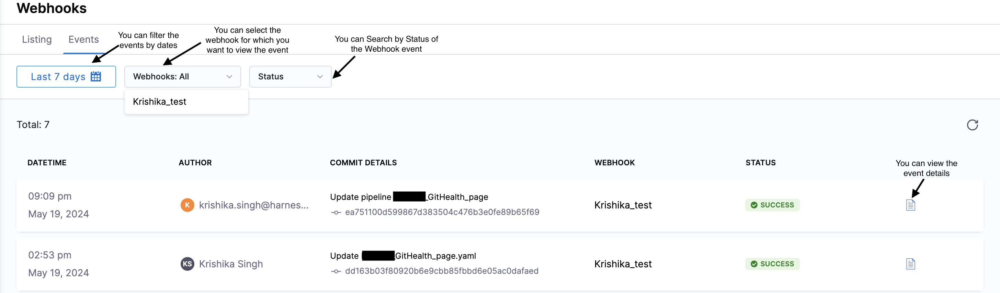
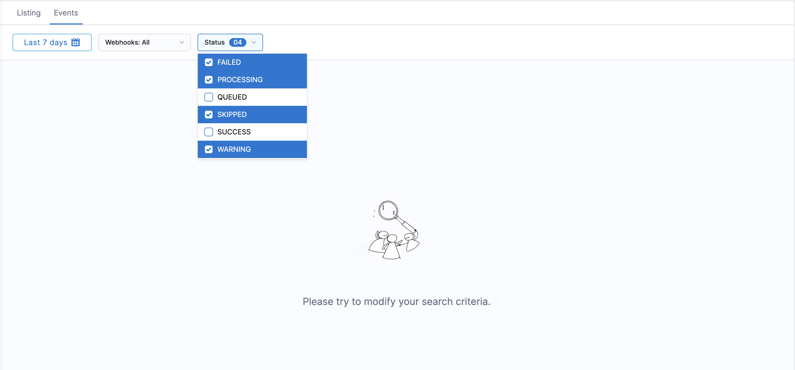
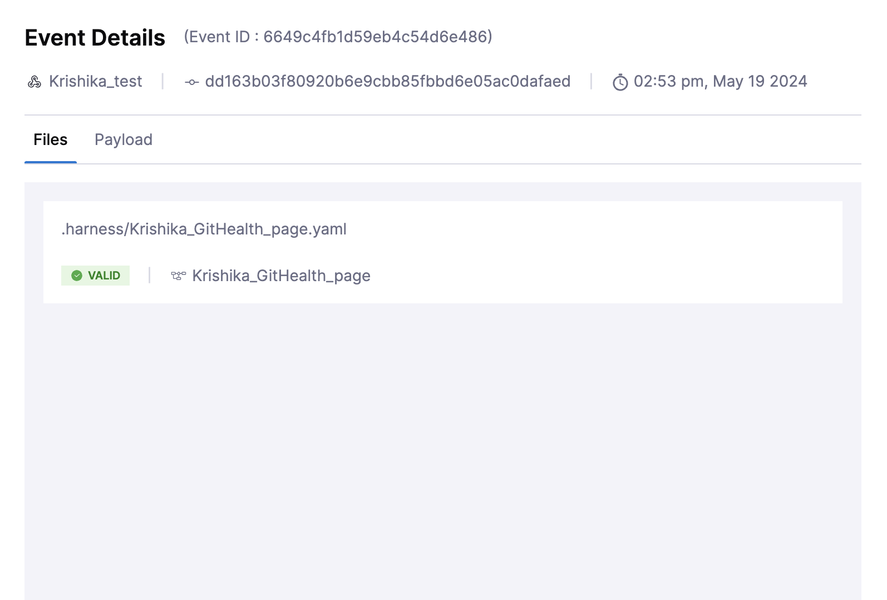
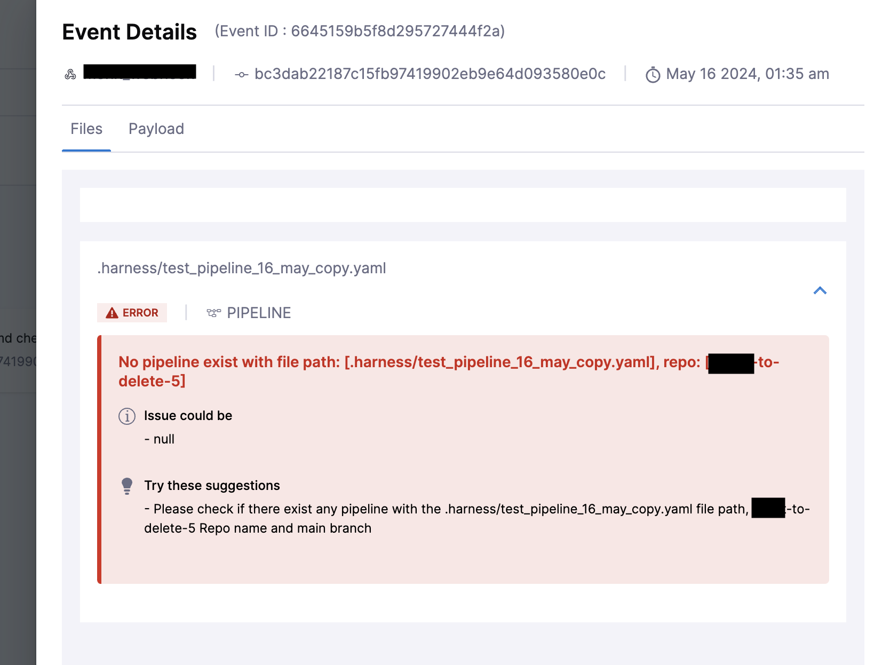

Once you have synced your Harness entities with your Git Repository, you can view [Bidirectional](./gitexp-bidir-sync-setup.md) activity between Harness and your repository with the help of **Bi-Directional Sync Health Status**.
For each entitiy, you can see file path, commit message, status of the last sync as well as the payload.

## How to view your Git Sync Activity?
- In the **Webhooks** page, you can see the **Events** tab.

By defaut you will see the event that were **FAILED**, **PROCESSING**, **SKIPPED** or if there is a **WARNING**. You can modify the filter as per your requirement

In the event page, you can see a list of all changes made to the files in your repository, tracked by the webhook you have set up.

When you click on the button as pointed in the screenshot above you will see **Event Details** i.e file changes as well as payload that was sent.

In the **Files** you can see the the file that has been updated along with commit details.

Harness validates all file changes and shows errors or warning if there are any and marks the status as Failed or with a Warning and provide the details regarding the error

Here, is an example of a warning which throws an error that no pipeline exist with file path `./harness/Pipelines/textAXA.yaml` :

