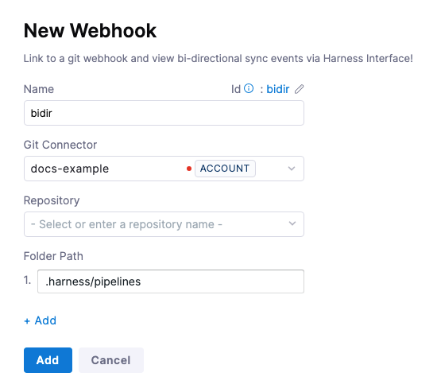
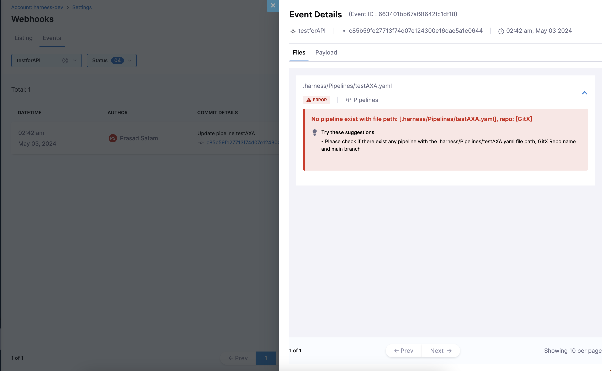

Once you have synced your Harness entities with your Git Repository, you can view [Bidirectional](./gitexp-bidir-sync-setup.md) activity between Harness and your repository with the help of **Bi-Directional Sync Health Status**.
For each entitiy, you can see file path, commit message, status of the last sync as well as the payload.

## How to register your webhook?

You can register your webhook on Organization, Project and Account Level. 

- To configure a webhook at the account scope, go to **Account Resources** > **Webhooks**, and then select **New Webhook**.
- To configure a webhook at the organization scope, go to **Account Resources** > **Organizations**, select your organization, and then, in the **Organization Resources** section, select **Webhooks**.
- To configure a webhook at the project scope, go to **Projects**, select your project, and then select **Webhooks**.

- In **Git Connector**, select or create a [Harness Git Connector](/docs/platform/connectors/code-repositories/ref-source-repo-provider/git-hub-connector-settings-reference) for your repo.
- In **Repository**, select the repo where you are going to store the Harness entities, such as pipelines.
-  In **Folder Path**, enter the path to the location in the repo that stores your Harness entities. Typically, the path starts with `.harness` and is followed by subfolders.
   
     

- The **Folder Path** setting is optional. If you omit a folder path, Harness will sync everything in the repo.

- Select **Add**. The webhook is added. You can navigate to your repo webhook settings to see the new webhook.

- In the **Webhooks** page, you can see the **Events** tab.

By defaut you will see the event that were **FAILED**, **PROCESSING**, **SKIPPED** or if there is a **WARNING**. You can modify the filter as per your requirement

In the event page you can see each event you have made to the files for the repo you have registered in webhook. 

When you click on the button as pointed in the screenshot above you will see **Event Details** i.e file changes as well as payload that was sent.

In the **Files** you can see the the file that has been updates along with commit details.

If an error occurs during sync, Harness marks the status as Failed and provides details.

Here, is an example of an error:

