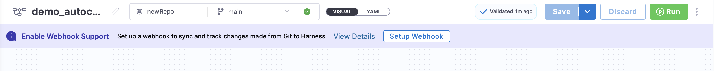
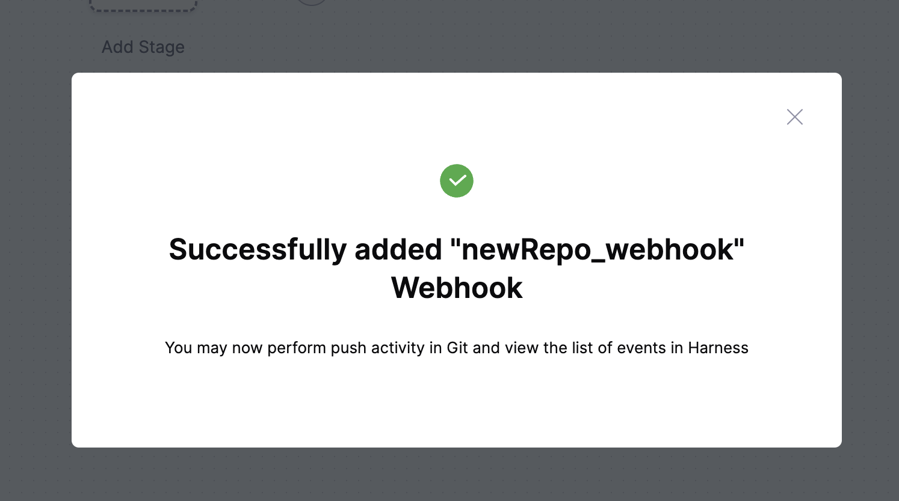
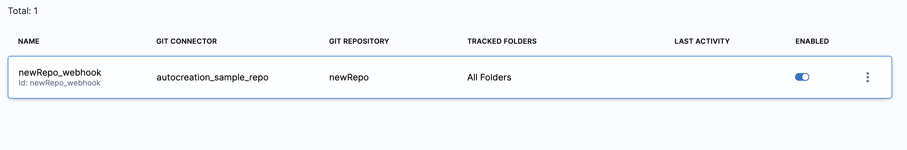
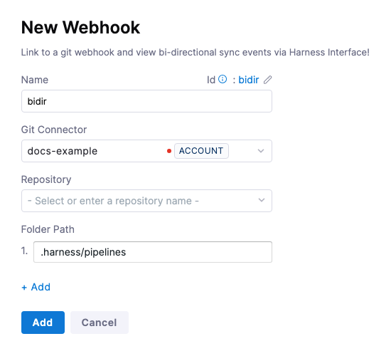
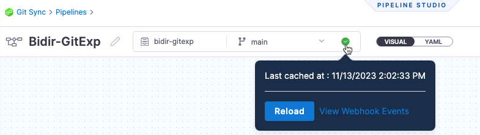

By default, Harness Git Experience syncs unidirectionally, from Harness to your Git repos. You can also have Harness Git Experience sync bidirectionally between Harness and your Git repo.

With bidirectional sync for Git Experience, changes made on either the Git repo or Harness are synched automatically.

This topic explains how to set up and use bidirectional sync.

### Supported Entities

#### Generally Available
- Pipelines
- Templates
- Input Sets
- Services
- Environments
- Infrastructure

## Important notes

- If users make changes on the Harness and Git side at the same time, precedence is given on a first come, first served basis.
- Customers using the current unidirectional sync (Harness --> Git) functionality can migrate to bi-directional sync using the steps in this topic. The process involves enabling an account-level setting. 
- If you make an invalid YAML change to the YAML in the Git repo file an **Invalid YAML Detected** error appears in the Harness UI. You can fix the invalid YAML in Harness or in the Git repo.
- If your Git repo server is on-premise, it must have connectivity to Harness SaaS. 
- Currently, only `.yaml` and `.yml` files are supported for bi-directional sync.
- When configuring a webhook, you need to be the owner of the relevant git repository.

## Configure bi-directional sync

GitX offers bidirectional sync, capturing changes committed on Git via webhook events. Harness is considered the source of truth, utilizing cached data for all operations, including pipeline execution. This approach ensures smooth execution of remote pipelines using the cached data.

To enable bidirectional sync, you need to register webhooks for the repository where the entity resides. Webhooks provide data on each commit, allowing Harness to cache the latest state of the file and keep it up-to-date with Git.

To facilitate the setup of entities with bidirectional sync, Harness provides banner notifications if an entity is not synced. Suppose you create a new remote entity in Harness without bidirectional sync enabled. In that case, you will see a banner on the entity creation page prompting you to set up a webhook to sync and track changes from Git to Harness. Below is an example of a remote pipeline without bidirectional sync enabled.

All you need to do is click on `Setup Webhook`, automatically webhook will be registered for your repository.

:::info note
To successfully register a webhook, ensure that the Harness Git connector you use has the necessary credentials. For example, when using GitHub, the GitHub user account must be a repo admin, and the Personal Access Token must include all repo, user, and `admin:repo_hook` scopes.

It is important to note that if you use a banner to set up the webhook, it will use the same connector that was used during the entity creation to create the webhook. Therefore, ensure that the connector has adequate permissions.
:::

If webhook is registered successfully you will see below message:-

Please note that webhooks will be created on the same level as the entity.

To see your newly registered webhook go to, **Project Settings** > **Project-level Resources** > **Webhooks** and you will see the webhook registered for your repository.

You can see the list of Git events in Harness. Learn more about [Git Sync Activity](./git-sync-health-page.md)

If you want to setup webhook manually refer: [Manually Setup Webhook](./gitexp-bidir-sync-setup.md/#manully-setup-webhook)

### Manully Setup Webhook

You can follow below steps to manually register webhook for your entity if you do not want to do it via banner automatically:-

 In Harness, do one the following, depending on the scope at which you want to create a webhook: 

  - To configure a webhook at the account scope, go to **Account Settings** > **Account-level Resources** > **Webhooks**, and then select **New Webhook**.
  - To configure a webhook at the organization scope, go to **Organization Resources** > **Organization-level Resources** > **Webhooks**, and then select **New Webhook**.
  - To configure a webhook at the project scope, go to **Project Settings** > **Project-level Resources** > **Webhooks**, and then select **New Webhook**.

1. In **Git Connector**, select or create a [Harness Git Connector](/docs/platform/connectors/code-repositories/ref-source-repo-provider/git-hub-connector-settings-reference) for your repo.
2. In **Repository**, select the repo where you are going to store the Harness entities, such as pipelines.
3. In **Folder Path**, enter the path to the location in the repo that stores your Harness entities. Typically, the path starts with `.harness` and is followed by subfolders.
   
     

   The **Folder Path** setting is optional. If you omit a folder path, Harness will sync everything in the repo.

4. Select **Add**. The webhook is added. You can navigate to your repo webhook settings to see the new webhook.

:::info
The `.harness` folder is tracked by default for all webhooks.
:::

In the **Webhooks** page, you can see the **Events** tab. Once you have synched an entity with the Git repo, the Git events are displayed here. You can view Git event Ids for troubleshooting.

### Sync a Harness entity

For this example, we'll create a new remote pipeline, sync it with the repo, make a change on the Git side, and then see the change on the Harness side.

1. In Harness, in **Pipelines**, select **Create a Pipeline**.
2. In **How do you want to setup your pipeline?**, select **Remote**.
3. Specify the **Git Connector**, **Repository**, and **Git branch** for storing and syncing the pipeline.
4. In **YAML Path**, you can enter the path to a repo folder where, if needed.
5. Select **Start**. The pipeline is created.
6. Add a CD or Custom stage to the pipeline and save it.
7. In your repo, confirm that the YAML file for the pipeline exists.
8. In your repo, open the YAML file for the pipeline and commit a change. For example, add a `description`.
9. Back in Harness, review the pipeline to see the changes.

## Troubleshooting

Harness provides the following troubleshooting features to help you diagnose sync errors:

- **Webhooks** page: In **Account Settings**, **Account Resources**, **Webhooks**, you can select the webhook for your Harness entity sync and view each event on the **Events** tab. For each event, you can select **Payload Details** to see the payload.
- **View Webhook Events**: in the Git information on your Harness entity, you can select **View Webhook Events** and see each event and payload for that entity.
  
    

