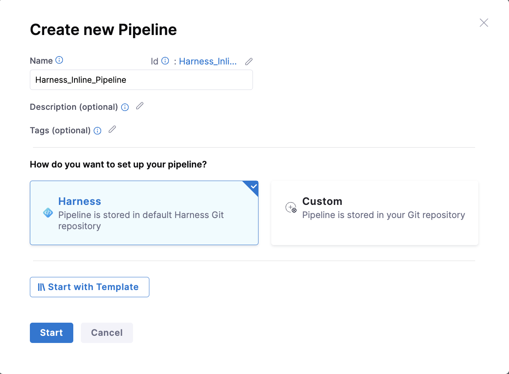
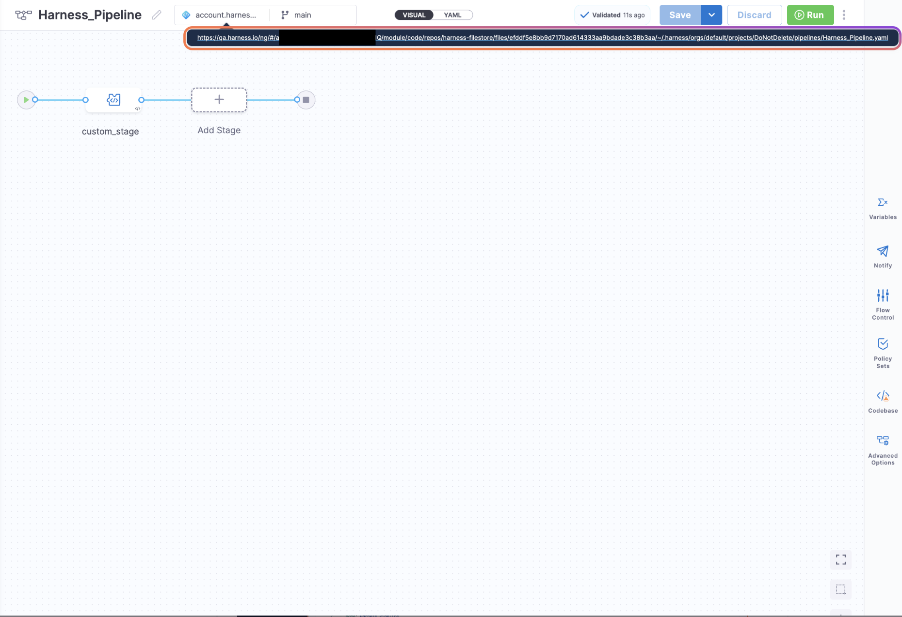

:::info note
Currently, this feature is behind the Feature Flag `PIPE_USE_HARNESS_CODE_FOR_INLINE_ENTITIES`. Please contact Harness support to enable this feature.
:::

## Overview 
By default, entities in Harness are stored either inline (within Harness) or in a remote Git repository. With this feature flag enabled, you will now have an option to store inline entities in the Harness Git Repository.

## Ways to Store Entities in Harness

There are two ways to store entities in Harness:

1. **Inline**: Entities are stored within Harness.
2. **Remote**: Entities are stored in Git.

With this feature enabled, entities will be stored in:

1. **Harness**: Entities will be stored in the default Harness Git Repository.
2. **Custom**: Entities will be stored in your Git repository, which includes the Harness Code Repository or a third-party Git provider.

### Inline Entity Storage

Inline entities will be stored in the default Harness Git Repository. The entity's YAML file will be stored in an account-level repository at a precomputed path. The file structure will follow the same approach as described in [Auto-creation of Entities](/docs/platform/git-experience/autocreation-of-entities) in Harness.

Once you save a pipeline in Harness, you can view the path of the YAML file for the entity. Clicking on the link will redirect you to the YAML file stored at the account level in the `harness-filestore` repository.

#### Interactive walkthrough for the same:
 <iframe 
     src="https://app.tango.us/app/embed/2fe97f28-47ee-48d0-98f8-929fef87ca79" 
     title="Storing Inline Entities in Harness Git Repository" 
     style={{minHeight:'640px'}}
     width="100%" 
     height="100%" 
     referrerpolicy="strict-origin-when-cross-origin" 
     frameborder="0" 
     webkitallowfullscreen="webkitallowfullscreen" 
     mozallowfullscreen="mozallowfullscreen" 
     allowfullscreen="allowfullscreen"></iframe>

## Important Notes

1. Users will have access to the `harness-filestore` repository created at the account level.
2. When a user deletes a pipeline from the UI, the corresponding file will be deleted from the Harness Code Repository. However, deleting a file from the Harness Code Repository will **not** delete the entity in the Harness UI.
3. Bidirectional sync is also supported, i.e., when the user makes changes to the YAML file, the same will be reflected in the UI and vice versa.

## Supported Entities

1. Pipelines  
2. Input Sets  
3. Templates
