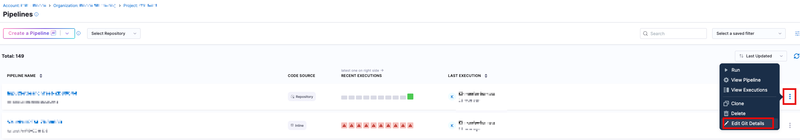
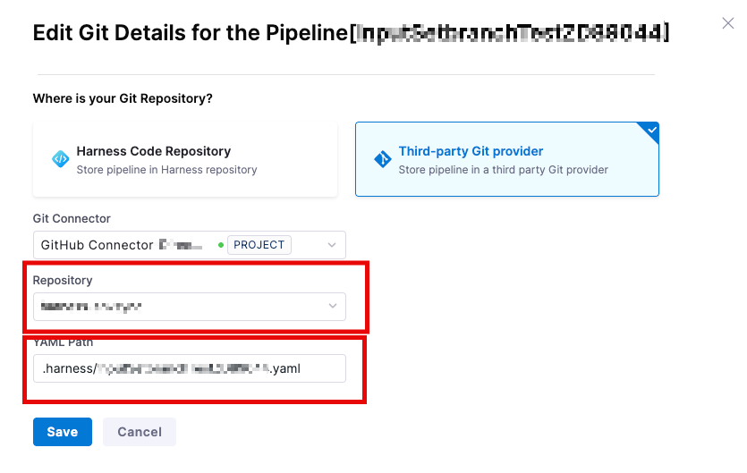
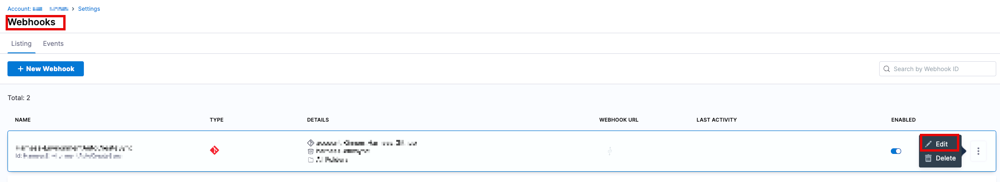
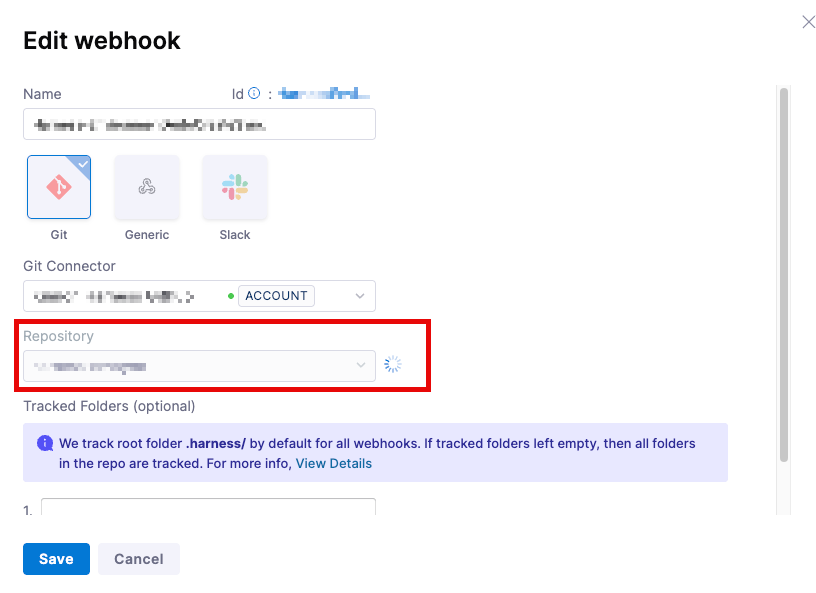

In the scenario a team wants to change the name of their Git Repo, a team will need to track the pipelines that are affected by this change.  This is because changing the repo name can cause odd issues to occur unless the webhook is updated and the pipeline references are updated.

First, we'll go through the mechanics of what can happen if the repo is updated, but nothing in Harness is updated

## How do Webhook Events work
Before going through the areas that need to be covered as a result of a repo name change, we should take a look at how Webhook events work between the Git Repository and Harness.

This can be divided in to two basic operations. 
- The first is how changes on the Git provider side get passed to Harness
- The second is how Harness reads changes and picks up changes from the Git provider.

## What happens when a Repo is Renamed
As an example, let's assume `repoA` was renamed to `repoNew`.  We'll use GitHub as an example. 

We'll now look at how to cover the change to the two parts of the webhook events.

### What happens to events going to Harness when no changes are made
When a repo is renamed, Harness receives a webhook with the updates and sends back a **200 HTTP response**, confirming the data was received. But this data then needs to be routed through our system to update the correct file in the correct branch and repository.

Because existing Harness resources are still linked to the old repo, `repoA`, they won't be updated. Even if there's a webhook cache for the new repo, `repoNew`, the incoming data won't be connected to the existing resources.

Harness doesn't receive a specific "renaming" event notification from Git, so it can't automatically cross-reference and update the resources.

Essentially, to Harness, renaming a repo to `repoNew` looks the same as creating a brand new repo with that name. We interpret the webhook payload the same way in both cases.

### Why does Harness report no errors accessing files in Github
When a repository is renamed, you might expect the old references to fail immediately. However, this doesn't happen because of how many Git providers, such as **GitHub**, handle these changes.

Git providers often keep the old references alive after a repo is renamed. Since the link to the old repository still works, Harness doesn't see a broken or unavailable reference. This is why Harness won't show the repo as dead in the UI or detect any unreconciled changes; it still sees the file as available.

The link to the updated file has moved, but the old link still resolves to it, so Harness's caching system won't detect any changes. Eventually, that old reference might stop working, and you may start to see errors with synchronization and caching.
 
## Preventing/Resolving the situation
In order to prevent this situation customers will need to **update their reference file** to the new repo location.  For example, for a pipeline
1. Go to the `Pipeline List` for your project
2. Click on the three dots `(...)` at the side of the appropriate pipeline.  Select `Edit Git Details`
   
3. Update the information for the new repo, and possibly the new file location.  Both have to point to the new existing location of the `yaml` file.
   
4. Click on **Save**

If the various files are not updated, customers run the risk of having stale data as it is not being updated with changes made in the Git provider.  Attempts to cache data will eventually time out, depending on the service.  GitHub, for instance, keeps a symlink to the new data location for a period of time, so the data may still appear to be alive and existing, even though it has been moved. 

In addition, **the Webhook for the repository will need to be updated**, if there isn't another existing Webhook caching the new repo location.  

1. Go to the appropriate `Admin Settings` (Project/Organization/Account level) for the webhook
2. Locate the webhook, click on the three dots `(...)` and select **edit**
   
3. Update the repository and save
   

Once the webhook is updated, it will then re-cache the data.