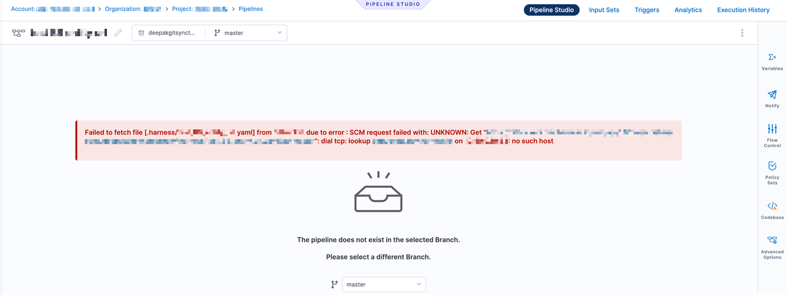

Entity caching reduces delays in loading your remote entities on the Harness UI. The Harness UI maintains a local cache to reduce delays in loading your remote entities. Caching is especially useful when there are multiple levels of nesting, such as those involving pipeline templates, stage templates, and step templates. Loading such nested entities can be time-consuming involving numerous network calls, thereby reducing the performance.

Harness caches the following remote entities:
- Remote pipelines
- Remote templates

:::note
The Git cache is only used to render entities faster in the Harness UI, not to improve pipeline execution. When executing a pipeline, Harness always fetches entities from Git to avoid using the stale data.
:::

You can reload the entities from Git and update the cache at any time. 

## Setting Up Caching
Caching occurs with git entities (GitHub, Bitbucket, etc) where a webhook has been established.  For example, setting up a webhook as a part of [the GitX Bi-directional sync](https://developer.harness.io/docs/platform/git-experience/gitexp-bidir-sync-setup/#setup-via-webhooks-page) or a webhook as a part of [Bitbucket Caching](https://developer.harness.io/kb/continuous-delivery/articles/bitbucket-api-limit/#setting-up-a-webhook-for-caching)

Please note that caching occurs for each webhook created on a **per repo** basis.  Every repo that is storing entities needs its own webhook in order to establish caching.  

## Entity cache life cycle 

Harness UI uses the following cache life cycle to render a remote entity:
1. The first time you load a remote entity to the Harness UI, the Harness UI fetches the entity from Git, renders it in the UI, and then updates the cache. Subsequently, the Harness UI loads the entity from the cache.
2. Harness displays a green tick if an entity's cache has been updated in the last two hours.

   

   Harness displays an orange tick against any entity whose cache was last updated more than two hours ago.

   

   You can refresh the cache and reload the entities from Git by selecting the **Reload from Git** option. 
   
   

   The following pop-up appears to confirm reload of the entities from Git.

   
  
  The cache status you see in the UI is only indicative of the cache status of the entity being fetched. Entities referenced within the fetched entity may have different cache statuses.
  For example, the cache status in the pipeline studio corresponds to the cache status of the pipeline. It is possible for referenced remote templates within this pipeline to have a different cache status.
  If you select **Reload from Git**, the caches of all the referenced entities are also retrieved and reloaded from Git.

3. Harness clears the cache for any entity that hasn't been fetched from GIT in the previous 30 days. Any subsequent access (whether through API or UI) will fetch the entity from GIT, update the cache, and return the response.

4. If the UI utilizes caching, the backend uses cached data and never pulls the latest from Git by default. 

5. When the cache is unavailable, Harness fetches the latest data from Git, updates the cache, and returns the response.

   For example, if you open a remote pipeline whose cache has expired, the backend updates its cache based on the latest Git version.
   
## Caching entities saved on multiple branches

To ensure isolation between caches for different entities for different branches, the cache for each entity is maintained separately for each branch. 
For example, if you have a stage template saved in separate branches in Git, Harness maintains a separate cache corresponding to each branch for the stage template. When this stage template is encountered during your entity fetch, the cache corresponding to a unique key is requested from the server. The server then looks for a cache with this key and returns the cache (if available). 

## Committing changes

When you commit changes to an entity that has been cached, Harness displays a warning if the cached version of the entity differs from that in Git.
To view the differences, click **See What Changed**.

You can do one of the following when there are differences:
- **Cancel**: Retain changes made to the UI. There are no commits pushed to Git.
- **Save**: Resolve the conflicts and commit your changes in the UI to Git.

## Connectivity loss
Customers may be naturally curious as to what may happen in the event of a potential network outage between Harness and the entity repository provider.  In this case, there are several scenarios to consider.  In general, while the connectivity is broken, Harness will utilize the "locked" cached version of the entity.

### Updates to remote entities at the remote entity repo
If autocreation is enabled, the new entities will not be created automatically and will have to be imported manually.  Another option would be for customers to recreate the file once the connectivity is fixed. For existing entities, we provide an option to `Reload from Git` where customers can manually reload from the repository once the connectivity is fixed.

At a base level, in case the entities `.yaml` files are updated on the remote repository while the connection is broken, the webhook event will never reach Harness and the cache that we maintain will never be updated. Customers should be able to see the attempt to reach Harness and a failure to reach Harness within the repo logs.

### Updates to remote entities from the Harness UI
If the connectivity is broken, customers will not be able to make changed to the entity locally.  The create/edit/delete operation will fail and the cache will not be updated.  The following error message may be seen when attempt to make an update.  This is because as a part of storing a remote entity, Harness cannot update the remote entity at the repo, resulting in the failure.

### Harness Executions (no changes or updates)
For existing entities, if the connectivity is broken, the pipeline will continue running and reference last cache version of the entities during execution. This includes any remote entities that were kept in the remote repo.

Any updates made during the downtime period will not be reflected in the execution.  Basically, the cache has an effective "locked" state.  