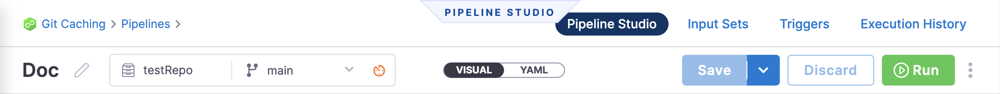
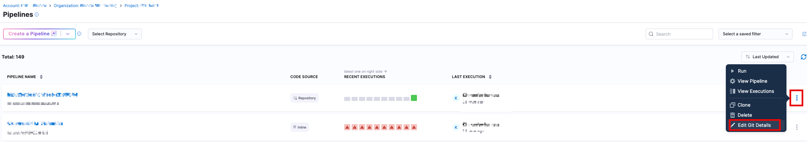
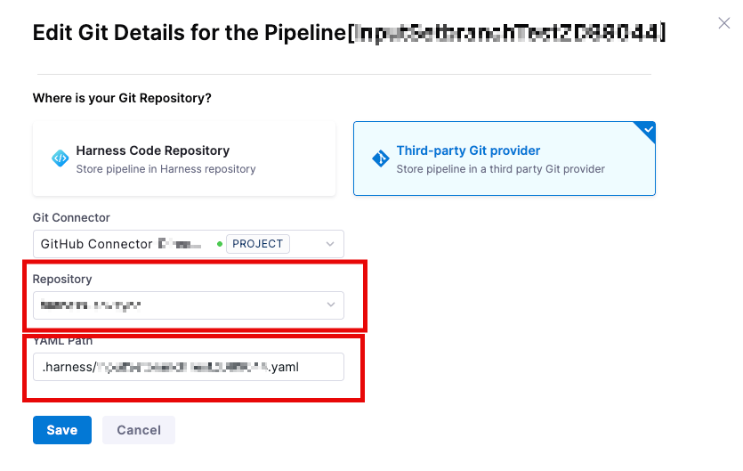
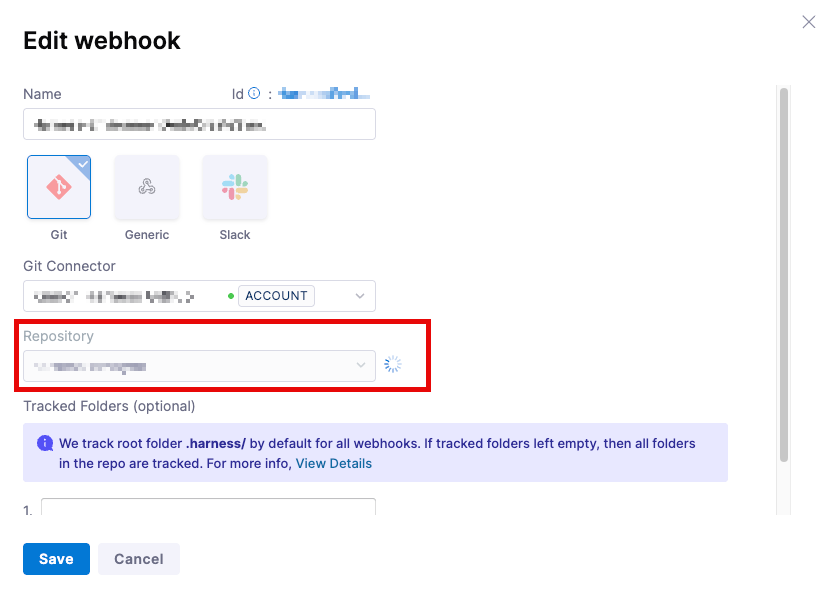

import GitXconnect from '/docs/platform/shared/gitx-connectivity.md'

Entity caching reduces delays in loading your remote entities on the Harness UI. The Harness UI maintains a local cache to reduce delays in loading your remote entities. Caching is especially useful when there are multiple levels of nesting, such as those involving pipeline templates, stage templates, and step templates. Loading such nested entities can be time-consuming involving numerous network calls, thereby reducing the performance.

Harness caches the following remote entities:
- Remote pipelines
- Remote templates

:::note
The Git cache is only used to render entities faster in the Harness UI, not to improve pipeline execution. When executing a pipeline, Harness always fetches entities from Git to avoid using the stale data.
:::

You can reload the entities from Git and update the cache at any time. 

## Setting Up Caching
Caching occurs with git entities (GitHub, Bitbucket, etc) where a webhook has been established.  For example, setting up a webhook as a part of [the GitX Bi-directional sync](https://developer.harness.io/docs/platform/git-experience/gitexp-bidir-sync-setup/#setup-via-webhooks-page) or a webhook as a part of [Bitbucket Caching](https://developer.harness.io/kb/continuous-delivery/articles/bitbucket-api-limit/#setting-up-a-webhook-for-caching)

Please note that caching occurs for each webhook created on a **per repo** basis.  Every repo that is storing entities needs its own webhook in order to establish caching.  

## Caching entities saved on multiple branches

To ensure isolation between caches for different entities for different branches, the cache for each entity is maintained separately for each branch. 
For example, if you have a stage template saved in separate branches in Git, Harness maintains a separate cache corresponding to each branch for the stage template. When this stage template is encountered during your entity fetch, the cache corresponding to a unique key is requested from the server. The server then looks for a cache with this key and returns the cache (if available). 

## Entity cache life cycle 

Harness UI uses the following cache life cycle to render a remote entity:
1. The first time you load a remote entity to the Harness UI, the Harness UI fetches the entity from Git, renders it in the UI, and then updates the cache. Subsequently, the Harness UI loads the entity from the cache.
2. Harness displays a green tick if an entity's cache has been updated in the last two hours.

   

   Harness displays an orange tick against any entity whose cache was last updated more than two hours ago.

   

   You can refresh the cache and reload the entities from Git by selecting the **Reload from Git** option. 
   
   

   The following pop-up appears to confirm reload of the entities from Git.

   
  
  The cache status you see in the UI is only indicative of the cache status of the entity being fetched. Entities referenced within the fetched entity may have different cache statuses.
  For example, the cache status in the pipeline studio corresponds to the cache status of the pipeline. It is possible for referenced remote templates within this pipeline to have a different cache status.
  If you select **Reload from Git**, the caches of all the referenced entities are also retrieved and reloaded from Git.

3. Harness clears the cache for any entity that hasn't been fetched from GIT in the previous 30 days. Any subsequent access (whether through API or UI) will fetch the entity from GIT, update the cache, and return the response.

4. If the UI utilizes caching, the backend uses cached data and never pulls the latest from Git by default. 

5. When the cache is unavailable, Harness fetches the latest data from Git, updates the cache, and returns the response.

   For example, if you open a remote pipeline whose cache has expired, the backend updates its cache based on the latest Git version.
   
<GitXconnect />

## Committing changes

When you commit changes to an entity that has been cached, Harness displays a warning if the cached version of the entity differs from that in Git.
To view the differences, click **See What Changed**.

You can do one of the following when there are differences:
- **Cancel**: Retain changes made to the UI. There are no commits pushed to Git.
- **Save**: Resolve the conflicts and commit your changes in the UI to Git.

## Changing Git Repo Name
In the scenario a team wants to change the name of their Git Repo, a team will need to track the pipelines that are affected by this change.  This is because changing the repo name can cause odd issues to occur unless the webhook is updated and the pipeline references are updated.

First, we'll go through the mechanics of what can happen if the repo is updated, but nothing in Harness is updated

### Why Harness doesn't pick up Repo Changes when a Repo is Renamed
This can be divided in to two basic operations that we can discuss. The first is how changes on the Git provider side get passed to Harness, and the second is how Harness reads changes and picks up changes from the Git provider.

As an example, let's assume `repoA` was renamed to `repoNew`.  We'll use GitHub as an example, although alternate Git providers may behave differently.

### Github changes being sent to Harness
Upon renaming a repo, updates via webhook for the changes will be sent to Harness.  Harness will report a `200` http response for the traffic, confirming that the data was received.  The data, though, will need to be routed through our system to update the appropriate file in the appropriate branch and repo.

However, since the existing Harness resources would still refer to the old repo, `repoA`, so they will not be updated.  There may even be an existing webhook cache for the new repo, `repoNew`, but the reference would have no correlation with the update. 

Harness also does not receive an "event" notification for the "renaming" of the repo, as the GitRepo does not update linked entities about the change.  Harness, therefore, will not be able to cross-correlate the resources, and automatically update references within Harness.
 
Basically, to Harness, there is no difference between renaming a repo to be `repoNew` and if the team were to create a brand new repo called `repoNew`.  We would interpret the webhook payload the same way.

### Harness not showing that the Repo is no longer available, or files are out of date
For a standard, renaming the repo should end up immediately failing the reference, but it doesn't because of how GitHub works, although, this behavior can differ depending on the provider.

This process happens because of how the Git Provider handles "old" references to moved files.  GitHub, as an example, has a process to "keep alive" the referral to the old repo.  Because this is being kept alive and not showing as a dead/unavailable reference, Harness won't show it as such in our UI.  Similarly, this would stop Harness from detecting unreconciled changes, as Harness would see the file as being "available" and would not even necessarily see the "update".

This is because the updated file's location has moved, but the link to resolve to the file hasn't changed. Therefore, Harness caching would not detect any change.

Eventually, that reference may not resolve anymore, and then the team may start to see errors in their synchronization and caching.
 
### Preventing/Resolving the situation
In order to prevent this situation customers will need to **update their reference file** to the new repo location.  For example, for a pipeline
1. Go to the `Pipeline List` for your project
2. Click on the three dots `(...)` at the side of the appropriate pipeline.  Select `Edit Git Details`
   
3. Update the information for the new repo, and possibly the new file location.  Both have to point to the new existing location of the `yaml` file.
   
4. Click on `Save

If the various files are not updated, customers run the risk of having stale data as it is not being updated with changes made in the Git provider.  Attempts to cache data will eventually time out, depending on the service.  GitHub, for instance, keeps a symlink to the new data location for a period of time, so the data may still appear to be alive and existing, even though it has been moved. 

In addition, **the Webhook for the repository will need to be updated**, if there isn't another existing Webhook caching the new repo location.  

1. Go to the appropriate `Admin Settings` (Project/Organization/Account level) for the webhook
2. Locate the webhook, click on the three dots `(...)` and select `edit`
   
3. Update the repository and save
   

Once the webhook is update, it will then re-cache the data.