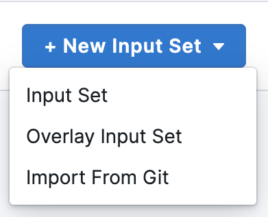
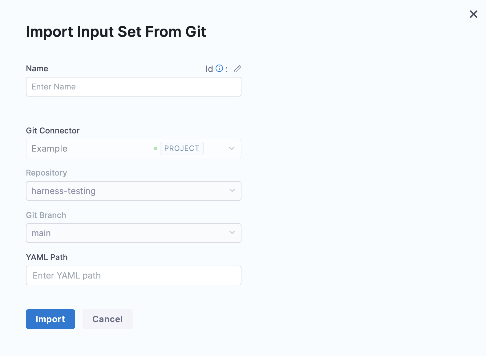

Harness input sets are collections of runtime inputs for a pipeline provided before execution.

All pipeline settings can be set as runtime inputs in Pipeline Studio's Visual or YAML editors.

Before running a pipeline, you can select one or more input sets and apply them to the pipeline.

You can either [create an input set](/docs/platform/pipelines/input-sets/) or import one from your Git repo.

This topic explains how to import an input set from your Git repo and apply it to your pipeline.

## Before you begin

* [Harness Git Experience Overview](git-experience-overview.md)
* [Harness Git Experience Quickstart](configure-git-experience-for-harness-entities.md)
* [Input sets and overlays](/docs/platform/pipelines/input-sets/)
* [Manage a Harness Pipeline Repo Using Git Experience](manage-a-harness-pipeline-repo-using-git-experience.md)
* [Manage input sets and triggers in Git Experience](manage-input-sets-in-simplified-git-experience.md)

## Import an input set

You can import an Input Set from the CI or CD module in Harness.

This topic shows you how to import an Input Set to the CD module.

1. In Harness, click **Deployments**.
2. Select your Project and click on **Pipelines** and click on **Input Sets**.
3. Click **New Input Set** and select **Import From Git**.
   
   
   
   The **Import Input Set From Git** settings appear.
   
   

4. Enter a **Name** for your Input Set.
5. Harness fetches the following details and auto-fills them:
	1. **Git Connector**
	2. **Repository**
	3. **Git Branch**
6. Enter the **YAML Path** from where you want to import the Input Set. Make sure that your YAML path starts with `.harness/` and the YAML file already exists in the specified Git repo and branch.
7. Click **Import**.  
Click on your **Run Pipeline** to proceed.

