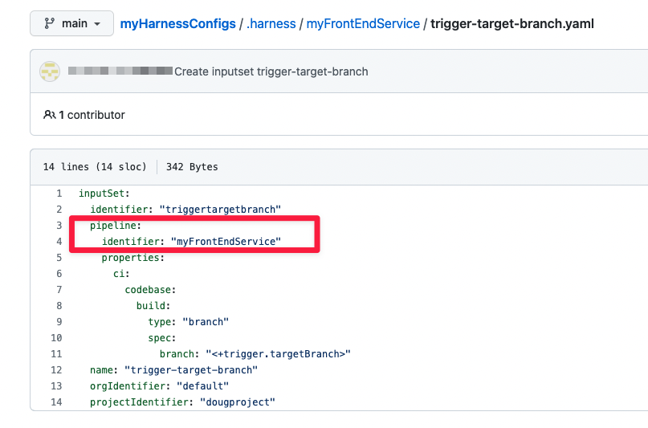

Git Experience enables you to store and manage your Harness pipelines and input sets as YAML definition files in your Git repos. You can store your Harness definitions in the same repo with your code. You can also store your Harness definitions in a separate repo from your codebase.

This topic describes the second workflow. We start with two code repos in Git, for a front-end service and a back-end service. Then we create pipelines, input sets, and triggers for the two codebases in a separate Harness repo.


### Before you begin

This topic assumes that you are familiar with the following:

* How to create a pipeline using Git Experience. See [Harness Git Experience QuickStart](configure-git-experience-for-harness-entities.md).
* How to create input sets and triggers using Git Experience. See [Manage input sets and triggers in Git Experience](manage-input-sets-in-simplified-git-experience.md).
* A basic understanding of how pipelines, input sets, and triggers work together:
	+ [Input sets and overlays](../pipelines/input-sets)
	+ [Trigger pipelines using Git events](/docs/platform/triggers/triggering-pipelines/)

This topic also assumes you have a Git repo with the codebase you want to build and at least one branch.

### Step 1: Create the Harness repo

Log in to your Git provider and create a new repo. In this workflow we call it **myHarnessConfigs**.

### Step 2: Create a new pipeline

In the Harness Pipeline Studio, go to your CI project and then select **Pipelines** > **New Pipeline**. The **Create New Pipeline** window appears.

Enter a name that corresponds to the code repo for the pipeline. In this case we use the same name as the repo: **myFrontEndService**. Under **How do you want to set up your pipeline**, select **Remote**.

Select the Git Connector and the Git repo where you want to save the pipeline. In this case, we select **myHarnessConfigs**.

In this case, we save the pipeline YAML as `./harness/myFrontEndService/myFrontEndService.yaml`.


Select **Start**. You can now set up your pipeline.

### Step 3: Set up your build stage and codebase

In the Pipeline Studio, select **Add Stage** and select **Build** for the stage type.

In **About your Stage**, select the Git repo with the codebase that you want the pipeline to build. Select **Set Up Stage**.


Set up your **Build** stage in the Pipeline Studio: define the build infrastructure and add at least one step. Select **Save**. The **Save Pipelines to Git** window appears.

Select the branch where you want to save the pipeline and select **Save**. You generally want to save it to the default branch on the first save. You can then create different branches in the Harness repo if you want to create different versions of your pipeline.


### Step 4: Create an input set

With Git Experience enabled, any input sets you create get stored in the same repo and branch as the pipeline definition. In this step, you will create a simple input set and save it with your pipeline.

Select **Run**. The **Run Pipeline** screen appears.

Under **Build Type**, select **Git Branch**.

For the **Branch Name**, select **Expression** and enter `<+trigger.targetBranch>` as a runtime expression.

Select **Save as Input Set**. The **Save Input Sets to Git** screen appears.

Select **Commit to an existing branch**.

Enter the name and YAML path for the input set. For the YAML path, use the same format as you did with the pipeline: `.harness` root folder, pipeline subfolder, and filename. In this example, we enter `.harness/myFrontEndService/trigger-target-branch.yaml`.

Select **Save** and save the input set into the default branch in your Harness repo.

Every input set is associated with a specific pipeline, which is specified by the `pipeline : identifier` element in the input set's YAML.



### Step 5: Create a trigger

Now that you have a pipeline and input set in your default branch, you can create a trigger that uses the input set you just created.

**Create the input set before creating the trigger.** If you want to use an input set as part of a trigger, create and sync the input set before creating the trigger.

In the Pipeline Studio, select **Triggers** and create a new trigger. Note the following:

* In the **Configuration** tab's **Repository Name** field, make sure you specify the codebase repo and not the Harness repo.
* In the **Pipeline Input Repo** tab's **Pipeline Input**, select the input set you just created.
* In the **Pipeline Input Repo** tab's **Pipeline Reference Branch** field, specify the default branch in the Harness repo where you initially saved the pipeline. When the trigger receives a payload, it looks in the repo where you store your Harness definitions. Then it uses the pipeline in the branch specified by this field. The default setting for the **Pipeline Reference Branch** field is `<+trigger.branch>`. This is a reasonable default if the trigger is webhook-based *and* your code and Harness configs are in the same repo. The second condition doesn't apply in this case; therefore, you must set this field manually.
* For information on other fields, go to [Trigger pipelines using Git events](/docs/platform/triggers/triggering-pipelines/).

In the **Pipeline Input** tab, select the input set you just created, and then select **Create Trigger**.

You now have a pipeline, input set, and trigger that you can use in new branches that you create from the default branch.

Unlike pipelines and input sets, trigger definitions are saved in the Harness database and not in your Git repo. Each trigger is associated with a specific pipeline, which is specified by the `pipelineIdentifier` element in the trigger YAML.


### Next steps

You now have a pipeline, input set, and trigger for your codebase. The pipeline and input set are in one repo, `myHarnessConfigs`. The code is in another repo, `myFrontEndService`. Note that both repos have the same default branch, `main`. When your trigger receives a matching payload, it starts a build using the pipeline in `myHarnessConfigs`. The trigger uses its `pipelineBranchName` element in its YAML definition and uses the pipeline in this branch (`main`) to run the build.

#### Set up more pipelines

Follow the previous workflow for each additional codebase you want to build in Harness. When saving multiple pipelines in the same repo, remember to save your pipelines and input sets in separate subfolders. In this example, we've added a pipeline and input set for our `myBackEndService` codebase:


```
% pwd  
~/myHarnessConfigs/.harness  
% ls -aR    
.	..	myBackEndService	myFrontEndService  
./myBackEndService:  
.	..	myBackEndService.yaml	trigger-target-branch.yaml  
./myFrontEndService:  
.	..	myFrontEndService.yaml	trigger-target-branch.yaml
```
#### Create branch-specific pipelines

You might find that you can use the default pipeline, input set, and trigger you just created for most of your builds, regardless of which codebase branch gets updated. The codebase sends a payload; the payload includes the updated branch; the trigger builds from this branch using the runtime expression `<+trigger.targetBranch>`.

Git Experience enables you to create branches in your Harness repo so you can create different versions of the same pipeline for different use cases. For example, suppose you want your pipeline to push to different registries depending on the updated branch. Updates to `main` push to a public registry; updates to all other branches push to a private registry. To implement this, do the following:

1. Customize your default pipeline and press **Enter**.
2. Select **Commit to a new branch** and enter the branch name. In this case, we save the pipeline in a new branch `push-to-private`:

   

3. Customize the input sets and triggers for the new pipeline as needed. For this specific use case, you would add a condition to the trigger so it uses the pipeline in `push-to-private` when it receives a payload from any branch except `main`.

   
   
4. In the trigger editor's **Pipeline Input** field, make sure that the **Pipeline Reference Branch** field references the new branch.
   
   

## Set default Git connector for Git Experience

You can set the default Git connector for Git Experience pipelines and input sets. The default Git connector will be selected whenever you create or import operations with Git Experience entities. 

This default connector can be changed at any time and another connector can be used when needed.

You can select the default connector in your project, org, or account **Default Settings**:

<DocImage path={require('./static/78f49fd6d5d64ecd1b877cf3f76767ae04cce53bffccbb67b20447c64ccca5cf.png')} width="60%" height="60%" title="Click to view full size image" />  
