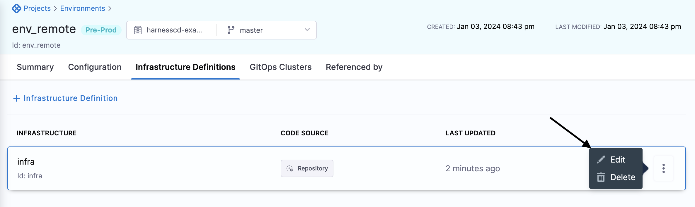
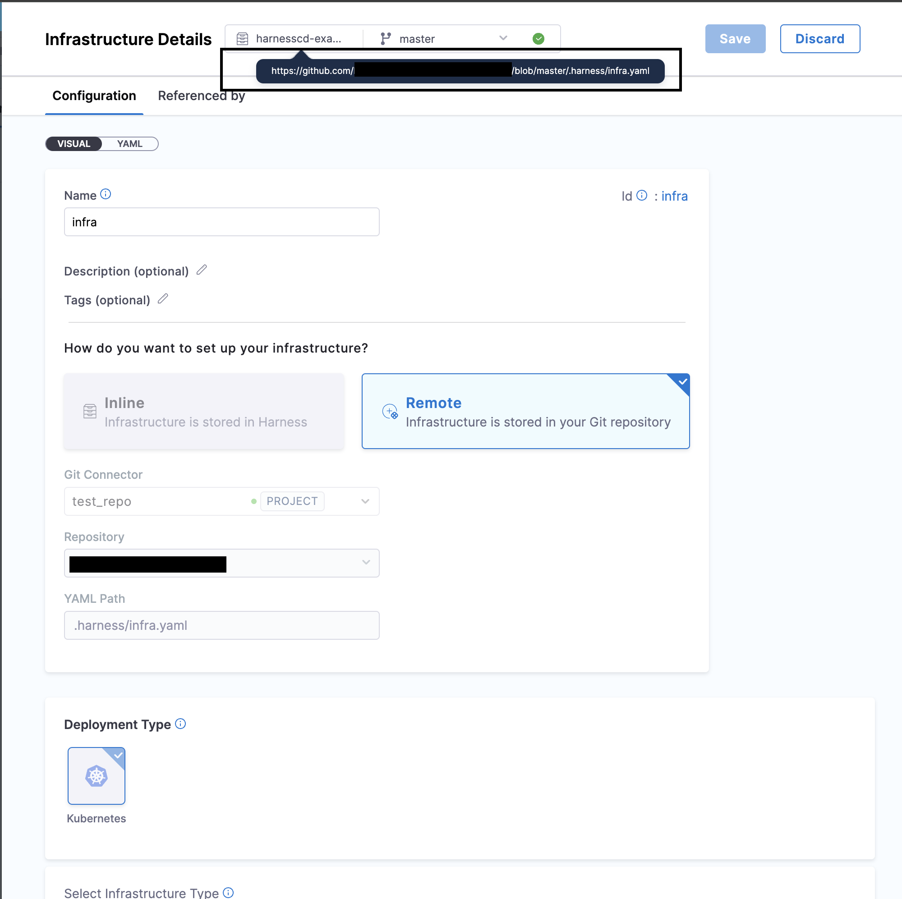
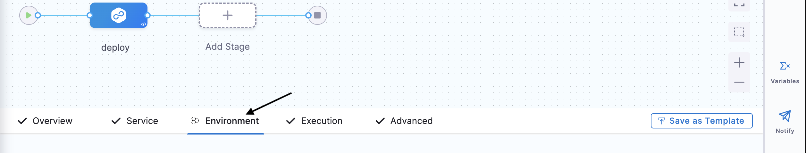
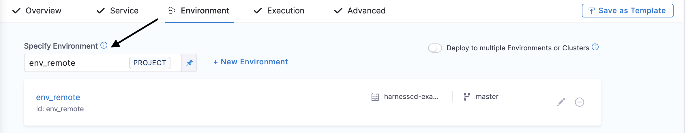
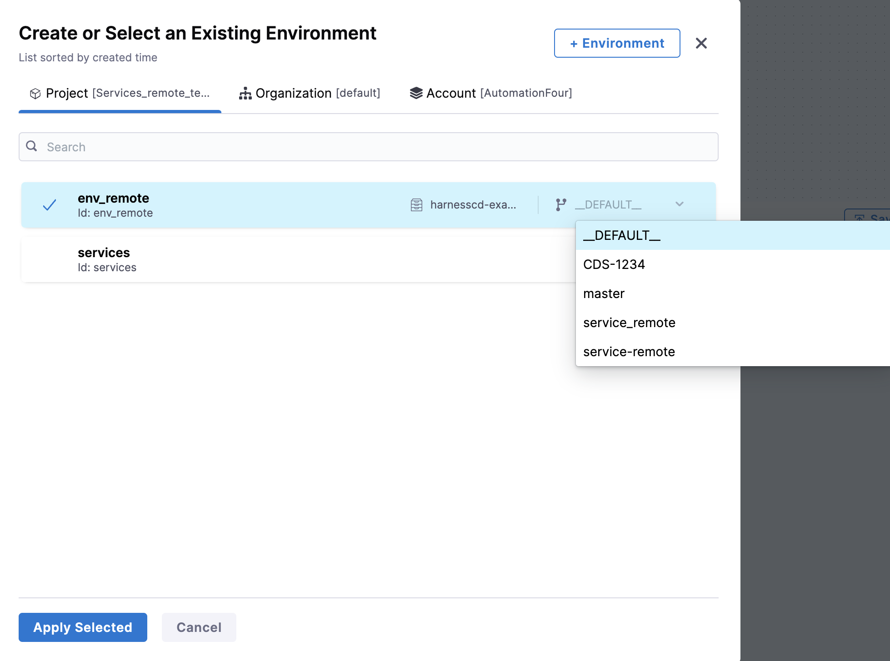
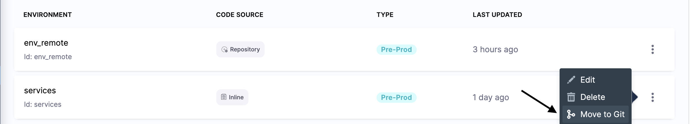
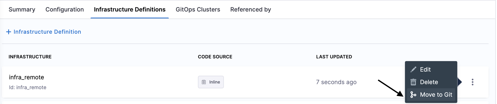

:::note
Currently, Git Experience support for environments and infrastructure definition is behind the feature flag ``CDS_ENV_GITX`` and 
``CDS_INFRA_GITX``. Contact [Harness Support](mailto:support@harness.io) to enable the feature.
:::

Harness lets you create an environment and infrastructure definition in the following ways:

* Create an inline environment and infrastructure definition and save its configuration in Harness.
* Create a remote environment and infrastructure definition and save its configuration in Git.

The topic explains how you can store your environment and infrastructure definition in Git.

## Before you begin

* Make sure you have a Git repo with at least one branch.​
* Make sure you have a [Harness Git connector](/docs/platform/connectors/code-repositories/connect-to-code-repo) with a Personal Access Token (PAT) for your Git account.​

## Create remote environment
You can create an environment from your account, organization, or project. This topic explains the steps to create an environment from the project scope.
1. In your Harness Account, go to your project.
2. To create a environment from outside of a pipeline, under **Project Settings**, select **Envrionment**. To learn more about creating senvironments, go to [Create Environment](docs/continuous-delivery/x-platform-cd-features/environments/create-environments.md).

3. Select **+ New Environment**.

4. In **Name**, enter a name for the environment.
5. Select **Remote**.
6. In **Git Connector**, select or create a Git connector to the repo for your project.​ For steps, go to [Code Repo Connectors](/docs/category/code-repo-connectors).
7. In **Repository**, select your repository. If your repository isn't listed, enter its name. Create the repository in Git before entering it in **Select Repository**. Harness does not create the repository for you.
8. In **Git Branch**, select your branch. If your branch isn't listed, enter its name. Create the branch in your repository before entering it in **Git Branch**. Harness does not create the branch for you.
9. Select the branch where you want to save your Environment. You generally want to save it to the default branch on the first save. You can then create different branches in the Harness repo if you want to create different versions of your environment. 

10. Harness Git Experience auto-populates the **YAML Path**. You can change this path and the file name.
11. Select **Save**.
12. Click on the YAML path provided (the one highlighted under the rectangular box), it will take you GitHub file where the environment is stored.

##  Create Remote infrastructure definition
1. After saving the above settings, environment configuration will open up, click on **Infrastructure Definition**.
2. Select **+ New Infrastructure Definition**.

(You can select either of the two options to create an Infrastructure Definition)
3. In **Name** enter name for the infrastructure definition.
4. Select **Remote**
5. It will auto populate the connector, repository and branch as well as the YAML Path. The auto-population of the connector,branch and repository is based on your environment configuration, specifically extracted from the Git repository where you've stored your environment details.You can change the connector as well as the branch.
6. Select the **Deployment Type**, **Infrastructure Type** and provide **Cluster Details**.To know more about Infrastructure Definition refer [Infrastructure Definition](/docs/continuous-delivery/x-platform-cd-features/environments/create-environments.md) .
7. Click on **Save**.
8. Select **More Options** (&vellip;) as shown in the image below and click on **Edit**.

8. By clicking on the **Edit** Infrastructure Details option, you can view the relevant information by following the link highlighted in the image below, contained within a rectangular box. This link will direct you to the GitHub file where the infrastructure definition is stored.

### Add remote environment in a CD pipeline
After creating the environment, you have the option to utilize it in your Continuous Delivery (CD) pipeline directly. Alternatively, you also have the flexibility to establish a remote environment within your pipeline as needed.
1. Go to stage settings, and then select **Environment**.

2. Under **Specify Environment** select the environment if already created. If the environment doesn't exist, create it by selecting **+ New Environment** and following the steps to [Create Remote Environment](#create-remote-environment).

3. When setting up your pipeline, you have the ability to choose a specific branch to determine the version of the environment you wish to utilize in your pipeline.

:::note
By default it will pick up the branch of the pipeline where the environment is getting added.
:::
4. Click **Apply Selected**.

## Moving inline environment configuration to Git
1. Select **Environment**.
2. Select **More Options** (&vellip;) as shown in the image below.

3. Select **Move to Git**.
It will pop up the similar settings as shown above in [Create Remote Environment](#create-remote-environment) section for storing environment configuration in Git.

## Moving inline infrastructure definition to Git.
1. Select **Environment** and select the specific environment for which you want to migrate the infrastructure definition to Git.
2. Select **Infrastructure Definition** and click **More Options** (&vellip;) as shown in the image below.

3. Select **Move to Git**.
It will pop up the similar settings as shown above in [Create Remote Infrastructure Definition](#create-remote-infrastructure-definition) section for storing infrasturcture definition configuration in Git.