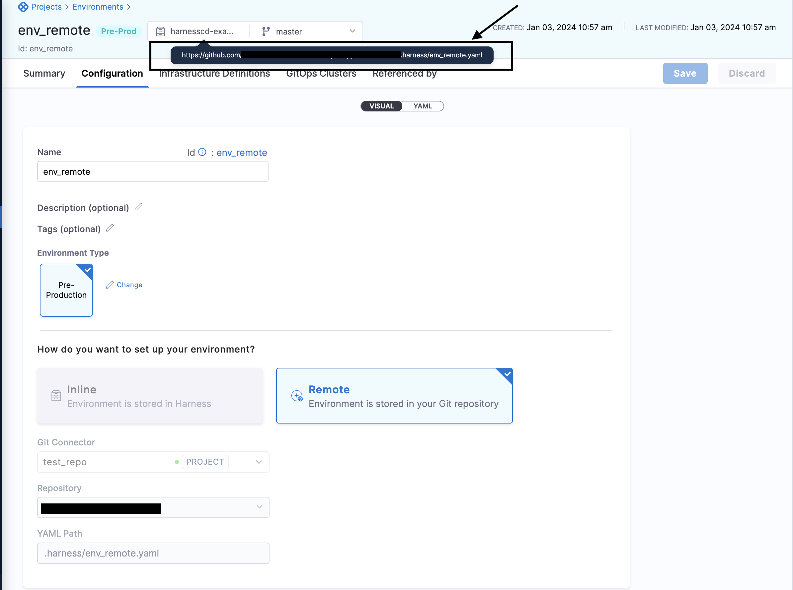
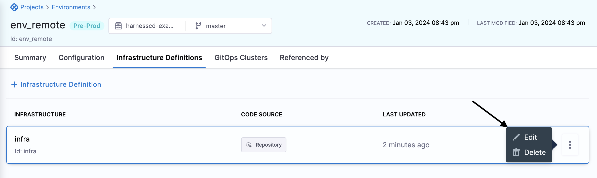
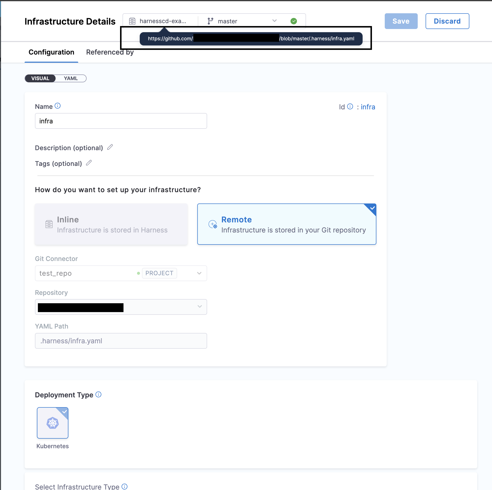
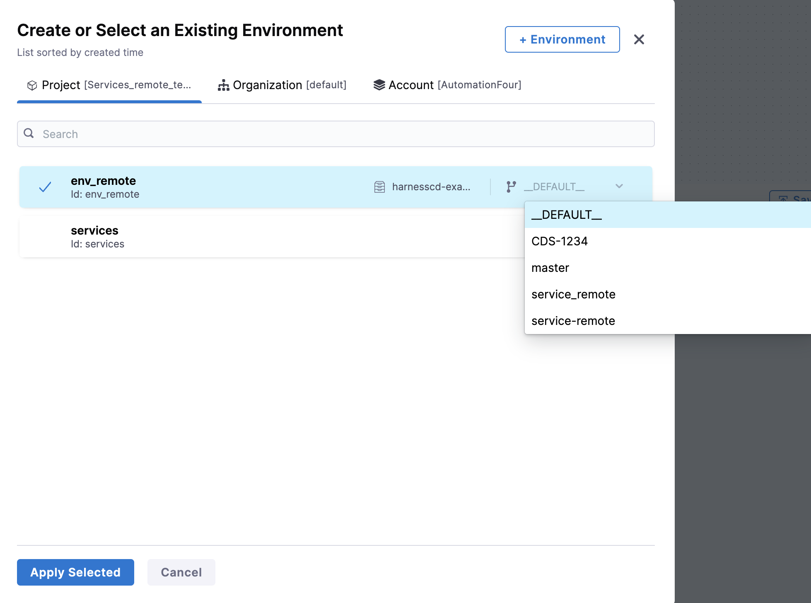
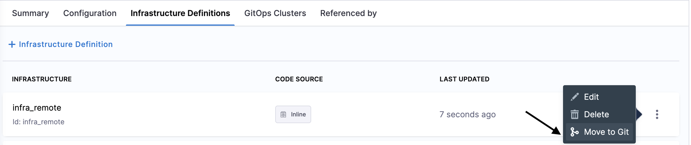

:::info note
Currently, Git Experience support for environments and infrastructure definition is behind the feature flags `CDS_ENV_GITX` and 
`CDS_INFRA_GITX`. Contact [Harness Support](mailto:support@harness.io) to enable the feature.
:::

When you create a new Harness environment or infrastructure definition, you can store it in one of the following ways:

- Inline: Harness stores the entity in its platform.
- Remote: The Harness entity is stored in Git.

You can set the entity as Inline or Remote when you create it, and then change the storage method after it is created. Changing the storage method is described in this topic.

The topic explains how to use the Remote option to store a Harness environment or infrastructure definition in your Git platform account.

## Before you begin

* Make sure you have a Git repo with at least one branch.​
* Make sure you have a [Harness Git connector](/docs/platform/connectors/code-repositories/connect-to-code-repo) with a Personal Access Token (PAT) for your Git account.​
## Visual Summary

Here's a quick video of how you can manage services, environment and infrastructue definition through Git Experience.

<!-- Video:
https://www.youtube.com/watch?v=ZvtyLxmtHTo-->
<DocVideo src="https://www.youtube.com/watch?v=ZvtyLxmtHTo" />

## Create a remote environment

You can create a remote environment at the Harness account, organization, or project level. This topic explains the steps to create it at the project level. The process is the same for the other levels.

1. In your Harness account, go to a project.
In **Project Settings**, select **Environments**. To learn more about creating environments, go to [Create environments](/docs/continuous-delivery/x-platform-cd-features/environments/create-environments).
2. Select **New Environment**.
3. In **Name**, enter a name for the environment.
4. In **How do you want to set up your environment**, select **Remote**.
5. In **Git Connector**, select or create a Git connector to the repo for your environment.​ For more information, go to [Code Repo Connectors](/docs/category/code-repo-connectors).
6. In **Repository**, select your repository. If your repository isn't listed, enter its name. Create the repository in Git before entering it in **Repository**. Harness does not create the repository for you.
7. In **Git Branch**, select your branch. If your branch isn't listed, enter its name. Create the branch in your repository before entering it in **Git Branch**. Harness does not create the branch for you. You generally want to save it to the default branch on the first save. You can then create different branches in the Harness repo if you want to create different versions of your environment. 
8. Harness Git Experience auto-populates the **YAML Path**. You can change this path and the file name.
9. Select **Save**.
10. In the new environment, click on the YAML path provided to view your new environment in your Git repo.

    

##  Create a remote infrastructure definition

1. In the remote environment, select **Infrastructure Definition**.
2. Select **New Infrastructure Definition**. 
3. In **Name** enter name for the infrastructure definition.
4. In **How do you want to set up your infrastructure**, select **Remote**.
5. Harness will automatically populate the connector, repository, branch, and YAML path. The auto-population of the connector, branch, and repository is based on the environment configuration, specifically extracted from the Git repository where you've stored your environment details. You can change the connector as well as the branch.
6. Select the **Deployment Type**, **Infrastructure Type**, and then provide infra details. For more information, go to [Create environments](/docs/continuous-delivery/x-platform-cd-features/environments/create-environments).
7. Select **Save**.
8. For the new infrastructure definition, select **More Options** (&vellip;) and then select **Edit**.

    
9. Click the YAML path to view your Infrastructure Definition YAML file in your Git repo.

    

### Add a remote environment in a CD pipeline

Adding a remote environment in a CD pipeline stage is no different than adding an inline environment.

When adding a remote environment to the stage, you have the ability to choose a specific branch to determine the version of the environment you wish to utilize in your pipeline.

:::note
1. When the remote environment is linked to the pipeline , branch of the environment gets displayed as ``__DEFAULT__``.
`__DEFAULT__` resolves to same branch as pipeline ,when both the environment and pipeline where it is linked are in the same repository or the main branch of the repository where the environment resides when it is different.
2. Infrastructure definition takes the branch of the environment when both reside in the same repository.
3. When a remote stage template containing Remote environment is linked in a Remote Pipeline, the Stage template branch is defaulted when both the entities are in the same repository. If the environment is in a different repository , that repository is taken. Read more about creating [remote stage template](/docs/platform/templates/create-a-remote-stage-template.md).
:::

## Change an inline environment to a remote environment

1. In **Environments**, locate the environment you want to change.
2. Select **More Options** (&vellip;).
3. Select **Move to Git**.

The same settings used when creating a remote environment appear. Configure the settings just as you would for a new remote environment.

## Change an inline infrastructure definition to a remote infrastructure definition

1. Select an environment, and then select the infrastructure definition you want to store in your Git repo.
2. Select **More Options** (&vellip;).

    

3. Select **Move to Git**.

The same settings used when creating a remote infrastructure definition appear. Configure the settings just as you would for a new remote infrastructure definition.

