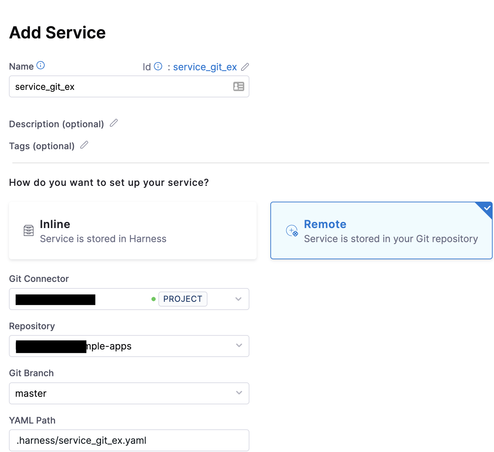
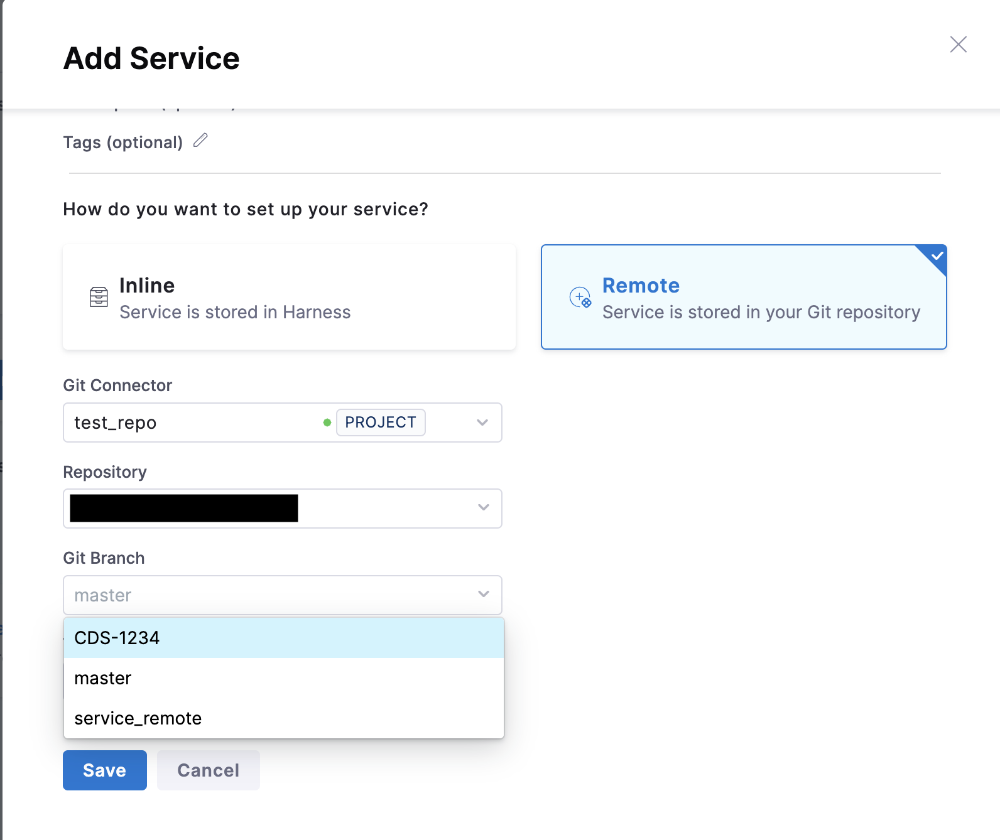
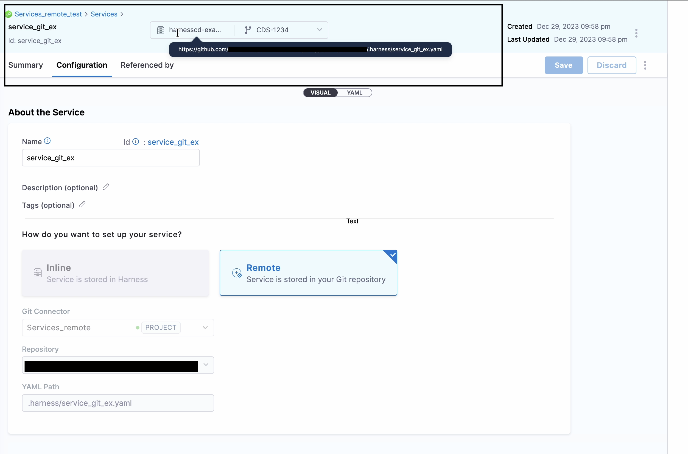
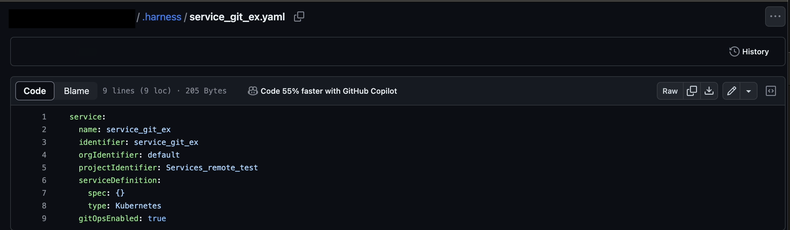
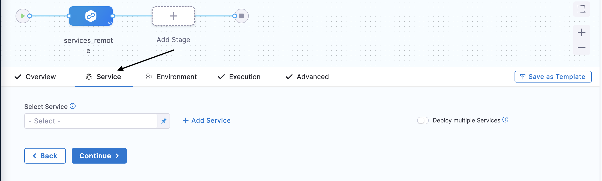
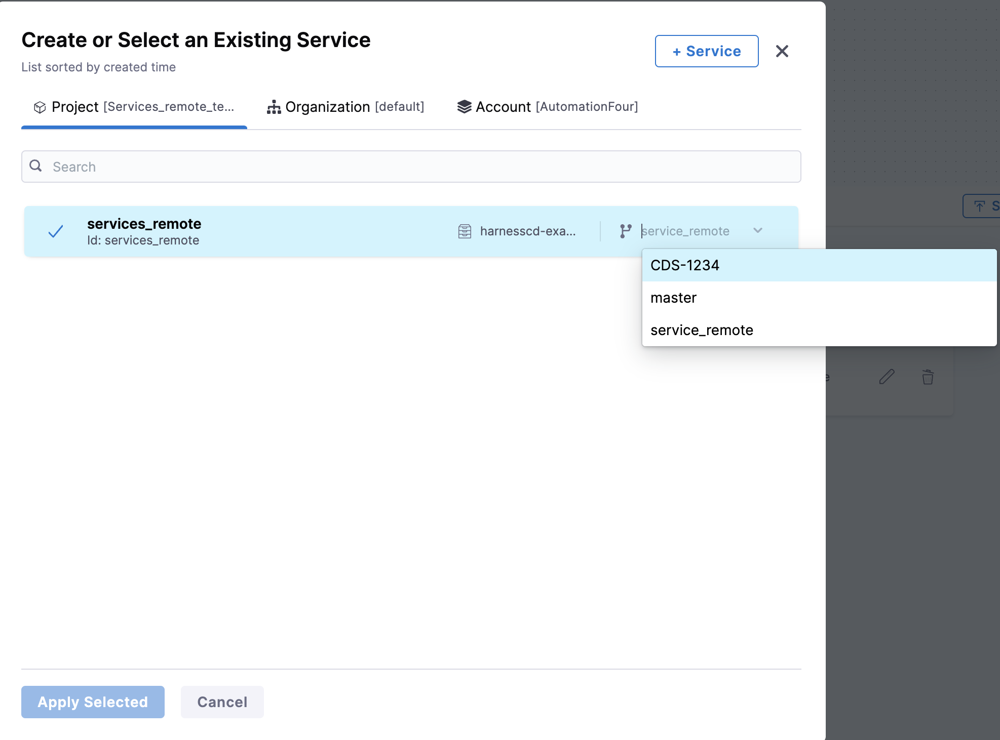
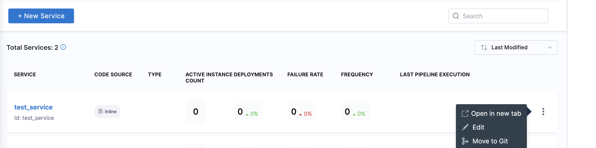

:::note
Currently, Git Experience support for services is behind the feature flag `CDS_SERVICE_GITX`. Contact [Harness Support](mailto:support@harness.io) to enable the feature.
:::

Harness lets you create a service in the following ways:

* Create an inline service and save its configuration in Harness.
* Create a remote service and save its configuration in Git.

The topic explains how you can store your services in Git.

## Before you begin

* Make sure you have a Git repo with at least one branch.​
* Make sure you have a [Harness Git connector](/docs/platform/connectors/code-repositories/connect-to-code-repo) with a Personal Access Token (PAT) for your Git account.​

## Create a remote service

You can create a service from your account, organization, or project. This topic explains the steps to create a service from the project scope.

To create a remote service, do the following:

1. In your Harness Account, go to your project.
2. To create a service from outside of a pipeline, under **Project Settings**, select **Services**. To learn more about creating services, go to [Create Services](docs/continuous-delivery/x-platform-cd-features/services/create-services.md).
3. Select **+ New Service**. The **Add Service** settings appear.
     
4. In **Name**, enter a name for the service.
5. Select **Remote**.
6. In **Git Connector**, select or create a Git connector to the repo for your project.​ For steps, go to [Code Repo Connectors](/docs/category/code-repo-connectors).
7. In **Repository**, select your repository. If your repository isn't listed, enter its name. Create the repository in Git before entering it in **Select Repository**. Harness does not create the repository for you.
8. In **Git Branch**, select your branch. If your branch isn't listed, enter its name. Create the branch in your repository before entering it in **Git Branch**. Harness does not create the branch for you.
9. Select the branch where you want to save your Service. You generally want to save it to the default branch on the first save. You can then create different branches in the Harness repo if you want to create different versions of your service.
    
10. Harness Git Experience auto-populates the **YAML Path**. You can change this path and the file name.
11. Select **Save**.
     
12. Click on the YAML path provided (the one highlighted under the rectangular box), it will take you GitHub file where the service is stored.
     

### Add services in a pipeline
Once the service is created you can use it in your CD pipeline, or you can create services within your pipeline. 
To add services in a pipeline, do the following:
1. Go to stage settings, and then select **Service**.
    
2. Select **Services** if the service is already created. If the service doesn't exist, create it by selecting **+ Add Services** and following the steps to [create a remote service](#create-a-remote-service).
3. You can select the branch for selecting the version of service you want to use in your pipeline.
    
:::note
By default it will pick up the branch of the pipeline, suppose you are creating a service at a branch named `remote-services`, it will pick up the service version created at branch `remote-services`.
:::
4. Click **Apply Selected**.

## Inline service to remote

Suppose the service's Harness configuration is stored as ``Inline``, it can be easily moved to ``Git``afterward. 

1. Select **Services**.
2. Select **More Options** (&vellip;) as shown in the image below. 
3. Select **Move to Git**.
It will pop up the similar settings as shown above in **Create Remote Service** section for storing service configuration in Git.

 
