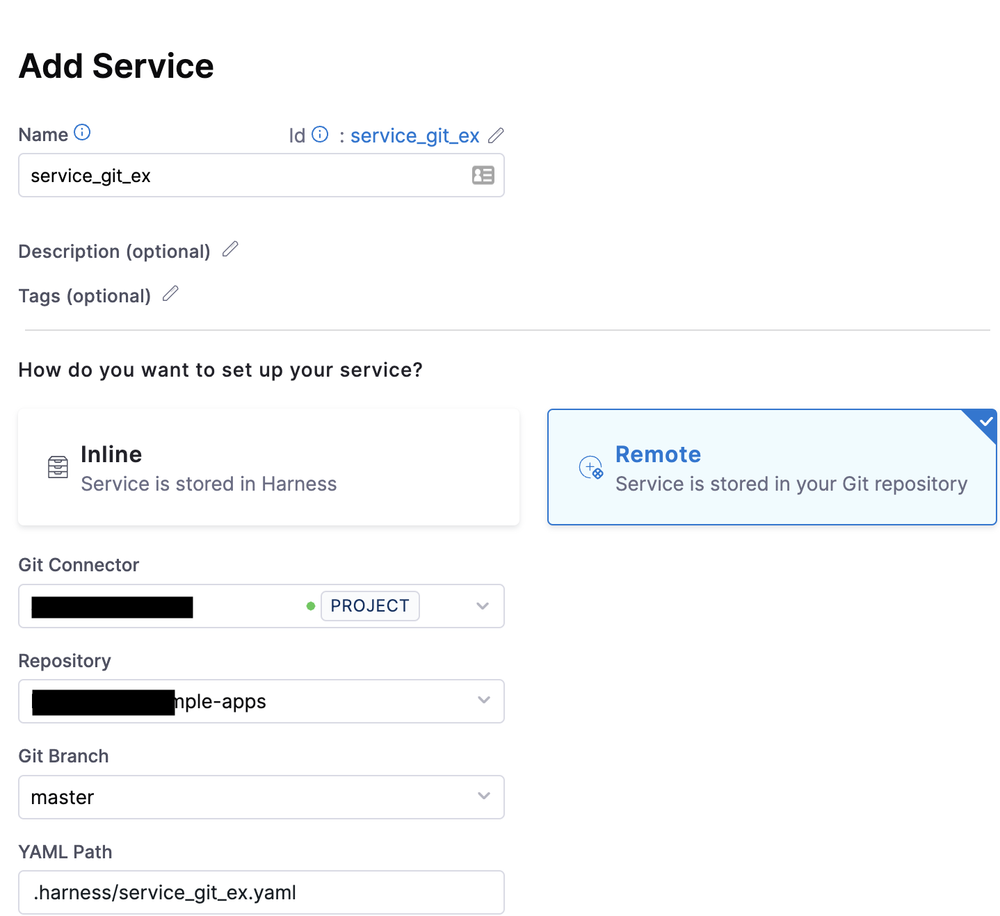
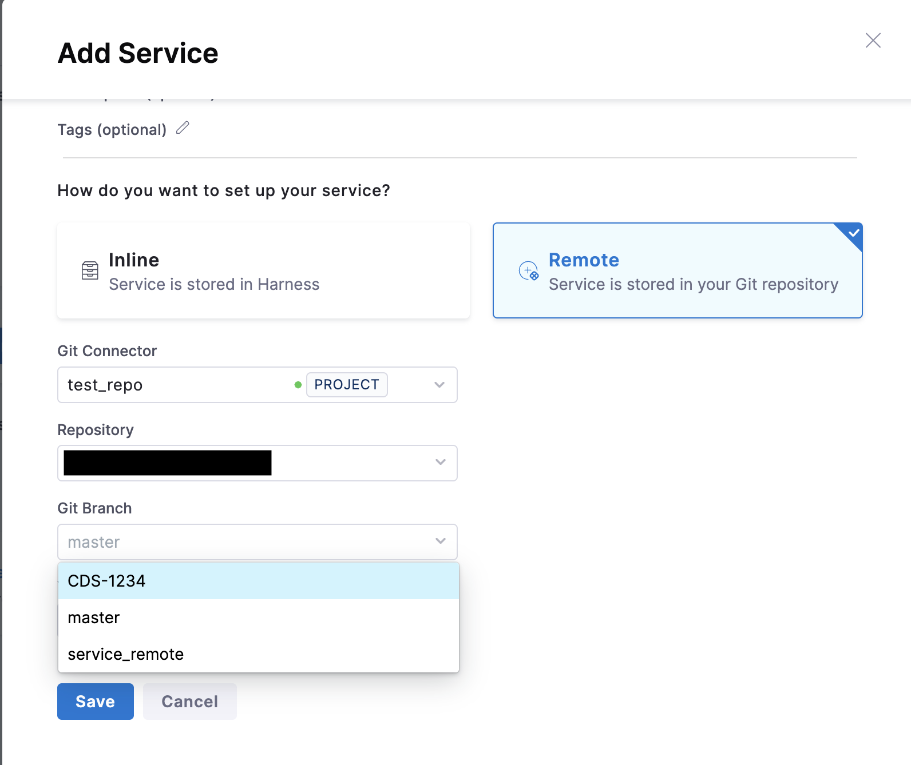
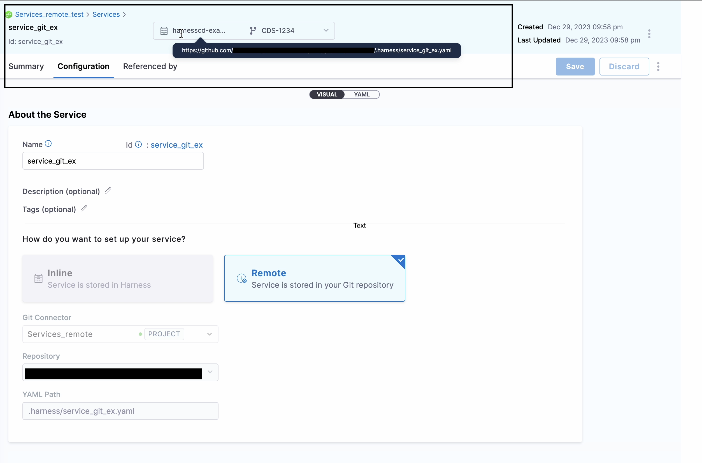
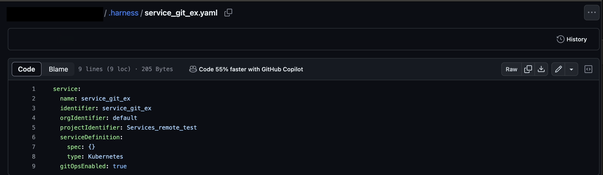
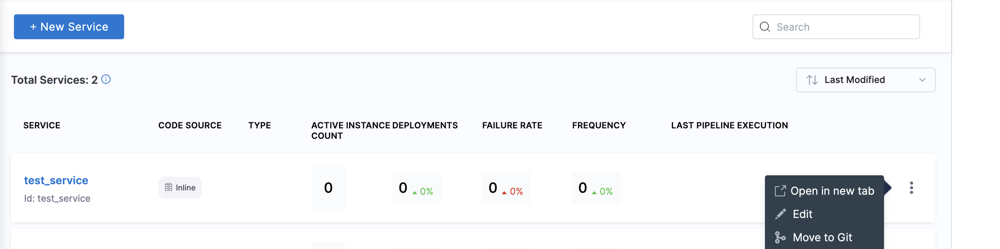

:::info note
Currently, Git Experience support for services is behind the feature flag `CDS_SERVICE_GITX`. Contact [Harness Support](mailto:support@harness.io) to enable the feature.
:::

When you create a new Harness service, you can store the service in one of the following ways:

* Inline: Harness stores the service in its platform.
* Remote: the Harness service is stored in Git.

You can set the service as Inline or Remote when the service is created, and then change the service storage method after it is created. Changing the storage method is described in this topic.

The topic explains how to use the Remote option to store your services in your Git platform account.

## Before you begin

* Ensure you have a Git repo with at least one branch.​
* Ensure you have a set up a [Harness Git connector](/docs/platform/connectors/code-repositories/connect-to-code-repo) with a Personal Access Token (PAT) for your Git account.​

## Visual summary

Here's a quick video of how you can manage services, environments, and infrastructure definitions through Git Experience.

<!-- Video:
https://www.youtube.com/watch?v=ZvtyLxmtHTo-->
<DocVideo src="https://www.youtube.com/watch?v=ZvtyLxmtHTo" />

## Create a remote service

You can create a service at the Harness account, organization, or project level. This topic explains the steps to create a service at the project level. The process is the same for the other levels.

To store a new service in a remote Git repo, do the following:

1. In your Harness account, go to a project.
2. In **Project Settings**, select **Services**. To learn more about creating services, go to [Create Services](docs/continuous-delivery/x-platform-cd-features/services/create-services.md).
3. Select **New Service**. The **Add Service** settings appear.
    
    
   
5. In **Name**, enter a name for the service.
6. In **How do you want to set up your service**, select **Remote**.
7. In **Git Connector**, select or create a Harness Git connector to the repo where you will store the service.​ For more information, go to [Code Repo Connectors](/docs/category/code-repo-connectors).
8. In **Repository**, select a repository. If your repository isn't listed, enter its name. Create the repository in Git before entering it in **Select Repository**. Harness does not create the repository for you.
9. In **Git Branch**, select a branch. If your branch isn't listed, enter its name. Create the branch in your repository before entering it in **Git Branch**. Harness does not create the branch for you. Save the service to the default branch on the first save. You can then create different branches in the Harness repo if you want to create different versions of your service.
    
    
    
    Harness Git Experience auto-populates the **YAML Path**. You can change this path and the file name.
   
11. Select **Save**. You can see the repo details in the new service.

    
    
13. Click the YAML path to view your service YAML file in your Git repo.

    

## Add remote services to a pipeline

Once the remote Harness service is created, you can use it in your CD pipeline. You can add a remote service to a pipeline regardless of whether the pipeline is inline or remote.

The **Deployment Type** of the remote service (Kubernetes, ECS, etc.) must match the **Deployment Type** of the stage where you are adding the service.
 
To add a remote service to a pipeline, do the following:

1. In your pipeline, go to the CD stage **Service** settings.

    
   
3. In **Select Service**, select the remote service.
4. Select the branch for the version of the service you want to use in your pipeline.

    
   
6. Select **Apply Selected**.

:::note

1. When the remote Service is linked to the pipeline , branch of the Service gets displayed as `__DEFAULT__`.
`__DEFAULT__` resolves to same branch as pipeline, when both the service and pipeline where it is linked are in the same repository or the main branch of the repository where the Service resides when it is different.
2. When a remote stage template containing Remote service is linked in a Remote Pipeline, the Stage template branch is defaulted when both entities are in the same repository. If the service is in a different repository, that repository is taken. For more information, go to [create a remote stage template](/docs/platform/templates/create-a-remote-stage-template.md).

:::

## Change an inline service to a remote service

You change a service stored from **Inline** to **Remote** and save it in a Git account. 

1. Select **Services**.
2. Select **More Options** (&vellip;). 
3. Select **Move to Git**.

The same settings used when creating a remote service appear. Configure the settings just as you would for a new remote service.

 
