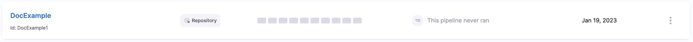

You can move your inline pipelines and input sets to Git. 

Moving inline entities like pipelines to a Git repository can provide several benefits, including:

- Version control: By storing the pipelines in a Git repository, you can easily track changes and roll back if necessary.
  
- Collaboration: Multiple people can work on pipelines at the same time. This makes it easy to review and merge changes.
  
- Reusability: You can pull the pipelines from the Git repository and use it in different projects or environments.
  
- Compliance: Storing pipelines in a Git repository can help with compliance and auditing.
  
- Flexibility: The pipelines can be run from different environments by using a CI/CD pipeline.
  
- Security: Only authorized users can access them.

:::caution
When you move an inline pipeline to Git, the pipeline's associated entities aren't automatically moved to a Git repository. You must also move the corresponding input sets to the remote repository.

If your pipeline has a trigger, you must modify the YAML of the trigger to add a new field `pipelineBranchName`. This will ensure that your trigger works seamlessly with your pipeline.

Following is an example of a sample YAML for a trigger: 

```yaml
trigger:
  name: sample trigger
  identifier: sample_trigger
  enabled: true
  orgIdentifier: sampleOrg
  projectIdentifier: sampleProject
  pipelineIdentifier: samplePipeline
  source:
    type: Webhook
    pollInterval: "0"
    spec:
      type: Github
      spec:
        type: PullRequest
        spec:
          connectorRef: sample_connector
          autoAbortPreviousExecutions: false
          repoName: sampleRepo
          actions:
            - Close
  pipelineBranchName: <+trigger.branch>
  inputSetRefs:
    - sampleinputset
```
:::


This section explains steps to move an [inline pipeline](../pipelines/add-a-stage.md#step-1-create-a-pipeline) and its associated input sets to Git.


1. In app.harness.io, go to your project.
2. Select **Pipelines**. 
3. Select **Move to Git** next to the inline pipeline you want to move to Git.
   
   

4. The **Move Pipeline to Git** dialog opens.
   
   

5. In **Git Connector**, select or create a Git Connector to the repo for your Project. For more information, see [Code Repo Connectors](../connectors/Code-Repositories/connect-to-code-repo.md).
   
   <details>
   <summary> IMPORTANT </summary>

   Connector must use the Enable API access option and Token
   The Connector must use the Enable API access option and Username and Token authentication. Harness requires the token for API access. Generate the token in your account on the Git provider and add it to Harness as a Secret. Next, use the token in the credentials for the Git Connector.​

    

   For GitHub, the token must have the following scopes: 

   

   </details>
   
6. In **Repository**, select your repository. There are only a few repositories listed here, so if yours isn't listed, enter its name.
   
   :::note
   Create the repository in Git before entering it in **Select Repository**. Harness does not create the repository for you.
   :::
   
7. In **Git Branch**, select your branch. If your branch isn't listed, enter its name since only a select few branches are filled here.
   
   :::note
   Create the branch in your repository before entering it in **Git Branch**. Harness does not create the branch for you. 
   :::
    
8.  Harness pre-populates the YAML Path. You can change this path and the file name.
    
9.  Enter a message in **Commit Message**.

10. Select **Move to Git**.
    
    Your pipeline now appears in the list as a remote entity with the repository details next to it.

    
    