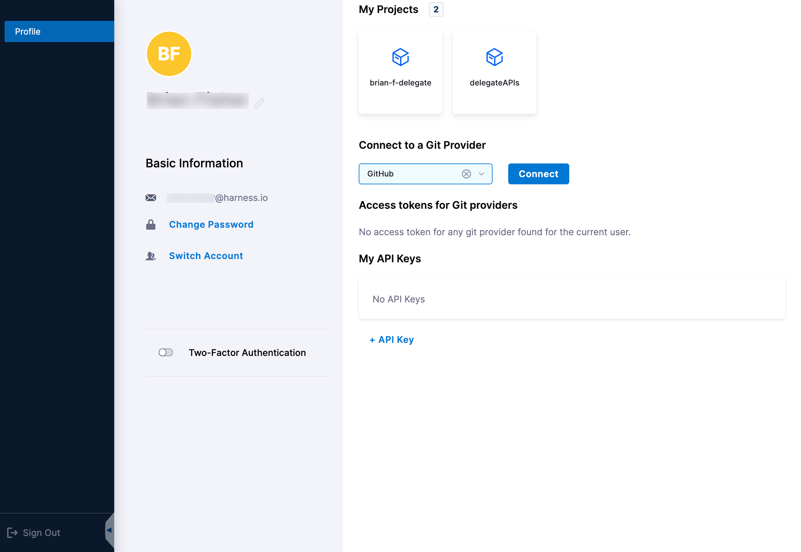
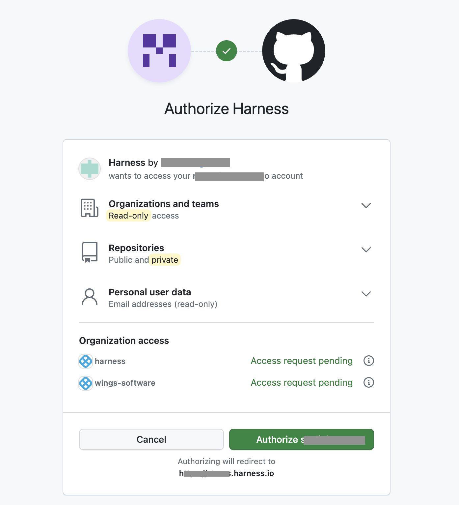
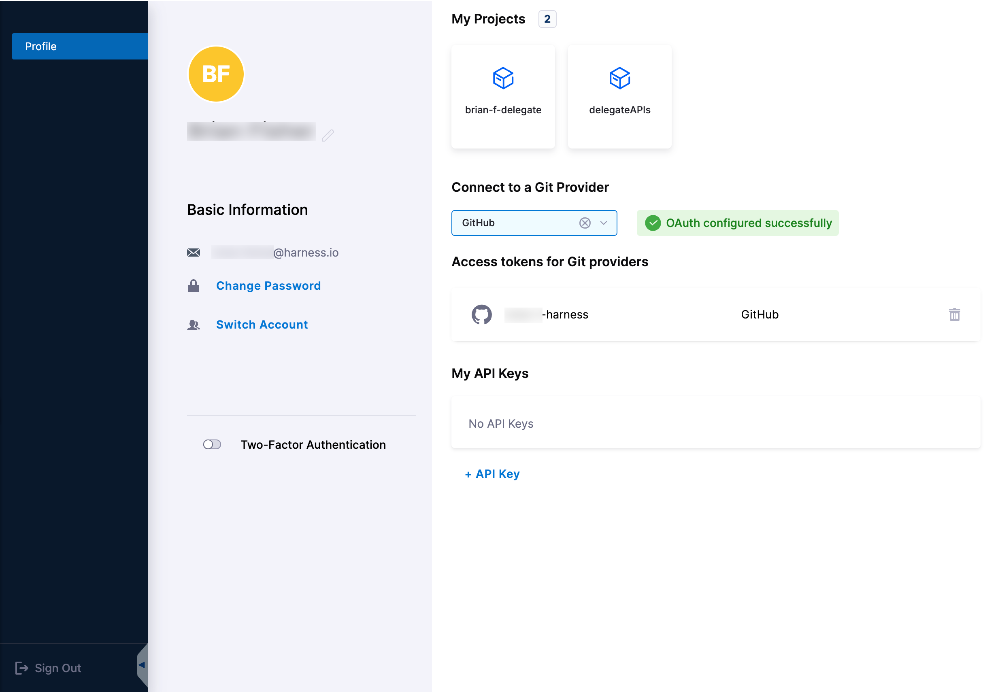
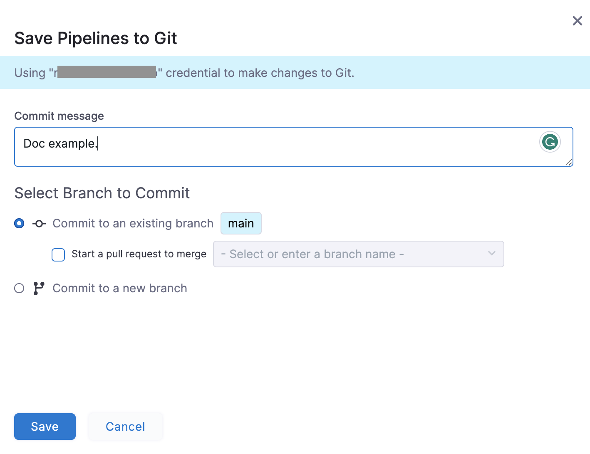
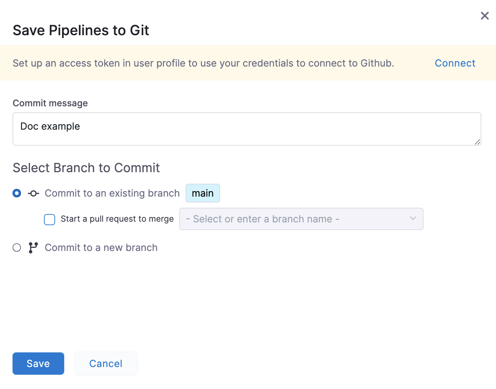

You can store configurations for your resources, such as pipelines and input sets, in Git using Harness Git Experience. Harness fetches user credentials from the Harness account and uses the corresponding user name as the author of the commit.

You can push configuration changes using your own credentials by integrating OAuth with Git. 
When you integrate OAuth with Git Experience, the credentials are stored in your Harness account user profile. These credentials are used for any subsequent commits.

:::important
Harness will continue to use the user name corresponding to the account if you don't integrate OAuth with Git Experience.
:::

This topic explains how to configure OAuth for Git Experience in Harness.

## Configure OAuth for Git provider

Harness supports OAuth integration for the following Git providers: 
* GitHub
* GitLab
* Bitbucket SaaS

:::info note
Harness does not support OAuth integration for Azure repos. Additionally, please note that we don't support OAuth for On-prem GIT systems.
:::
This topic explains how to configure OAuth for GitHub.

To configure your credentials for Git: 

1. Go to your user profile in Harness.
2. In **Connect to a Git Provider**, select **GitHub**.

   

3. Select **Connect**.
   The OAuth settings for the selected Git provider appear.

   

4. Select **Authorize**.
   Harness fetches the corresponding OAuth token associated with the Git provider and displays it under **Access token for Git providers**.

   

:::info note
You can delete access tokens you no longer need. Under **Access tokens for Git providers**, select the trash can icon that corresponds to the Git provider token you want to delete. A confirmation message appears, asking if you want to delete the SCM. After you confirm, Harness removes the configuration.
:::

## Commit changes to Git with the configured OAuth token

To commit changes to Git using the configured OAuth token: 

1. Go to an existing remote pipeline or [create](./configure-git-experience-for-harness-entities.md#add-a-remote-pipeline) a new one.
2. Edit the pipeline and select **Save**.
   The **Save Pipelines to Git** settings appear. Harness displays the user name being used for this commit.

   

3. Select **Save**.

   :::important
   If you have not configured OAuth for Git, Harness prompts you to set up an access token in the user profile to use for Git commits.
   You can do one of the following to commit your changes to Git: 
   * Select **Connect** to configure OAuth for Git and use your Git credentials for the commit, and then select **Save**. This is optional.
   * Select **Save** to use the credentials from the Git connector for the commit.

   

4. Go to your branch in the Git repository. It now displays the author details beside the commit.
   
:::info note
We currently do not support OAuth authentication for Git providers that use vanity URLs.
:::

## Generating an OAuth Access Token with VanityURLs as the Host

Harness supports the creation of OAuth Access Tokens when users are using VanityURLs as the host. This functionality is currently available for **GitHub** and **Gitlab**. 

### Github

In case of [Github](https://docs.github.com/en/apps/oauth-apps/building-oauth-apps/authorizing-oauth-apps#redirect-urls), customers can follow the steps outlined in [Configuring OAuth for Git provider](#configure-oauth-for-git-provider), and Harness will automatically update configurations.

### Gitlab

For [GitLab](https://docs.gitlab.com/ee/integration/oauth_provider.html#adding-an-application), customers need to ensure that their Vanity URL is added to the OAuth application's redirect URI list. The OAuth application is set up by Harness, so customers will need to contact [Harness Support](mailto:support@harness.io) to complete this process. They must provide their subdomain to have the Vanity URL whitelisted.

Example: If your subdomain is `yourcompany.harness.io`, the redirect URI would be:

`https://yourcompany.harness.io/gateway/api/secret/oauth2/gitlab`

### Supported Vanity URL Format
Currently, Harness supports vanity URLs in the format `https://<YOUR_SUBDOMAIN>.harness.io`.
Invalid combinations include:

1. `https://<YOUR_SUBDOMAIN_1>.<YOUR_SUBDOMAIN_2>.harness.io`
2. `https://app.harness.io/<YOUR_SUBDOMAIN>`

