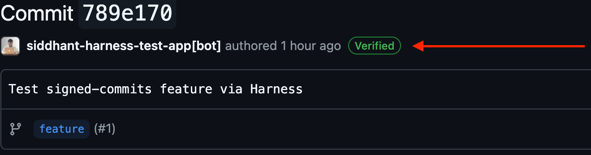
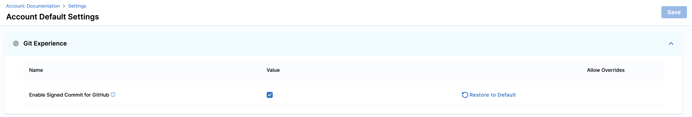
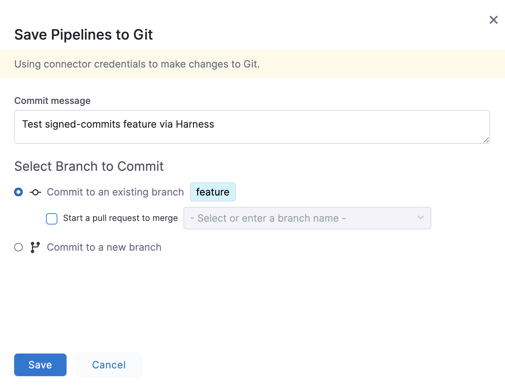
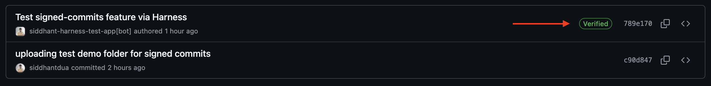

Git Experience supports signed commits when committing changes to your GitHub repo using Harness.
Signed commits add a layer of trust and security to your commits. They prove that a commit was genuinely created via Harness, and that the code changes have not been tampered with since.

:::info Note

In order to utilize signed commits, you need to have a GitHub App based connector configured in your Harness account. If you don't have a GitHub App based GitHub connector configured, you can follow the steps to understand how to [Use a GitHub App in a GitHub connector](/docs/platform/connectors/code-repositories/git-hub-app-support/).

:::

### Enable Signed Commits for your Account

To enable signed commits in Git Experience, Please follow the steps below:  

- Go to **Account Settings** --> **Default Settings** --> **Git Experience** 
- Check **Enable Signed Commit for GitHub** option.
- Click on Save.

Once you have enabled signed commits for your account, you can start committing pipeline changes to your GitHub repo with signed commits.

### Utilize Signed Commits 

In the Pipeline Studio, when you make a change in your pipeline and click **Save**, the changes are committed to your GitHub repo with a signed commit.

The signed commit will be visible in your GitHub Repo with a **Verified** tag as opposed to a commit which is not signed. 

