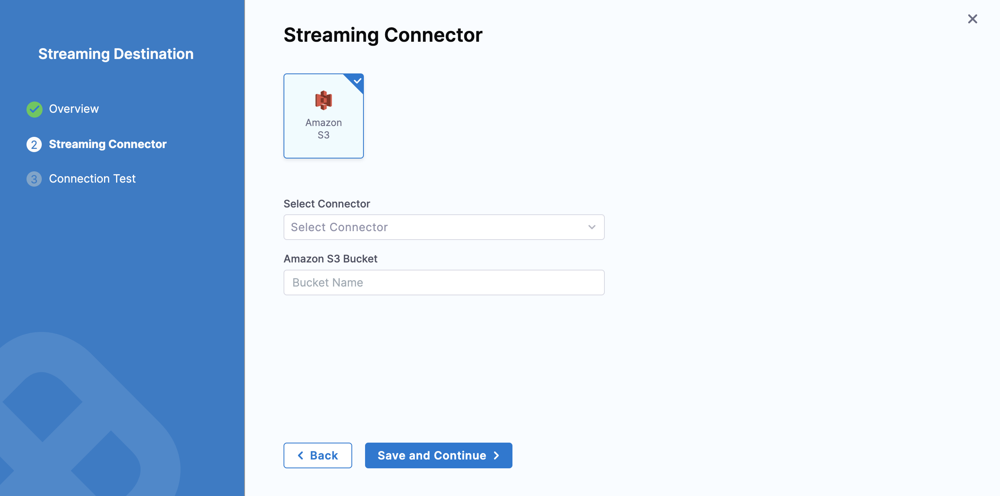

import Tabs from '@theme/Tabs';
import TabItem from '@theme/TabItem';

You can configure a streaming destination in Harness to send audit log data to another location for processing. Integrating audit data with other Security Incident and Event Management (SIEM) tools lets you do the following:

- Trigger alerts for specific events.

- Create views of audit data.

- Perform anomaly detection.

- Store more than 2 years audit data, which is the maximum amount of data that Harness keeps for your accounts.

- Keep your resources and data protected, and ensure compliance with regulations.

Harness streams the audit events to your chosen SIEM tool as structured JSON.

## Important notes about streaming

- Streaming destinations receive all audit event data, which could include sensitive information. Make sure you trust the streaming destination.
- Harness supports streaming to Amazon S3.
- You can add multiple streaming destinations in Harness.

## Add a streaming destination

You can add a streaming destination at the Account or Org scope. This topic explains how to add a streaming destination at the account scope.

To add a streaming destination:

1. In your Harness account, select **Account Settings**.

2. Under **Security and Governance**, select **Audit Trail**. The Account Audit Trail page opens.

   

3. Select **Audit Log Streaming**, then select **New Streaming Destination** to open the configuration settings.

4. Enter a name for the streaming destination. Harness populates the destination's Id automatically. You can retain or change the Id.

5. (Optional) Enter a description and tag(s) for the streaming destination.

6. Select **Continue**.

## Configure the streaming connector

After you add your streaming destination, you're ready to configure the streaming connector.

<Tabs>
<TabItem value="S3" label="Amazon S3" default>

To configure the Amazon S3 streaming connector:

1. Follow the steps above to [Add a streaming destination](#add-a-streaming-destination).

2. Select **Amazon S3**.

3. In **Select Connector**, select an existing AWS Cloud Provider connector or create a new one.

   You must use the **Connect through a Harness Delegate** connectivity mode option when you set up your AWS Cloud Provider connector. Audit streaming does not support the **Connect through Harness Platform** connector option.

   Go to [Add an AWS connector](../../connectors/cloud-providers/add-aws-connector.md) for steps to create a new AWS Cloud Provider connector.

4. Select **Apply Selected**.

5. In **Amazon S3 Bucket**, enter the bucket name.

   Harness writes all the streaming records to this destination.

   

6. Select **Save** and **Continue**.

7. After the connection test is successful, select **Finish**.

   The streaming destination gets configured and appears in the list of destinations under **Audit Log Streaming**. By default the destination is inactive.

</TabItem>

<TabItem value="Splunk" label="Splunk">

:::note

Currently, this feature is behind the feature flag `PL_AUDIT_STREAMING_USING_SPLUNK_HEC_ENABLE` and requires Harness Delegate version 82500 or later. Contact [Harness Support](mailto:support@harness.io) to enable the feature.

:::

:::info
Splunk audit log streaming is compatible with Splunk enterprise and SaaS.
:::

To configure the Splunk streaming connector:

1. Follow the steps above to [Add a streaming destination](#add-a-streaming-destination).

2. Select **Splunk**.

3. In **Select Connector**, select an existing Splunk connector or create a new one.

   :::important
   When you set up your Splunk connector, you must:

   - Select HEC Authentication
   - Set up and use your Splunk HEC token.
   - Use the **Connect through a Harness Delegate** connectivity mode option. Audit streaming does not support the **Connect through Harness Platform** connector option.

4. Select **Apply Selected**, then select **Save and Continue**.

5. After the connection test is successful, select **Finish**.

   The streaming destination gets configured and appears in the list of destinations under **Audit Log Streaming**. By default the destination is inactive.

:::info troubleshoot HEC configurations
At times, you might experience issues with the HEC connector. Here are some troubleshooting steps you can take to resolve common issues.

- You should set HEC connectors without a declared `SourceType`. Although the data will be JSON-formatted, it is not declared as such. Setting a `SourceType` as `JSON` might filter data from the stream.

   

- Harness utilizes the following [standard endpoints](https://docs.splunk.com/Documentation/Splunk/9.2.1/Data/HECRESTendpoints) and appends them automatically to the customer's URL. They are not customizable.
   - `/services/collector/event`
   - `/services/collector/health`
   - `/services/server/info`
:::
</TabItem>
</Tabs>

## Activate or deactivate streaming

1. To activate streaming to this destination, toggle the status to **Active** besides the streaming destination.

   Harness starts writing audit logs after the destination is activated.

   Harness streams audit logs to the destination every 30 minutes.

2. You can pause audit streaming, preventing any new audit events from being streamed to the configured endpoint by setting the status to **Inactive**.

   When you reactivate the streaming destination, Harness starts streaming the audit logs from the point where it was paused.

## Update audit stream

You can change the audit stream configuration by clicking three dots beside the stream destination. This opens a pop-up menu with the following options:

- **Edit:** Select a different streaming destination or make changes to the existing destination.

- **Delete:** Delete the audit stream destination. You must set the audit stream destination to inactive before you can delete it.

   

## Amazon S3 audit file details

Here is an example of an audit stream file in one of the Amazon S3 buckets.


This file has a list of audit events in JSON format.

Following are the key points about the naming convention of the audit stream file:

- There are three timestamps in the file name: `<t1>_<t2>_<t3>`.
- `<t1>` and `<t2>` indicate the time range of audit events in the file. This time range is provided for information only and is not always accurate. The timestamp can also be out of range if there is a delay in capturing the event.
- `<t3>` indicates the time when the file was written.

:::important
Harness recommends not building any business logic based on the file name.
:::

## Payload schema

Streamed audit events have a predictable schema in the body of the response.

|**Field**       |  **Description**     |   **Is required**    |
|  ---  |  ---  |  ---  |
|   auditEventId    |  Unique ID for the audit event.     |   Required    |
|   auditEventAuthor    |  [Principal](/docs/platform/role-based-access-control/rbac-in-harness#rbac-components) attached with audit event.    |   Required    |
|    auditModule   | Module for which the audit event is generated.      |   Required    |
|   auditResource    |  Resource audited.     |  Required     |
|   auditResourceScope    |  [Scope](/docs/platform/role-based-access-control/rbac-in-harness#permissions-hierarchy-scopes) of the audited resource.     |   Required    |
|  auditAction     |  Action on the audited resource.     |  Required     |
|    auditEventTime   |  Date and time of the event.     | Required      |
|   auditHttpRequestInfo    |  Details of the HTTP request.     |  Optional     |

### JSON payload

```json
{
  "$schema": "http://json-schema.org/draft-04/schema#",
  "type": "object",
  "properties": {
    "auditEventId": {
      "type": "string"
      "description":"Unique ID for each audit event"
    },
    "auditEventAuthor": {
      "type": "object",
      "properties": {
        "principal": {
          "type": "object",
          "properties": {
            "type": {
              "type": "string"
            },
            "identifier": {
              "type": "string"
            },
            "email": {
              "type": "string"
            }
          },
          "required": [
            "type",
            "identifier",
          ]
        }
      },
      "required": [
        "principal"
      ]
      "description":"Information about Author of the audit event"
    },
    "auditModule": {
      "type": "string"
      "description":"Information about Module of audit event origin"
    },
    "auditResource": {
      "type": "object",
      "properties": {
        "type": {
          "type": "string"
        },
        "identifier": {
          "type": "string"
        }
      },
      "required": [
        "type",
        "identifier"
      ]
      "description":"Information about resource for which Audit event was generated"
    },
    "auditResourceScope": {
      "type": "object",
      "properties": {
        "accountIdentifier": {
          "type": "string"
        },
        "orgIdentifier": {
          "type": "string"
        },
        "projectIdentifier": {
          "type": "string"
        }
      },
      "required": [
        "accountIdentifier",
      ]
      "description":"Information about scope of the resource in Harness"
    },
    "auditAction": {
      "type": "string"
      "description":"Action CREATE,UPDATE,DELETE,TRIGGERED,ABORTED,FAILED , Not exhaustive list of events"
    },
    "auditHttpRequestInfo": {
      "type": "object",
      "properties": {
        "requestMethod": {
          "type": "string"
        }
        "clientIP": {
          "type": "string"
        }
      },
      "required": [
        "requestMethod",
        "clientIP"
      ]
      "description":"Information about HTTP Request"
    },
    "auditEventTime": {
      "type": "string"
      "description":"Time of auditEvent in milliseconds"
    }
  },
  "required": [
    "auditEventId",
    "auditEventAuthor",
    "auditModule",
    "auditResource",
    "auditResourceScope",
    "auditAction",
    "auditEventTime",
  ]
}
```
