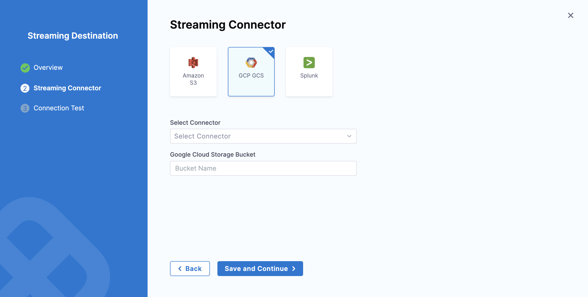
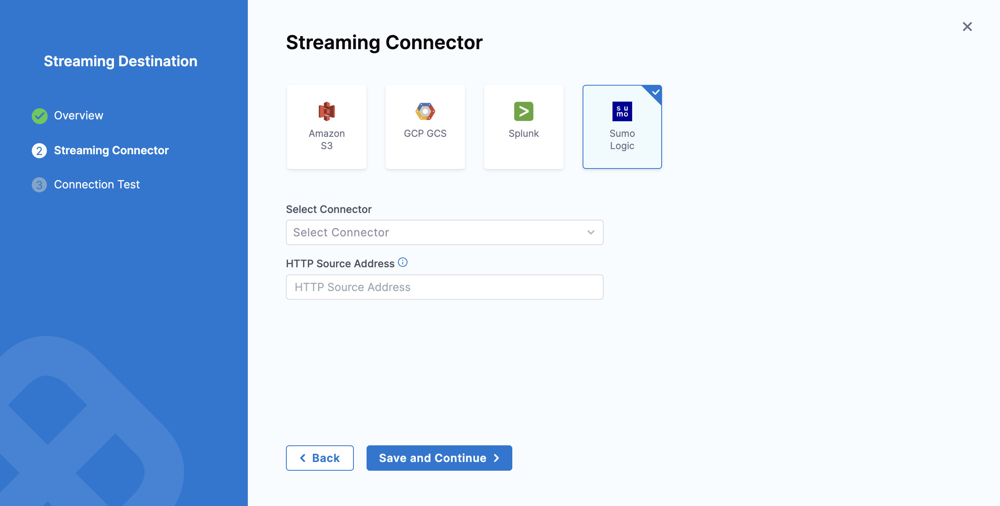
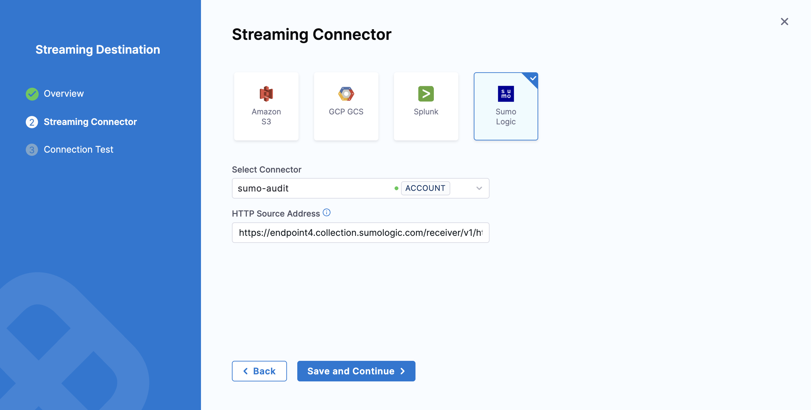

import Tabs from '@theme/Tabs';
import TabItem from '@theme/TabItem';
import SumoPermission from './static/sumo-access-keys-permission.png'
import SumoHTTPSource from './static/sumo-http-url.png'

Audit logs help you track and analyze your system and user events within your Harness account. You can stream these audit logs to external destinations and integrate them with Security Information and Event Management (SIEM) tools to:

- Trigger alerts for specific events
- Create custom views of audit data
- Perform anomaly detection
- Store audit data beyond Harness's 2-year retention limit
- Maintain security compliance and regulatory requirements

:::warning
All audit event data is sent to your streaming destination and may include sensitive information such as user emails, account identifiers, project details, and resource information. Ensure you only configure trusted and secure destinations.
:::

## Add a streaming destination

You can only add streaming destinations at the Account scope. Follow these steps to create a new streaming destination:

<Tabs>
<TabItem value="interactive" label="Interactive">
    <iframe
    src="https://app.tango.us/app/embed/8ac0ca21-8490-472e-bcdf-036c4aebe816"
    style={{ minHeight: '640px', width: '100%' }}
    sandbox="allow-scripts allow-top-navigation-by-user-activation allow-popups allow-same-origin"
    security="restricted"
    title="Apply Branding Changes in Harness"
    referrerPolicy="strict-origin-when-cross-origin"
    frameBorder="0"
    webkitAllowFullScreen
    mozAllowFullScreen
    allowFullScreen
    />
</TabItem>
<TabItem value="manual" label="Manual">

1. In your Harness account, select **Account Settings**.

2. Navigate to **Security and Governance** > **Audit Trail** > **Audit Log Streaming**.

3. Select **New Streaming Destination** to open the configuration settings.

4. Enter a name for the streaming destination.

5. (Optional) Enter a description and tag(s) for the streaming destination.

6. Select **Continue** to proceed.
</TabItem>
</Tabs>

## Configure the streaming connector

Once a streaming destination is added, you're ready to configure the streaming connector. For object storage services(AWS S3 and GCP GCS), you can choose to stream audit events in either JSON and NDJSON formats.

<Tabs>
<TabItem value="S3" label="Amazon S3" default>

To configure the Amazon S3 streaming connector:

1. Select **Amazon S3**.

2. In **Select Connector**, select an existing AWS Cloud Provider connector or create a new one.

   You must use the **Connect through a Harness Delegate** connectivity mode option when you set up your AWS Cloud Provider connector. Audit streaming does not support the **Connect through Harness Platform** connector option.

   Go to [Add an AWS connector](../../connectors/cloud-providers/add-aws-connector.md) for steps to create a new AWS Cloud Provider connector.

3. Select **Apply Selected**.

4. Select the **Format** of the data — either [JSON or NDJSON](#example-audit-event).

    :::note
    [NDJSON](https://en.wikipedia.org/wiki/JSON_streaming#Newline-delimited_JSON) format is supported in Harness Delegate version 25.10.87100 or later. 
    :::

    

5. In **Amazon S3 Bucket**, enter the bucket name.

   Harness writes all the streaming records to this destination.

   

6. Select **Save** and **Continue**.

7. After the connection test is successful, select **Finish**.

   The streaming destination gets configured and appears in the list of destinations under **Audit Log Streaming**. By default the destination is inactive.

  **Amazon S3 audit file details**

  Here is an example of an audit stream file in one of the Amazon S3 buckets.

  

</TabItem>
<TabItem value="GCS" label="GCP GCS" default>

:::note
Currently, this feature is behind the feature flag `PL_GCP_GCS_STREAMING_DESTINATION_ENABLED`. Additionally, if you are using OIDC credentials, you will need the `PL_GCP_OIDC_AUTHENTICATION` feature flag. 

Contact [Harness Support](mailto:support@harness.io) to enable the feature.
:::

To configure the GCP GCS streaming connector:

1. Select **GCP GCS**.

2. In **Select Connector**, select an existing GCP connector or create a new one.

   You can use either to **Connect through a Harness Delegate** or **Connect through Harness Platform** connectivity mode options when setting up your GCP connector. Audit streaming supports both options.

   Go to [Add an GCP connector](../../connectors/cloud-providers/connect-to-google-cloud-platform-gcp.md) for steps to create a new GCP Provider connector.

3. Select **Apply Selected**.

4. Select the **Format** of the data — either [JSON or NDJSON](#example-audit-event).
    
    :::note
    [NDJSON](https://en.wikipedia.org/wiki/JSON_streaming#Newline-delimited_JSON) format is supported in Harness Delegate version 25.11.87200 or later. 
    :::
      
    

5. In **Google Cloud Storage Bucket**, enter the bucket name. Harness writes all the streaming records to this destination.

    

6. Select **Save** and **Continue**.

7. After the connection test is successful, select **Finish**.

   The streaming destination gets configured and appears in the list of destinations under **Audit Log Streaming**. By default the destination is inactive.

</TabItem>
<TabItem value="Splunk" label="Splunk">

:::note
Currently, this feature is behind the feature flag `PL_AUDIT_STREAMING_USING_SPLUNK_HEC_ENABLE` and requires Harness Delegate version 82500 or later. Contact [Harness Support](mailto:support@harness.io) to enable the feature.
:::

:::info
Splunk audit log streaming is compatible with Splunk enterprise and SaaS.
:::

To configure the Splunk streaming connector:

1. Select **Splunk**.

2. In **Select Connector**, select an existing Splunk connector or create a new one.

   :::important
   When you set up your Splunk connector, you must:

   - Select HEC Authentication
   - Set up and use your Splunk HEC token.
   - Use the **Connect through a Harness Delegate** connectivity mode option. Audit streaming does not support the **Connect through Harness Platform** connector option.

3. Select **Apply Selected**, then select **Save and Continue**.

4. Select the **Format** of the data — either JSON or NDJSON.

5. After the connection test is successful, select **Finish**.

   The streaming destination gets configured and appears in the list of destinations under **Audit Log Streaming**. By default the destination is inactive.

:::info troubleshoot HEC configurations
At times, you might experience issues with the HEC connector. Here are some troubleshooting steps you can take to resolve common issues.

- You should set HEC connectors without a declared `SourceType`. Although the data will be JSON-formatted, it is not declared as such. Setting a `SourceType` as `JSON` might filter data from the stream.

   

- Harness utilizes the following [standard endpoints](https://docs.splunk.com/Documentation/Splunk/9.2.1/Data/HECRESTendpoints) and appends them automatically to the customer's URL. They are not customizable.
   - `/services/collector/event`
   - `/services/collector/health`
   - `/services/server/info`
:::
</TabItem>

<TabItem value="sumo-logic" label="Sumo Logic">

  :::note
  Currently, this feature is behind the feature flag `PL_ENABLE_SUMOLOGIC_AUDIT_STREAMING` and requires Harness Delegate version 85500 or later. Contact [Harness Support](mailto:support@harness.io) to enable the feature.
  :::

  :::info Important note
  Starting with Harness Delegate version 25.10.87100, each audit event is streamed as a separate log line in Sumo Logic.
  <details>
  <summary>Example event streamed to Sumo Logic</summary>
  ```json
    {
    "event": "Harness-Audit-Event-68ffa287f277183fb388a560",
    "fields": {
      "auditResource.identifier": "string",
      "auditResourceScope.accountIdentifier": "string",
      "auditEventAuthor.principal.type": "string",
      "auditEventAuthor.principal.identifier": "string",
      "auditAction": "string",
      "auditEventMetadata.batchId": "string",
      "auditHttpRequestInfo.requestMethod": "string",
      "auditResource.type": "string",
      "auditModule": "string",
      "auditEventId": "string",
      "auditEventTime": "number",
      "auditEventAuthor.principal.email": "string",
      "auditHttpRequestInfo.clientIP": "string"
      }
    } 
  ```
  </details>
  :::

  :::info **Prerequisites**

    1. Sumo Logic's [Access ID and Access Key](https://help.sumologic.com/docs/manage/security/access-keys/). An Access Key can have two scope types: [Default and Custom](https://help.sumologic.com/docs/manage/security/access-keys/#create-an-access-key). If selecting Custom, ensure you enable the permissions shown in the image below. 
        

    2. [HTTP Source Address](https://help.sumologic.com/docs/send-data/hosted-collectors/http-source/) to receive logs.
  :::

  To configure Sumo Logic as a New Streaming Destination:

  1. Select **Sumo Logic**.
  
  2. In **Select Connector**, select an existing connector or create a new one. For now, let's add a new connector.  

        
            
      - Click New Connector → Add a name, description, and tags accordingly.

      - Add the Sumo Logic API server URL. To know your Sumo Logic API Endpoint refer [Sumo Logic documentation ](https://help.sumologic.com/docs/api/getting-started/#sumo-logic-endpoints-by-deployment-and-firewall-security) 
            
      - Add Sumo Logic Access ID and Access Key. You can either [add new secrets](https://developer.harness.io/docs/platform/secrets/add-use-text-secrets/) or use existing ones. For now, we have used the existing secrets as shown in the GIF below.

      - Complete the Delegate setup → Save and Continue.

        

      - Verify the connection and click Finish to complete the setup. 

  3. Add the HTTP Source Address. Click Save and Continue to proceed.
          
       

  4. Verify the connection and click on Finish.

    :::warning Troubleshoot a Sumo Logic Streaming destination
      
      - Verify that the correct HTTP Source Address is provided. If an incorrect address is entered, logs will not be streamed, and an error will appear in the Harness UI.

      - Ensure that the access keys are valid and have the required permissions. If an invalid Access ID or Access Key is provided, or if the key does not have the required permissions, Sumo Logic will not generate an error message, and you will not see any error shown in the Harness UI.
    :::

</TabItem>

</Tabs>

## Activate or deactivate streaming

1. To start streaming to this destination, toggle the status to Active. Audit logs will begin writing once the destination is activated and are streamed every 30 minutes.

2. You can pause audit streaming, preventing any new audit events from being streamed to the configured endpoint by setting the status to **Inactive**.

   When you reactivate the streaming destination, Harness starts streaming the audit logs from the point where it was paused.

## Update audit stream

You can change the audit stream configuration by clicking three dots beside the stream destination. This opens a pop-up menu with the following options:

- **Edit:** Select a different streaming destination or make changes to the existing destination.

- **Delete:** Delete the audit stream destination. You must set the audit stream destination to inactive before you can delete it.

   

## Payload schema

Streamed audit events have a predictable schema in the body of the response.

|**Field**       |  **Description**     |   **Is required**    |
|  ---  |  ---  |  ---  |
|   auditEventId    |  Unique ID for the audit event.     |   Required    |
|   auditEventAuthor    |  [Principal](/docs/platform/role-based-access-control/rbac-in-harness#rbac-components) attached with audit event.    |   Required    |
|    auditModule   | Module for which the audit event is generated.      |   Required    |
|   auditResource    |  Resource audited.     |  Required     |
|   auditResourceScope    |  [Scope](/docs/platform/role-based-access-control/rbac-in-harness#permissions-hierarchy-scopes) of the audited resource.     |   Required    |
|  auditAction     |  Action on the audited resource.     |  Required     |
|    auditEventTime   |  Date and time of the event.     | Required      |
|   auditHttpRequestInfo    |  Details of the HTTP request.     |  Optional     |


### Example audit event

This file contains a list of audit events in JSON format. Key points about the audit stream file naming convention:

- The file name includes three timestamps: `<t1>_<t2>_<t3>`.
- `<t1>` and `<t2>` indicate the time range of the audit events in the file. This range is provided for reference only and may not always be accurate. Timestamps can also be out of range if there is a delay in capturing events.
- `<t3>` represents the time when the file was written.

<Tabs>
<TabItem value="JSON" label="JSON" default>

In JSON format, an array of object is streamed per batch. Each object in the array represents an audit event.

```json
{
  "$schema": "http://json-schema.org/draft-04/schema#",
  "type": "object",
  "properties": {
    "auditEventId": {
      "type": "string"
      "description":"Unique ID for each audit event"
    },
    "auditEventAuthor": {
      "type": "object",
      "properties": {
        "principal": {
          "type": "object",
          "properties": {
            "type": {
              "type": "string"
            },
            "identifier": {
              "type": "string"
            },
            "email": {
              "type": "string"
            }
          },
          "required": [
            "type",
            "identifier",
          ]
        }
      },
      "required": [
        "principal"
      ]
      "description":"Information about Author of the audit event"
    },
    "auditModule": {
      "type": "string"
      "description":"Information about Module of audit event origin"
    },
    "auditResource": {
      "type": "object",
      "properties": {
        "type": {
          "type": "string"
        },
        "identifier": {
          "type": "string"
        }
      },
      "required": [
        "type",
        "identifier"
      ]
      "description":"Information about resource for which Audit event was generated"
    },
    "auditResourceScope": {
      "type": "object",
      "properties": {
        "accountIdentifier": {
          "type": "string"
        },
        "orgIdentifier": {
          "type": "string"
        },
        "projectIdentifier": {
          "type": "string"
        }
      },
      "required": [
        "accountIdentifier",
      ]
      "description":"Information about scope of the resource in Harness"
    },
    "auditAction": {
      "type": "string"
      "description":"Action CREATE,UPDATE,DELETE,TRIGGERED,ABORTED,FAILED , Not exhaustive list of events"
    },
    "auditHttpRequestInfo": {
      "type": "object",
      "properties": {
        "requestMethod": {
          "type": "string"
        }
        "clientIP": {
          "type": "string"
        }
      },
      "required": [
        "requestMethod",
        "clientIP"
      ]
      "description":"Information about HTTP Request"
    },
    "auditEventTime": {
      "type": "string"
      "description":"Time of auditEvent in milliseconds"
    }
  },
  "required": [
    "auditEventId",
    "auditEventAuthor",
    "auditModule",
    "auditResource",
    "auditResourceScope",
    "auditAction",
    "auditEventTime",
  ]
}
```
</TabItem>

<TabItem value="NDJSON" label="NDJSON" default>

In NDJSON format, each audit event is streamed as a single log line with the following structure:

```json
{
  "auditEventId": "string",
  "auditEventAuthor": {
    "principal": {
      "type": "string",
      "identifier": "string"
    }
  },
  "auditModule": "string",
  "auditResource": {
    "type": "string",
    "identifier": "string"
  },
  "auditResourceScope": {
    "accountIdentifier": "string"
  },
  "auditAction": "string",
  "auditHttpRequestInfo": {
    "requestMethod": "string",
    "clientIP": "string"
  },
  "auditEventTime": "number",
  "auditEventMetadata": {
    "batchId": "string"
  }
}

```
</TabItem>
</Tabs>