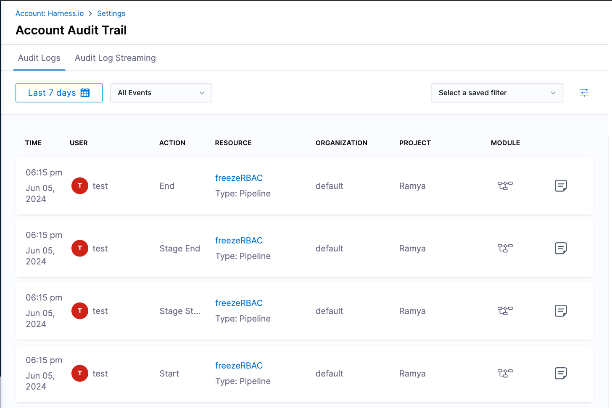
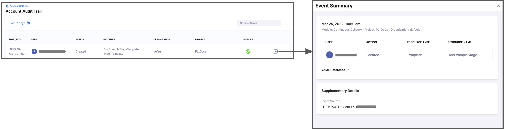
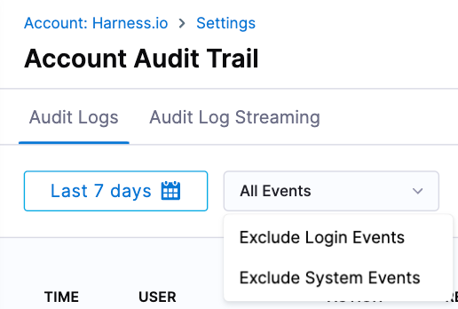
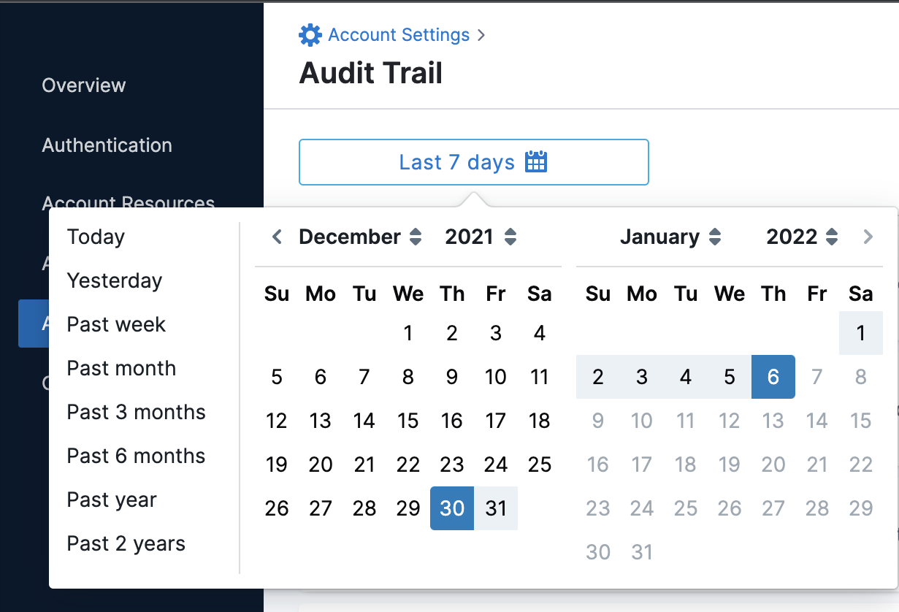
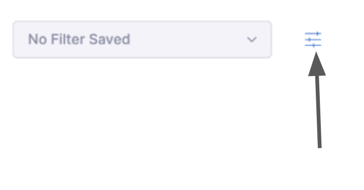
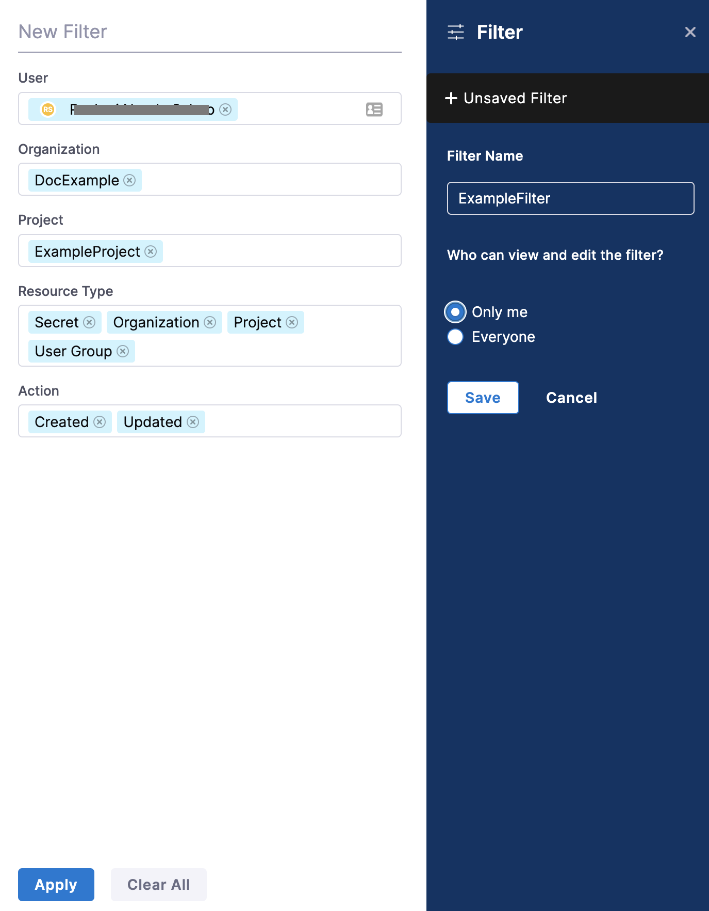
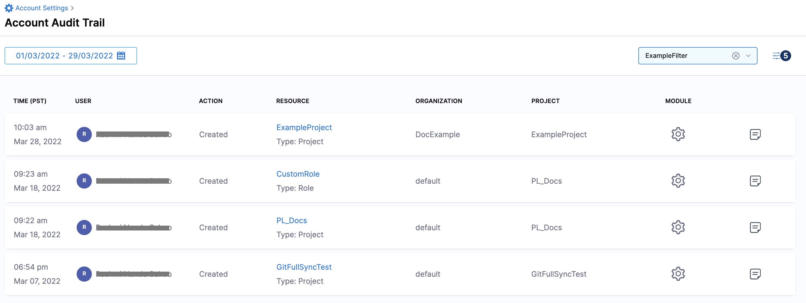

With Audit Trail in Harness, you can view and track changes to your Harness resources within your Harness account.

The audit data retention period is 2 years. Harness reserves the right to delete audit data after 2 years. You can request a longer retention period by contacting Harness. For example, if you require audit data for legal discoveries, contact Harness, and we can help.

This topic shows you how to view audit trails for your Harness account.

### Before you begin

* [Learn Harness' Key Concepts](/docs/platform/get-started/key-concepts.md)
* [RBAC in Harness](/docs/platform/role-based-access-control/rbac-in-harness)

### View an audit trail

You can view audit trail data at the Account or Org scope. This topic explains how to view audit trail data at the account scope.

:::info note
The events in the scope of accounts will not be displayed if you are viewing the audit trail at the Org.
:::

In Harness, go to **Account Settings**, and then select **Audit Trail**.

The **Audit Trail** page opens, displaying a record for each event that changed the setup of your Harness account, modules, or Harness entities. By default, Harness shows audit logs for the previous 7 days.

It might take a few minutes for events to appear on the Audit Trail. Wait a minute and then refresh your browser if you don't notice an event right away.

For each event record, this view shows the:

* Date and time (**Time**).
* The user who made the change (**User**).
* **Action** by the user such as created, updated, deleted, and so on.
* Harness entity affected (**Resource**).
* **Organization** corresponding to the affected entity.
* **Project** corresponding to the affected entity.
* **Module** corresponding to the affected entity.
* **Event Summary** with YAML difference.

   

The **Audit Log Streaming** tab enables you to configure a streaming destination in Harness to send audit log data to another location for processing. For more information, go to [Configure audit streaming](/docs/platform/governance/audit-trail/audit-streaming/).

:::info IMPORTANT

By default, the pipeline execution audit events such as Pipeline Start, Pipeline End, Stage Start, and Stage End are not captured in the Audit Trail. To enable capturing these events, you must enable the `Enable Pipeline Execution Audit Events` setting available under the pipeline category in the account level settings. This setting is only available at the account level.

:::

#### Delegate operations

All delegate operations are recorded under the SYSTEM user. The **Action** column displays actions when a delegate is created, updated, or upserted.

#### Exclude audit trail records

You can view all the records or filter the displayed records by selecting one of the following:

* **Exclude Login Events:** For excluding login events like successful, or unsuccessful logins, 2FA, and so on, from the displayed records.
* **Exclude System Events:** For excluding system events from the displayed records.

These can be applied with or without your [custom filters](#option-add-a-filter) for Audit Trails.

### Set date/time range

You can restrict the Audit Trail's displayed events by date and time.

Use the Date Picker to restrict events to a predefined date range, or to a custom date/time range:

Selecting **Custom Date Range** enables you to set arbitrary limits by date and time of day.

### Add a filter

To add a filter, perform the following steps:

1. In Harness, under **Account Settings**, select **Audit Trail**.
2. In **Account Audit Trail**, click the filter icon.
3. In the **New Filter** settings, select the filters to scope down the viewable audit events.
You can scope down the viewable audit events by adding filters and selecting:

   * User
   * Organization
   * Project
   * Resource Type
   * Resource Identifier
   * Action

   :::info note
   The Resource Identifier operates in conjunction with the Resource Type. It allows you to use the resource identifier to filter audit events related to a specific resource using that identifier.
   :::

4. In **Filter Name**, enter a name for your filter.
5. Under **Who can view and edit the filter?**, select **Only me** or **Everyone** based on the visibility you want to set for this filter.
6. Select **Save**. Your filter is now created.

   

7. Select **Apply** to view the audit events as per the filter you just created.

   

   By default, the events of the last 7 days are returned for the filter. To view more results, you can select the date range accordingly.

   
