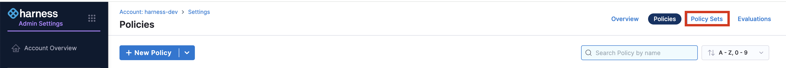
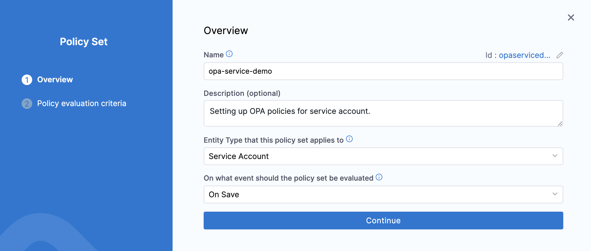

Harness provides governance using Open Policy Agent (OPA), Policy Management, and Rego policies.

You can create a policy and apply it to all [Service Accounts](../../role-based-access-control/add-and-manage-service-account). The policy is evaluated during Service account-level events, such as 'On Save,' which happens when a Service account is created or updated. For more details, check out the [Harness Governance Quickstart](/docs/platform/governance/policy-as-code/harness-governance-quickstart).

### Prerequisites

* [Harness Governance Overview](/docs/platform/governance/policy-as-code/harness-governance-overview)
* [Harness Governance Quickstart](/docs/platform/governance/policy-as-code/harness-governance-quickstart)
* Policies use OPA authoring language Rego. For more information, go to [OPA Policy Authoring](https://academy.styra.com/courses/opa-rego).

### Step 1: Add a Policy

1. In Harness, go to **Account Settings** → **Policies** → **New Policy**.

    

2. The **New Policy** settings will appear.  

    Enter a **Name** for your policy → click **Apply**.

    

3. Next, add your Rego policy. 
    
    For example, add a policy to prevent users from creating a service account with names having "success" in it, like 'pipeline-success' or 'successfuldeploy' and so on.

    ```
    package opaexamplepolicy  

    deny[msg] {
        contains(input.serviceAccount.name, "success")
        #input.serviceAccount.name == "word"
        msg = sprintf("CONTAINS Service account name '%s' contains the forbidden word 'success'.", [input.serviceAccount.name])
    }
    ```
    click **Save**

    

### Step 2: Add the Policy to a Policy Set

After creating your policy, add it to a Policy Set before applying it to your Service Account.

1. In **Policies**, click **Policy Sets** .

    

2. Click **New Policy Set**, Enter a **Name** and **Description** for the Policy Set.

   In **Entity type**, select **Service Account**.

   

   In **On what event should the Policy Set be evaluated**, select **On save.** → **Continue**.

    :::note Important
    
        Existing service accounts are not automatically updated with policies. Policies are applied only when they are created or updated. 
    :::

### Step 3: Select Policy evaluation criteria

1. Click **Add Policy** in **Policy evaluation criteria**.  

   Select the policy from the list. 

    


2. Choose the severity and action for policy violations.
    
    You can select one of the following

    * **Warn & continue** - You will receive a warning if the policy is not met when the Service Account is evaluated, but the Service Account will be saved and you may proceed.
    * **Error and exit** - You'll get an error and be exited without saving the Service Account if the policy isn't met when the Service Account is examined.

    

    Click **Apply**, and then click **Finish**.

### Step 4: Policy Enforcement.

1. Now, your Policy Set is automatically set to Enforced, to make it unenforced, toggle off the **Enforced** button.
    
    

### Step 5: Apply a Policy to a Service Account

- After creating your Policy Set and adding policies, apply it to a service account.

  You can add a [Service Account](/docs/platform/role-based-access-control/add-and-manage-service-account/#create-a-service-account) from any module in your Project in Project setup, or in your Organization, or Account Resources. 

1. "Go to **Account Settings** → **Access Control** → **Service Account**

    click **New Service Account**.  

    Try using a name denied by your policy, e.g., **"successfuldeploy"**."

    Based on your selection in the Policy Evaluation criteria, you will either receive a warning or an error.

    

### Explore More on Harness Policy as code.

* [Harness Policy As Code Overview](/docs/feature-flags/troubleshoot-ff/harness-policy-engine)