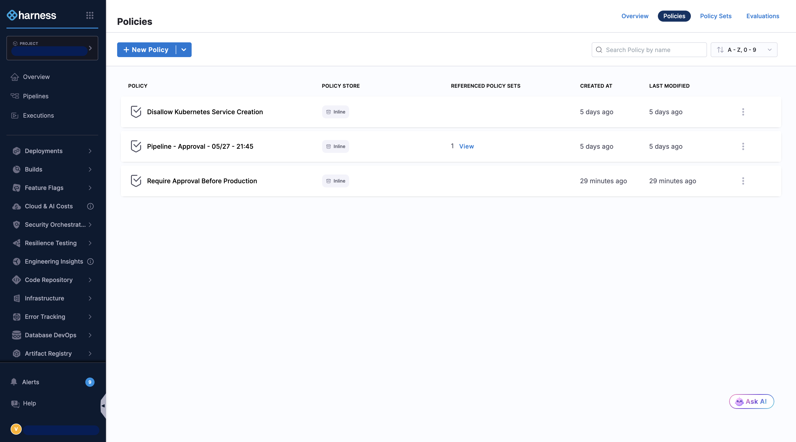
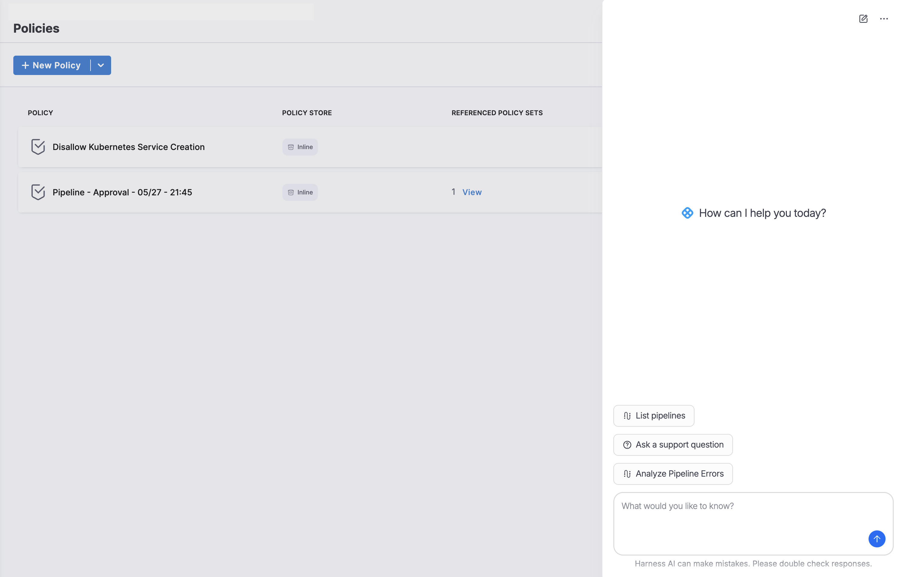
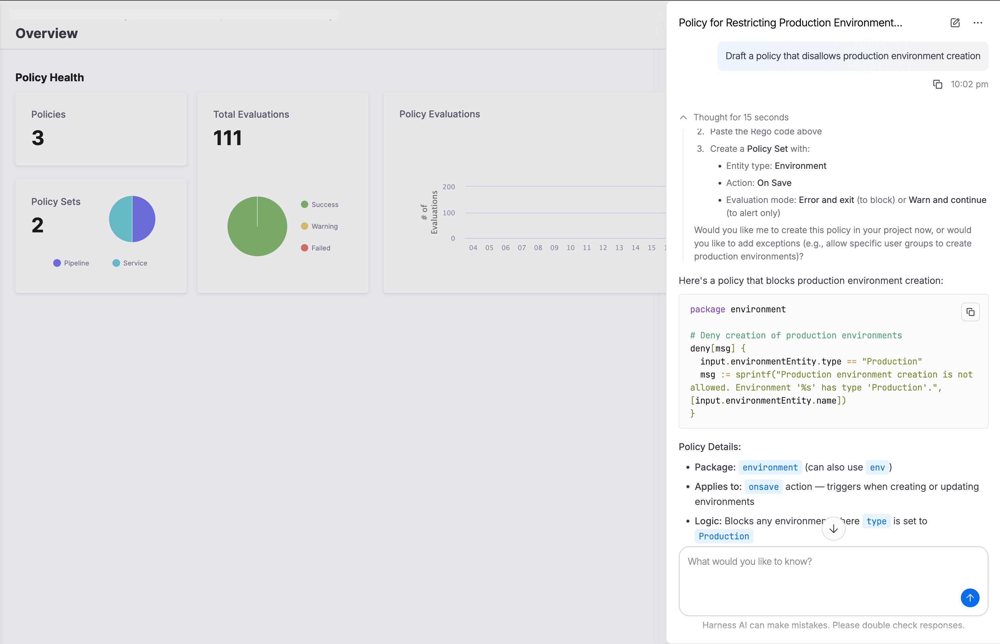
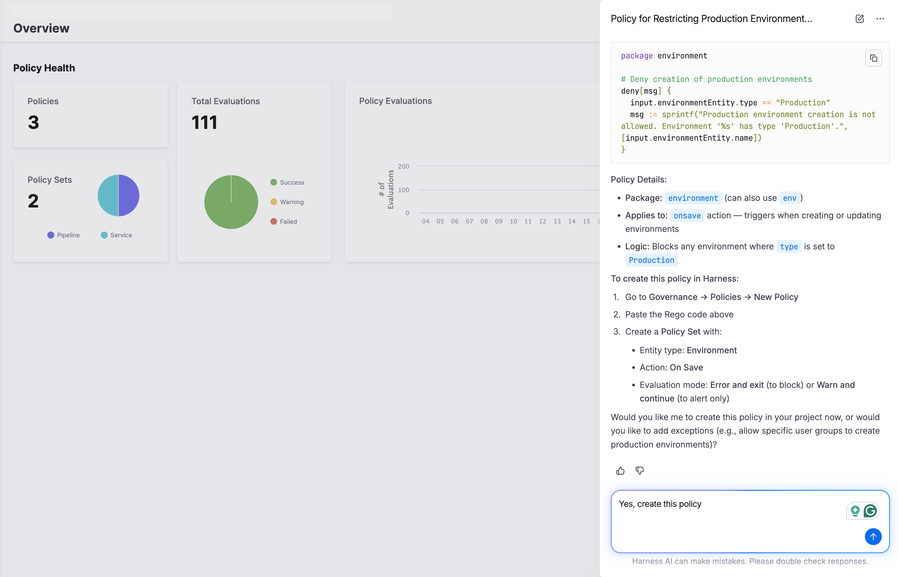
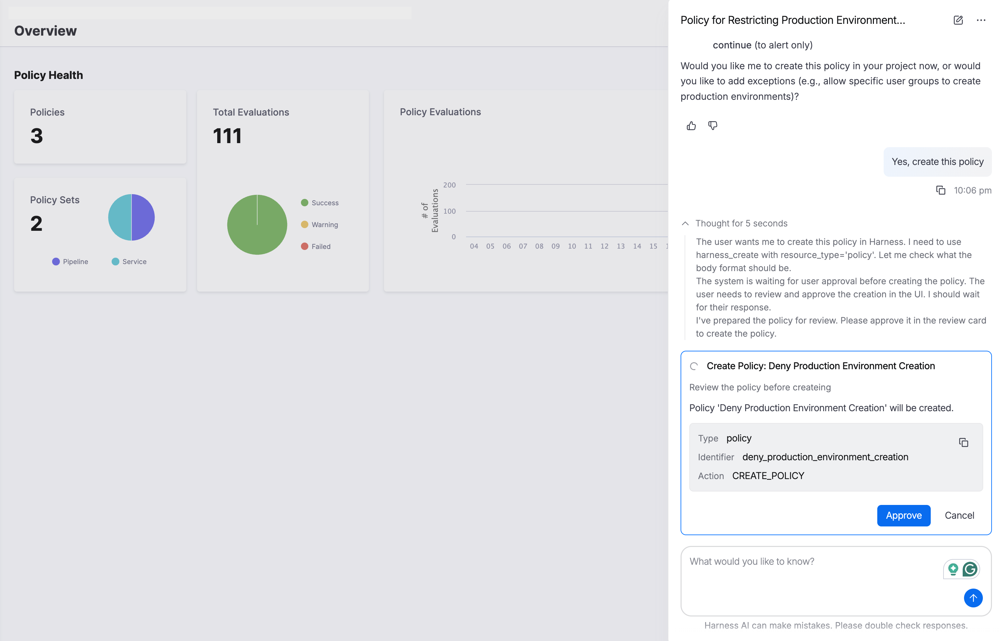
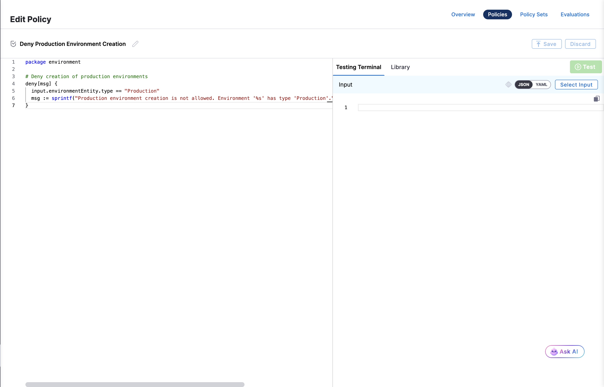
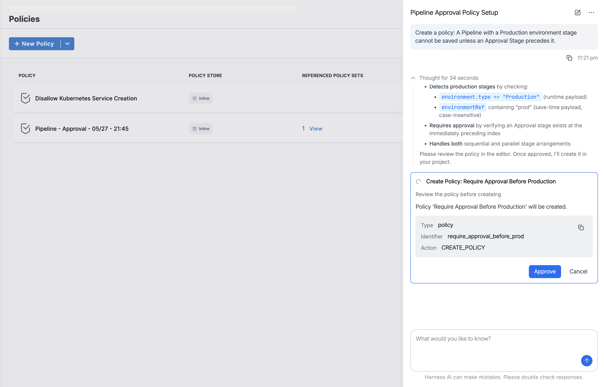
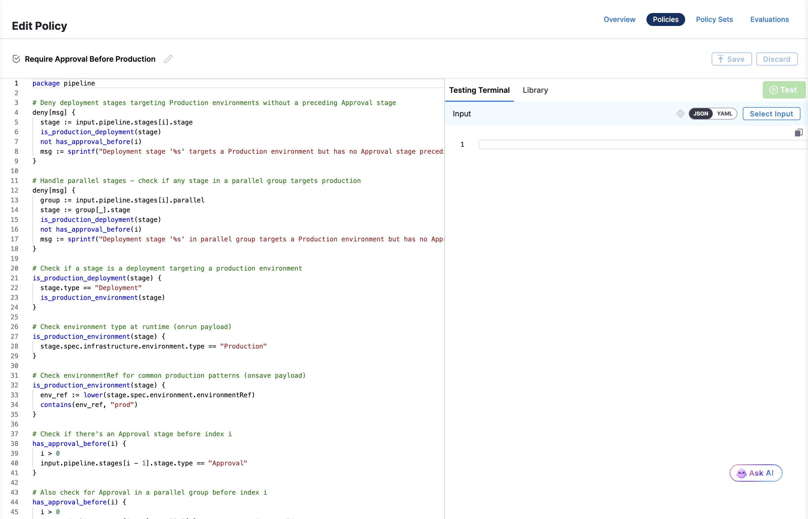
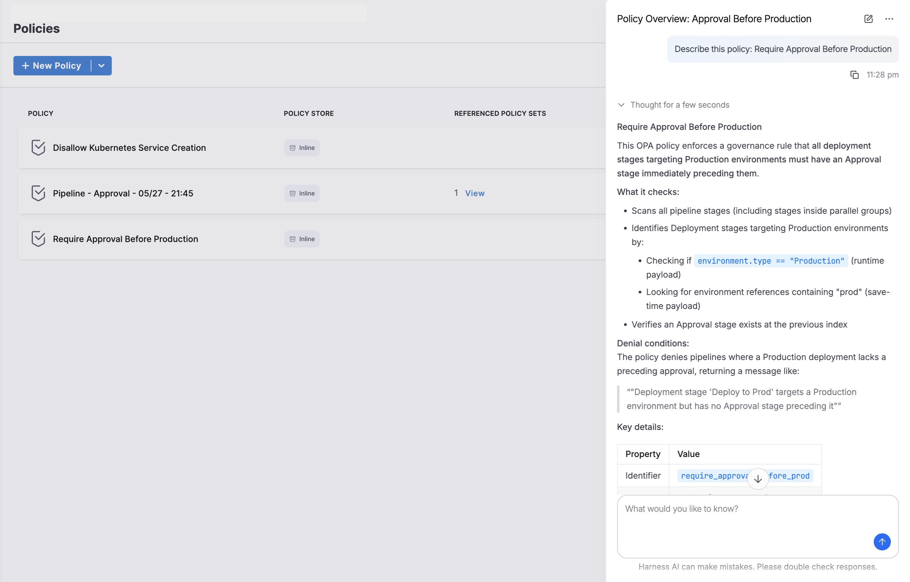

:::note
This feature is behind the feature flag `OPA_ENABLE_CANARY_AI`. Contact [Harness Support](mailto:support@harness.io) to enable the feature.
:::

Visit the following Harness Legal pages for legal information about AI:

- [Harness AI Data Privacy](https://www.harness.io/legal/harness-ai-data-privacy)

The Harness AI assistant for OPA policies has been enhanced with improved policy generation capabilities powered by the unified Harness AI agent. This integration provides more accurate and context-aware policy suggestions by leveraging specialized skills trained on OPA and REGO best practices.

Harness AI includes comprehensive support for the following functionalities:

- **Create OPA Policies:** The enhanced Harness AI assistant helps you write OPA policies for pipelines, connectors, templates, and other Harness objects without needing deep knowledge of REGO (Open Policy Agent language). The assistant uses specialized skills that understand Harness-specific policy patterns and can generate accurate policies based on your requirements.

- **Describe existing OPA Policies:** Harness AI offers detailed descriptions of existing policies. This helps you understand what a policy does without having to fully understand REGO syntax or trace through policy comments. The AI assistant can explain policy logic, failure conditions, and the impact of policy rules in plain language.

---

## Access the Harness AI assistant

You can access the AI assistant from the Policies page using the **Ask AI** button in the bottom right corner. This provides quick access to the AI assistant for creating new policies or getting help with existing ones.

When you click the **Ask AI** button, a chat interface opens where you can interact with the AI assistant. The interface shows suggested actions and a text input field where you can describe what you need.

---

## How the Harness AI assistant works

The OPA AI assistant is integrated with the unified Harness AI agent, which uses specialized skills trained on OPA policy patterns and REGO syntax. When you request the AI to create or explain a policy, the assistant:

1. Analyzes your natural language request to understand the policy requirements
2. Applies specialized knowledge of Harness entity types (pipelines, connectors, environments, services)
3. Generates REGO policy code that follows Harness OPA policy conventions
4. Validates the generated policy structure to ensure it works with Harness governance

This approach produces more accurate policies that align with Harness best practices and reduces the need for manual adjustments.

---

## Draft a policy for review

You can use the **"Draft a policy..."** prompt to generate a policy draft in the chat window for review before creating it in Harness. This allows you to verify the REGO code and policy logic before committing to create the policy.

To draft a policy for review:

1. In the Harness application, go to **Policies**.

2. Click the **Ask AI** button in the bottom right corner.

3. In the chat interface, start your prompt with **"Draft a policy..."**. For example:

   `Draft a policy that disallows production environment creation`

4. The AI assistant will generate the REGO policy code and display it in the chat window. **Review the generated code** including:
   - The package name
   - The deny rules and conditions
   - The error messages
   - The policy logic explanation

   

5. The AI will also provide instructions on how to create this policy in Harness, including the entity type, evaluation mode, and steps to follow.

   

6. If you are satisfied with the drafted policy, confirm by responding **"Yes, create this policy"**. The AI will present a policy creation approval dialog.

   

7. Click **Approve** to create the policy. The policy editor will open with the REGO code pre-populated. You can use the **Testing Terminal** to test your policy before saving.

   

8. Configure any additional policy settings such as policy sets, enforcement level, and scope.

9. Click **Save** to save the policy.

:::tip
The "Draft" approach is recommended when you want to review and verify the complete REGO code before creating the policy. This gives you more control and visibility into what the AI generates before committing it to your Harness account.
:::

---

## Create a policy using Harness AI

To create a policy directly without reviewing the REGO code first, use the **"Create a policy..."** prompt. This workflow is faster and shows you a policy logic summary before approval.

1. From the **Policies** page, click the **Ask AI** button.

2. Describe the policy you want to create. **Be specific and clear about your requirements**. For example:

   `Create a policy that ensures a pipeline with a Production environment stage cannot be saved without an Approval Stage before it`

   **Tips for effective prompts:**
   - Clearly state the entity type (pipeline, service, environment, connector, etc.)
   - Specify the conditions that should trigger the policy
   - Mention whether the policy should block (error) or warn users
   - Include any specific field names or values to check

3. The AI assistant will analyze your request and generate the appropriate REGO policy code. In the chat window, **review the policy logic summary** including the rules table and conditions being checked. The AI shows what the policy checks for and when it will trigger.

   

4. If the generated policy does not meet your requirements, you can:
   - Click **Cancel** and refine your prompt with more details
   - Ask the AI assistant to modify the policy (e.g., "Make this policy issue a warning instead of an error")
   - Iterate until the policy matches your needs

5. Once satisfied, click **Approve** to create the policy. The AI-generated REGO code will be applied to the policy editor.

6. The policy editor will open with the AI-generated REGO code already populated. **Review the code one final time** and make any manual adjustments if needed.

   

7. Configure any additional policy settings such as policy sets, enforcement level (error or warning), and scope (account, organization, or project).

8. Click **Save** to save the policy.

:::tip Best practices
- **Test your policy** in the testing terminal before deploying to production
- **Start with warnings** instead of errors to understand the policy's impact before enforcing it strictly
- **Review generated policies** thoroughly. While the AI is trained on OPA best practices, you should verify the logic matches your specific requirements.
- **Iterate with the AI**. If the first generation is not perfect, provide more context and regenerate.
:::

---

## Describe a policy using Harness AI

You can use Harness AI to get detailed descriptions of existing policies in your account. This helps you understand the policy at a high level without deep expertise in REGO.

1. Navigate to the **Policies** page and click the **Ask AI** button.

2. Ask the AI to describe the policy you want to understand. For example:

   `Describe this policy` or `What does this policy do?`

   The AI assistant will provide a comprehensive explanation including:
   - What the policy enforces
   - What conditions it checks
   - When the policy denies deployments
   - Key technical details about how it works

   

This feature enables you to quickly understand complex policies and make informed decisions about tweaking or improving them without needing to parse through REGO syntax.
