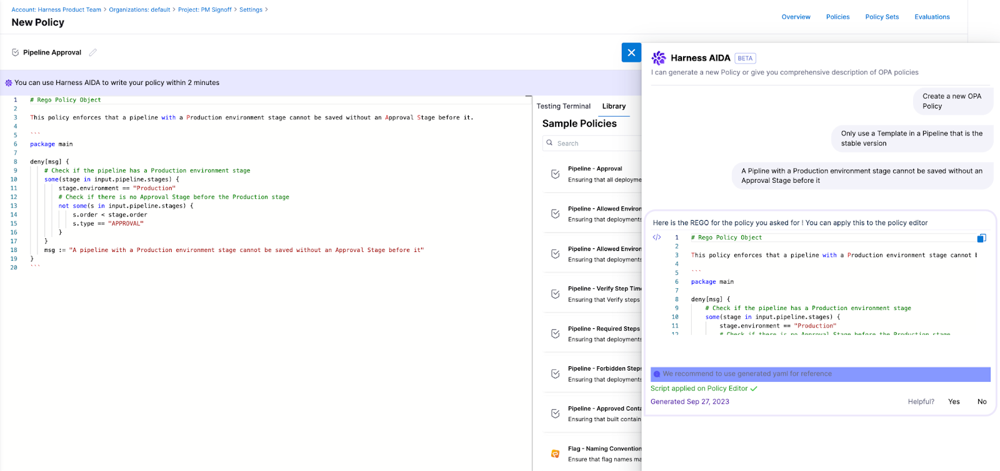
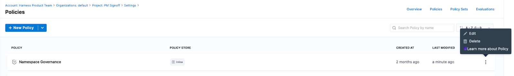
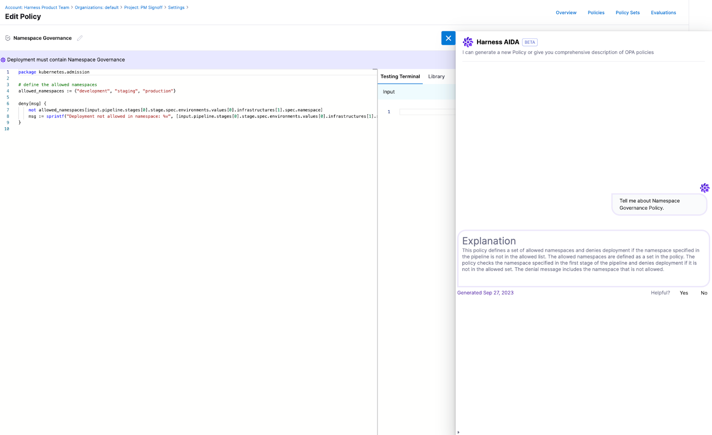
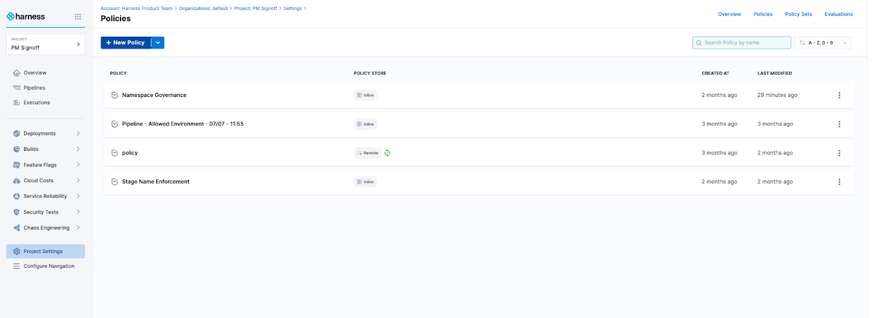
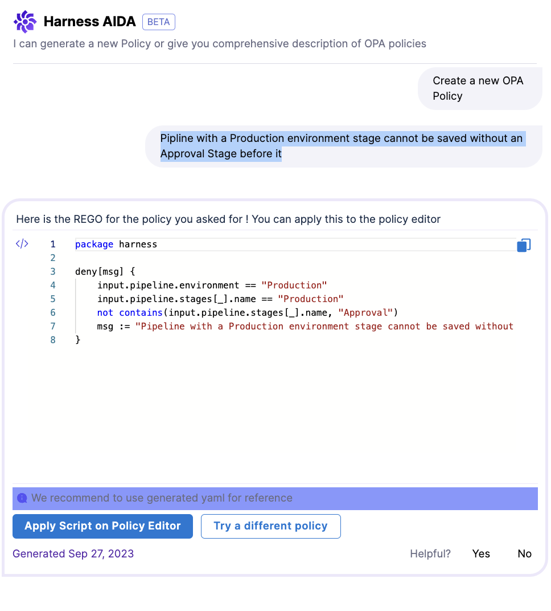
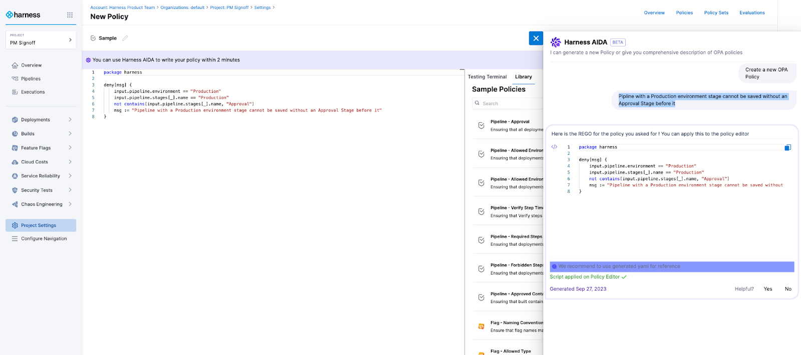

:::note

Currently, AIDA for Policies is an alpha feature behind the feature flag `OPA_AIDA_WIDGET` and is coming soon. Contact [Harness Support](mailto:support@harness.io) to enable the feature.

Visit the following Harness Legal pages for legal information about AIDA:
- [AIDA Terms](https://www.harness.io/legal/aida-terms)
- [AIDA Data Privacy](https://www.harness.io/legal/aida-privacy)

:::

Harness AI Development Assistant (AIDA&trade;) includes comprehensive support for the following functionalities:

- **Create OPA Policies:** Harness AIDA helps you get started and write OPA Policies based on pipelines, connectors, and templates, and other Harness objects with no need to understand the nuances of REGO (Open Policy Agent language). 

  

- **Describe existing OPA Policies:** Harness AIDA offers detailed descriptions of policies. This helps users understand what a policy does without having to fully understand REGO syntax and reading and tracing comments in the policy.

  
  
    

### Create a Policy by using Harness AIDA​

To create a policy by using the Harness AIDA, perform the following steps:

1. In the Harness application, go to **Policies**.
2. Select **Create a Policy**. 

    

3. Provide a name and click **Continue**.
4. Select **Harness AIDA**.
5. Type the policy you want to create. In the following example we will showcase: 

   `Pipeline with a Production environment stage cannot be saved without an Approval Stage before it`

   

6. Select **Apply Script on Policy Editor**.

   

7. Proceed to **Save the Policy**.

### Describe a Harness Policy by using Harness AIDA​

Using Harness AIDA, you can describe policies created in the account. This helps users understand the policy at a high level without deep understanding and expertise on REGO. Users immediately know what the policy does and its failure criteria. This knowledge enables users to tweak and improve policies downstream as needed.

   

   

