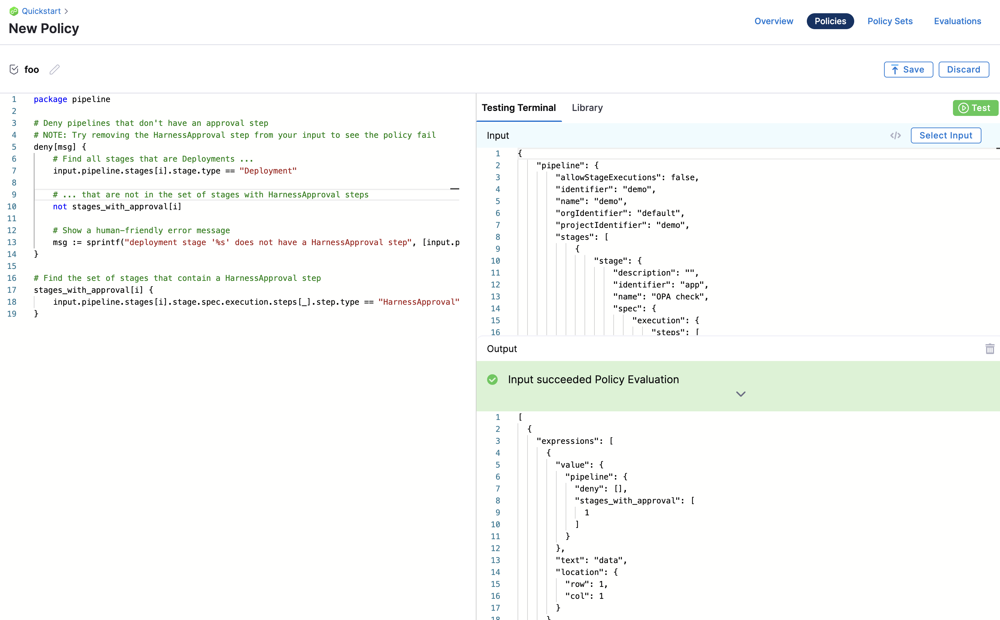
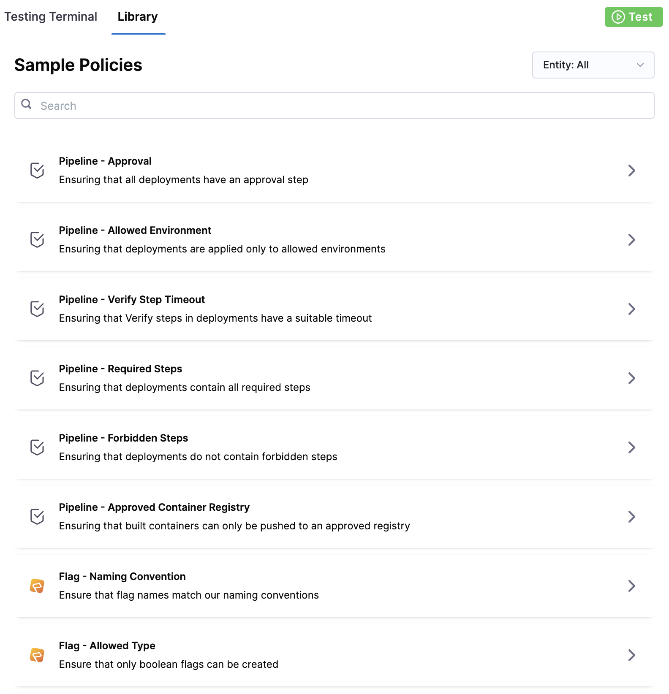
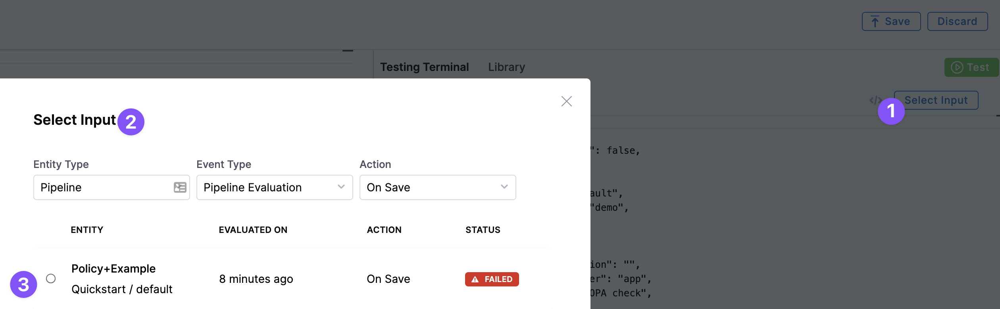
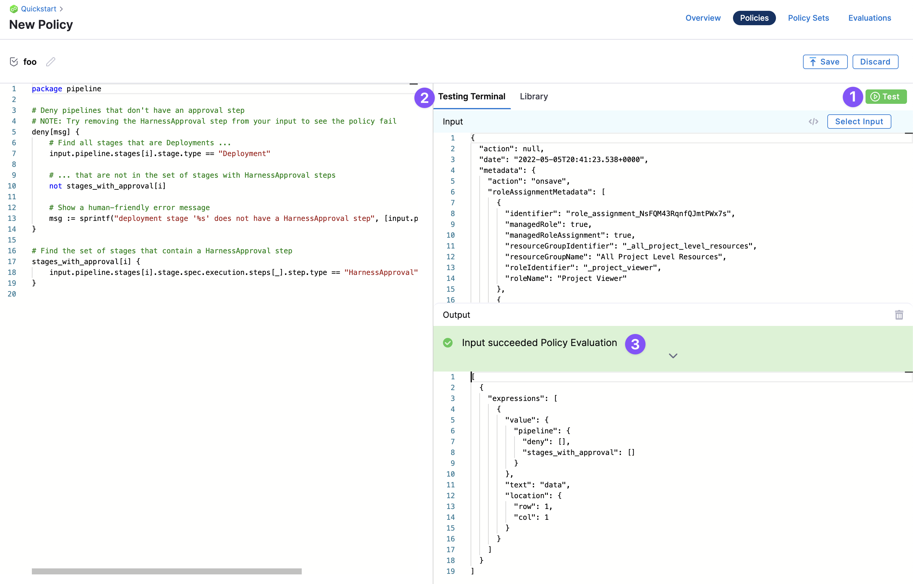
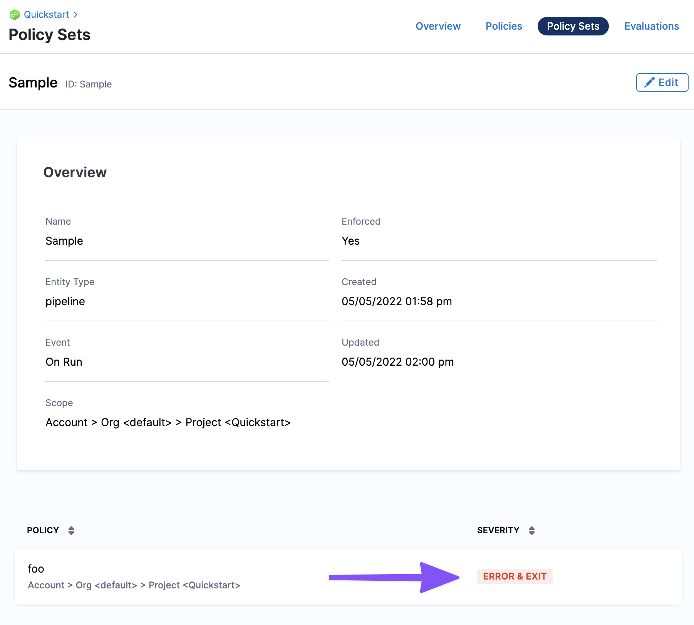
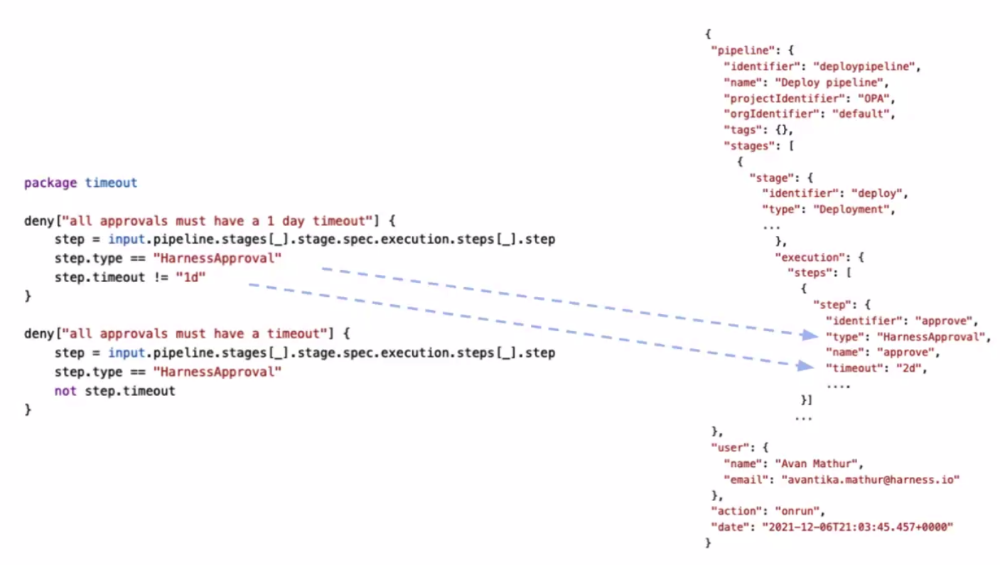
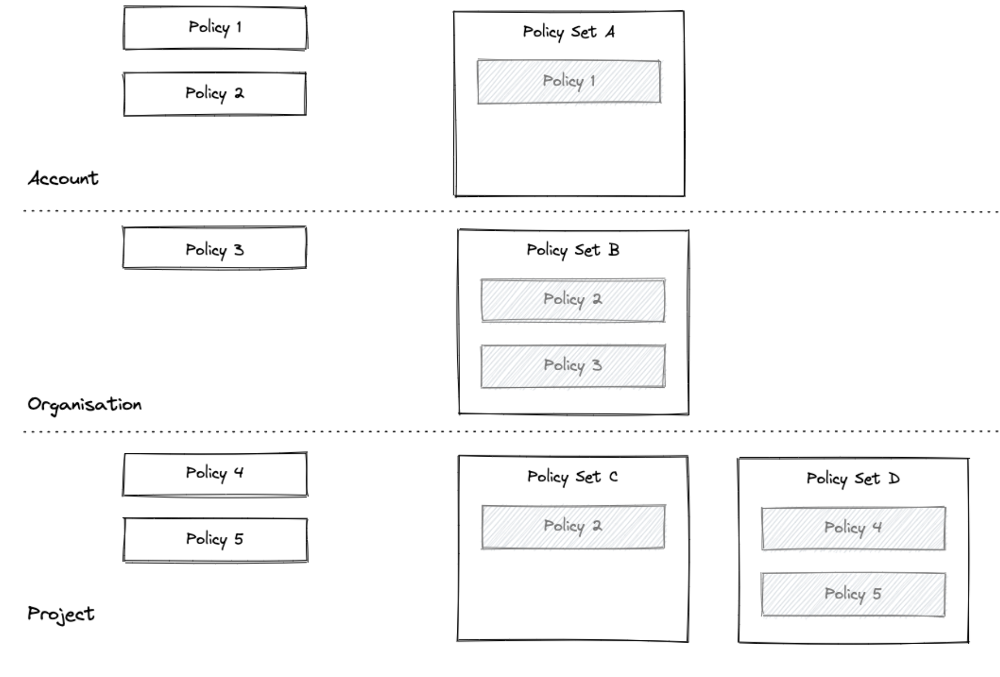

You can use Harness Policy As Code to implement governance in your Harness account and modules.

Harness Policy As Code uses [Open Policy Agent (OPA)](https://www.openpolicyagent.org/) as the central service to store and enforce policies for the different entities and processes across the Harness platform.

You can centrally define and store policies and then select where (which entities) and when (which events) they will be applied.

You can define and store policies directly in the OPA service in Harness or use the [Git Experience to store policies in a Git repository](./configure-gitexperience-for-opa.md).

## Governance Examples with Harness OPA

### Example: Apply policy when saving a pipeline

When a Pipeline is saved, there needs to be an Approval step before deploying to a production environment.

* **Success:** you configure an Approval Step in the Pipeline and then proceed to configure a prod stage. When you save the Pipeline, the policy rule is evaluated and returns `success`.
* **Warning:** a warning message appears: `You need an Approval step. If you save the Pipeline and deploy, Harness will throw an error.`
* **Failure:** you configure a Pipeline with a Deploy stage that deploys to a prod environment without an Approval stage before it. When you save the Pipeline, Harness throws an error message indicating the rule was enforced and the Pipeline fails validation.

### Example: Apply policy when a pipeline runs

On deployment, I need my pod CPU and memory to be pre-defined.

* **Success:** you deploy the Pipeline and during the dry run the pod CPU and memory have been defined and populated in the deployment manifest. As a result, the dry run progresses. Harness indicates that the rule was evaluated and the action was valid.
* **Failure:** pod CPU and memory were not defined in the deployment manifest. As a result, the dry run fails. Harness indicates that a rule was enforced and the deployment is prevented.

## Harness OPA Server

The Harness OPA server is an OPA server managed by Harness.

In Harness, you add Rego policies to a Policy Set and select the Harness entities (e.g. Pipelines) for evaluation. At that point, the policies are configured on the Harness OPA Server via a Kubernetes ConfigMap.

When certain events happen (e.g. saving or running a Pipeline), Harness reaches out to the Harness OPA server to evaluate the action using the Policy Set.

## Harness Policies

A policy is a single rule. Policies are written as code in the OPA Rego policy language.

A policy itself is just the rule and it's not enforced anywhere. When a policy is added to a Policy Set, it is associated with the entity event on which it will be enforced (On Save, On Run, etc).

Policies are written against an input payload, which is the JSON representation of the entity that the policy is being enforced against (Pipeline, Feature Flag, etc). It's important to note that input JEXL expressions/variables are not resolved before the JSON is sent to OPA.

Policies are saved within the hierarchy in the Harness platform: Account > Organizations > Projects.

Policy scope is determined by whether the policy is created at the account, Organization, or Project level. A policy added at the account level can be applied to all entities in the Orgs and Projects in the account. A policy added at the Project level can be applied to entities in that Project alone.

Polices can be tested individually, but they are not applied individually. To enforce a policy, it must be in a Policy Set.

Policies are written in the OPA policy language, Rego.

**New to OPA Policy Authoring?** Use the following resources to learn Rego:

* **Highly recommend:** Free online course on Rego from Styra founder and OPA co-creator Tim Hendricks: [OPA Policy Authoring](https://academy.styra.com/courses/opa-rego).
* See [Policy Language](https://www.openpolicyagent.org/docs/latest/policy-language/) from OPA. The [Rego Cheatsheet](https://dboles-opa-docs.netlify.app/docs/v0.10.7/rego-cheatsheet/) is also helpful to have on hand.

### Policy Editor

Harness policies are written and tested using the built-in policy editor.



For an example of how to use the policy editor, see [Harness Policy As Code Quickstart](/docs/platform/governance/policy-as-code/harness-governance-quickstart).

### Policy Library

The Policy Editor includes a library of policies that cover many common governance scenarios.

Sample policies are also useful references while writing your policy. When you import an example, a sample payload is also loaded for testing the policy.



You can simply use the library policies to quickly generate the policy you want to create.

### Select Input

In the Policy Editor, you can select sample entities to test your policy on. For example, Pipelines.



### Testing Terminal

The Testing Terminal lets you test the policy against real inputs while you're developing it. You can select input payloads from previous evaluations to test what will happen when your policy is evaluated.



### Policy Input Payload User Metadata

The input payload contains user metadata for the user that initiated the event. Metadata includes roles, groups, etc, and is added to every evaluation automatically. For example:


```
{  
  "action": null,  
  "date": "2022-05-05T20:41:23.538+0000",  
  "metadata": {  
    "action": "onsave",  
    "roleAssignmentMetadata": [  
      {  
        "identifier": "role_assignment_NsFQM43RqnfQJmtPWx7s",  
        "managedRole": true,  
        "managedRoleAssignment": true,  
        "resourceGroupIdentifier": "_all_project_level_resources",  
        "resourceGroupName": "All Project Level Resources",  
        "roleIdentifier": "_project_viewer",  
        "roleName": "Project Viewer"  
      }  
    ],  
    "timestamp": 1651783283,  
    "type": "pipeline",  
    "user": {  
      "disabled": false,  
      "email": "john.doe@harness.io",  
      "externallyManaged": false,  
      "locked": false,  
      "name": "john.doe@harness.io",  
      "uuid": "U6h_smb9QTGimsYfNdv6VA"  
    },  
    "userGroups": []  
  },  
...
```
This enables enforcing policies with advanced and attribute-based access control use cases.

For more information, go to [RBAC in Harness](/docs/platform/role-based-access-control/rbac-in-harness).

## Harness Policy Set

You define a set of rules (policies) that are evaluated together in a Policy Set.

Policies are only enforced once they are added to a Policy Set. In the Policy Set, policies are grouped and associated with a Harness entity and the event that will initiate evaluation.

Each policy in the set is also assigned a severity that determines what will happen if the policy evaluation fails (Error and Exit, Warn and Continue).



Policy Sets are stored to the Harness OPA server for a given entity type and event in Harness. The entity (Pipelines, etc) and event (On Save, On Run, etc) associated with a Policy Set determine when the policies in that set are evaluated.

Policy Sets are saved at the Harness account, Organization, or Project level, and where they are saved determines the scope of the Policy Set.

A Policy Set at the account level applies to all entities in the Orgs and Projects in the account. A Policy Set at the Project level only applies to entities in that Project alone.

## Entities and Events

When you create a policy, you identify the Harness entities were the policy is applied.

For example, here's a policy that applies the [Harness Approval](/docs/continuous-delivery/x-platform-cd-features/cd-steps/approvals/using-harness-approval-steps-in-cd-stages/) steps:



Currently, governance can be applied to the following Harness entities and events.

Soon, policies can be applied to more entities, such as Connectors, Services, Environments, Cloud Cost Management, Infrastructure Provisioners.

### Pipelines

Policies are evaluated against Harness Pipelines. The input payload is an expanded version of the Pipeline YAML, including expanded references of stages/steps. 

Policy Sets can be configured to be enforced automatically on these Pipeline events:

* **On Save:** Policies are evaluated when the Pipeline is saved.
* **On Run:** Policy sets are evaluated after the preflight checks.

Severities:

* **On error (Error and Exit):** a message is shown and the action does not complete.
* **On warning (Warn and Continue):** a message is shown and the action is completed.

The Policy step in a Pipeline also enables evaluating policies during Pipeline execution. See [Add a Governance Policy Step to a Pipeline](/docs/platform/governance/policy-as-code/add-a-governance-policy-step-to-a-pipeline).

### Feature Flags

Policies are evaluated against Harness [Feature Flags](/docs/feature-flags/get-started/overview).  

Policy Sets can be configured to evaluate policies on these Feature Flag events:

* Feature Flag is saved.
* Flag is created.
* Flag is toggled on or off.

See [Use Harness Policy As Code for Feature Flags](/docs/platform/governance/policy-as-code/using-harness-policy-engine-for-feature-flags.md).

### Repositories

Policies are evaluated against [Harness Code repositories](/docs/code-repository/config-repos/security.md).

### Custom

You can define a policy with the entity type Custom.

The Custom entity type provides flexibility to enforce policy evaluations against any input payload during Pipeline execution. This is done using the Policy step. See [Add a Governance Policy Step to a Pipeline](/docs/platform/governance/policy-as-code/add-a-governance-policy-step-to-a-pipeline).

Custom entity types are open ended. There is no pre-set JSON schema that is used for Custom policies. The payload that the policy is evaluated against is determined by you (defined in the Policy step).

## Policy and Policy Set Hierarchy and Inheritance

Policies and Policy Sets are saved at the Harness Account, Organization, or Project level in the Harness. Where the Policy or Policy set is saved determines its scope. 

* Policies saved at the Account level can be added to Policy Sets in the Account, or Orgs and Projects within that Account.
* A policy at the Org level can only be added to Policy Sets in that Org and its Project.
* A policy at the Project level can only be added to Policy Sets in that Project.



# Best Practices for Using Policy as Code in CI/CD Pipelines with Harness.io

## Introduction

In the world of modern software development, ensuring that your CI/CD pipelines adhere to security, compliance, and governance standards is critical. Harness.io provides a robust framework for implementing Policy as Code (PaC), enabling organizations to automate and enforce policies across their software delivery pipelines. This document details best practices for using Policy as Code with the Harness Platform, drawing on Harness's capabilities to help you maintain high standards of governance while preserving the agility of your development processes.

## 1. Understand the Harness Governance Framework

Harness Governance allows organizations to define, manage, and enforce policies across CI/CD pipelines, ensuring that deployments comply with both organizational standards and regulatory requirements. The governance framework in Harness revolves around the concept of Policy as Code, where policies are defined, versioned, and applied as part of your CI/CD configuration.

### Key Concepts:
- **Policy**: A policy is a set of rules that govern pipeline behavior. For example, a policy might require that all deployment artifacts are signed, or that specific tags are present on deployment resources.
- **Policy Set**: A collection of policies that can be applied to one or more pipelines. Policy Sets enable you to manage multiple related policies together, making it easier to enforce comprehensive governance across your pipelines.
- **Enforcement Level**: Policies in Harness can be enforced at different levels—`WARN` or `ERROR`. This flexibility allows teams to gradually introduce policies without disrupting their workflows.
- **Hosted Policy Engine by Harness**: The underlying mechanism that evaluates and enforces policies within the pipeline. The Policy Engine checks the pipeline’s configuration and execution against defined policies and takes appropriate action based on the enforcement level.

Harness's governance features are documented in detail [here](https://developer.harness.io/docs/platform/governance/policy-as-code/harness-governance-overview).

## 2. Start with Pre-defined Sample Policies

Harness offers a range of **sample policies** that address common governance scenarios, such as enforcing encryption for secrets, requiring approval for production deployments, or ensuring that only certified images are used in deployments. These samples provide a solid foundation for implementing governance in your pipelines.

### Implementation Example:
Consider a scenario where you want to ensure that all deployments to a production environment require approval from a senior engineer. Harness provides a sample policy for this use case, which you can quickly adapt to your specific needs.

- **Sample Policy**: The policy checks if a deployment is targeting a production environment and then enforces an approval step if certain conditions are met.
- **Customization**: You can customize the policy to define who can approve the deployment, what constitutes a production environment, and the specific steps that need to be taken for approval.

These samples and their usage are detailed in the [Sample Policy Use Case documentation](https://developer.harness.io/docs/platform/governance/policy-as-code/sample-policy-use-case).

## 3. Use Policy Sets to Group Related Policies

As your organization grows, so will the number of policies you need to enforce. Harness allows you to manage this complexity by grouping related policies into **Policy Sets**. Policy Sets enable you to apply multiple policies to different stages of your CI/CD pipelines, ensuring consistent governance across environments.

### Best Practice:
Organize your policies into sets that reflect different governance categories or environments:
- **Environment-based Policy Sets**: Create separate Policy Sets for `development`, `staging`, and `production` environments. This ensures that the appropriate level of governance is applied at each stage of the development lifecycle.
- **Compliance-based Policy Sets**: Group policies related to specific compliance requirements, such as data standards or security. This approach helps you easily apply and manage compliance across multiple pipelines.

For detailed guidance on creating and managing Policy Sets, refer to the [Harness Governance Quickstart guide](https://developer.harness.io/docs/platform/governance/policy-as-code/harness-governance-quickstart).

## 4. Gradually Introduce Policies with Flexible Enforcement Levels

Introducing policies into existing CI/CD pipelines can be challenging, especially if the policies are stringent. Harness provides flexibility in how policies are enforced, allowing you to introduce them gradually and reduce the risk of disruption.

### Best Practice:
- **Initial Deployment in `WARN` Mode**: When rolling out a new policy, start by setting the enforcement level to `WARN`. In this mode, the policy will flag violations without blocking the pipeline execution. This allows your team to adjust their practices without impacting delivery timelines.
- **Transition to `ERROR` Mode**: Once the team has adapted to the new policy, you can increase the enforcement level to `ERROR`, which will block the pipeline if the policy is violated. This step ensures that governance is enforced without compromising the stability of your CI/CD processes.  This setting will halt the pipeline immediately if the policy is not met, preventing any non-compliant deployments


For more information on setting enforcement levels, see the [Governance Overview](https://developer.harness.io/docs/platform/governance/policy-as-code/harness-governance-overview).

## 5. Apply Policies to Critical Pipeline Elements

To maximize the impact of your governance framework, it’s important to apply policies to the most critical elements of your CI/CD pipelines, such as **Secrets** and **Connectors**.

### Secrets:
Harness allows you to enforce policies on secrets, ensuring that sensitive information is handled securely. For example, you can create a policy that requires all secrets to be named a certain way, or that restricts access to secrets based on user role and pipeline context.

- **Policy Example**: A policy that enforces the use of approved secrets to be used in a pipeline pipeline.

For step-by-step instructions on adding a Policy Engine step to a secret, refer to the [documentation](https://developer.harness.io/docs/platform/governance/policy-as-code/add-a-policy-engine-step-to-a-secret).

### Connectors:
Connectors are often the interface between your CI/CD pipelines and external systems, such as artifact repositories, cloud providers, or databases. Ensuring that these connectors are secure and compliant with your governance policies is essential.

- **Policy Example**: A policy that requires all connectors to external systems to use multi-factor authentication (MFA) and to be configured with least-privilege access.

For detailed guidance on adding a governance policy step to a connector, see the [documentation](https://developer.harness.io/docs/platform/governance/policy-as-code/add-a-governance-policy-step-to-a-connector).

## 6. Continuously Monitor and Update Policies

Governance is an ongoing process, and policies need to evolve as your organization’s needs and the regulatory landscape change. Harness provides robust monitoring and reporting capabilities that allow you to track policy compliance over time.

### Best Practice:
- **Regular Reviews**: Schedule regular reviews of your policies to ensure they remain effective and relevant. Involve stakeholders from across the organization, including security, compliance, and development teams, in these reviews.
- **Policy Updates**: Use insights from Harness’s monitoring tools to identify where policies may need to be tightened or relaxed. For instance, if a particular policy is frequently violated, it might indicate a need for additional training or a policy adjustment.
- **Automated Reporting**: Leverage Harness’s automated reporting features to keep stakeholders informed about policy compliance. These reports can be customized to focus on key metrics, such as the number of policy violations, the severity of violations, and trends over time.

More details on monitoring and reporting can be found in the [Harness Governance Overview](https://developer.harness.io/docs/platform/governance/policy-as-code/harness-governance-overview).

## 7. Leverage the Harness Policy Engine for Custom Policies

Harness’s **Policy Engine** is designed to be flexible and extensible, allowing you to create custom policies that address your unique governance challenges. Whether you need to enforce specific deployment configurations, control resource usage, or validate security settings, the Policy Engine can be customized to meet these needs.

### Best Practice:
- **Custom Policy Development**: Start by identifying areas where existing policies do not fully meet your governance needs. Work with your development and security teams to define custom policies that address these gaps.
- **Testing and Validation**: Before rolling out custom policies to production, thoroughly test them in a staging environment. Use Harness’s Policy Engine to simulate policy enforcement and validate that the policies work as intended.
- **Documentation and Training**: Ensure that custom policies are well-documented and that your team is trained on their purpose and application. This will help minimize disruption and ensure smooth adoption.

For more information on creating and managing custom policies, refer to the [Harness Governance Overview](https://developer.harness.io/docs/platform/governance/policy-as-code/harness-governance-overview).

## 8. Document and Communicate Policies to Your Team

Effective governance requires that all team members understand and adhere to the policies that have been implemented. Clear documentation and regular communication are key to ensuring that policies are followed.

### Best Practice:
- **Policy Documentation**: Maintain a central repository of all policies applied within your CI/CD pipelines. This documentation should include the rationale behind each policy, how it is enforced, and any relevant exceptions or nuances.
- **Regular Communication**: Use team meetings, internal wikis, or other communication channels to keep your team informed about policy changes. Regularly remind your team about the importance of adhering to these policies, and provide them with the resources they need to comply.
- **Training and Workshops**: Conduct training sessions or workshops to help your team understand the policies and how to implement them effectively in their day-to-day work. These sessions can also be a forum for discussing any challenges or questions the team might have.

## Conclusion

Harness.io's Policy as Code framework is a powerful tool for enforcing governance, security, and compliance across your CI/CD pipelines. By following the best practices outlined in this document, you can ensure that your policies are effective, manageable, and aligned with your organization’s objectives. Start by leveraging Harness’s pre-defined policies, gradually enforce them, and continuously monitor and update your governance framework to keep your CI/CD processes secure and compliant.

For further reading and detailed guidance, please refer to the following resources:
- [Harness Governance Overview](https://developer.harness.io/docs/platform/governance/policy-as-code/harness-governance-overview)
- [Sample Policy Use Case](https://developer.harness.io/docs/platform/governance/policy-as-code/sample-policy-use-case)
- [Harness Governance Quickstart](https://developer.harness.io/docs/platform/governance/policy-as-code/harness-governance-quickstart)
- [Add a Policy Engine Step to a Secret](https://developer.harness.io/docs/platform/governance/policy-as-code/add-a-policy-engine-step-to-a-secret)
- [Add a Governance Policy Step to a Connector](https://developer.harness.io/docs/platform/governance/policy-as-code/add-a-governance-policy-step-to-a-connector)


## See also

* [Harness Policy As Code Quickstart](/docs/platform/governance/policy-as-code/harness-governance-quickstart)
* [Add a Policy Step to a Pipeline](/docs/platform/governance/policy-as-code/add-a-governance-policy-step-to-a-pipeline)
* [Harness Policy As Code Overview for Feature Flags](/docs/feature-flags/troubleshoot-ff/harness-policy-engine)
