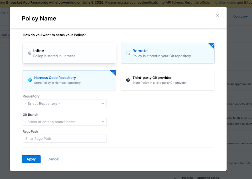
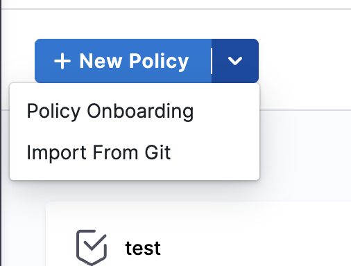
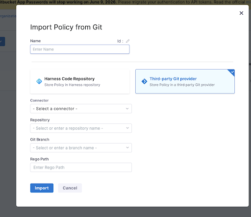
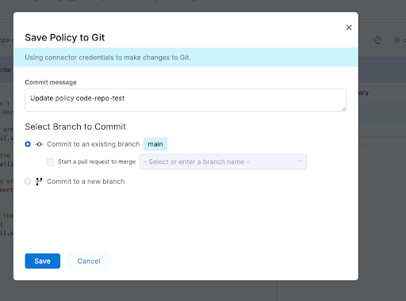
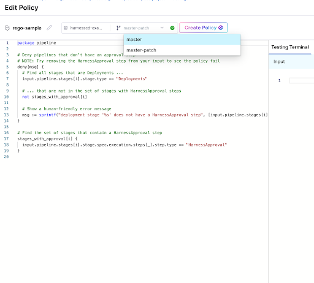

Git Experience enables you to store and manage the Rego policies you use for governance in Harness through Git. You can keep your Harness Rego policies in a Git repository and use them for policy evaluations, giving your team full version control over governance rules.

As Rego policies become a central part of governance efforts, storing them in Git lets you leverage branching, pull requests, and audit history. In Harness, you can either import an existing Rego policy from Git or create a remote policy in Harness that resides in a Git repository.

:::important Default branch only
At the time of evaluation, Harness only uses the policy stored in the default branch of the repository. Ensure all policies used in enabled policy sets are merged to the default branch. Use feature branches for testing, then merge to the default branch before enabling the policy for production evaluations.
:::

## Prerequisites

- **Harness Git Experience:** Go to [Harness Git Experience overview](/docs/platform/git-experience/git-experience-overview) to understand how Git-backed resources work.
- **Git connector:** A Harness Git connector with a Personal Access Token (PAT) for your Git account. Not required if you use Harness Code Repository. Go to [Harness Git Experience quickstart](/docs/platform/git-experience/configure-git-experience-for-harness-entities) to set up a connector.
- **Policy permissions:** Create/Edit permissions for policies. Go to [RBAC in Harness](/docs/platform/role-based-access-control/rbac-in-harness) to configure roles.
- **Git repository:** A Git repo with at least one branch.

## Create a Git-backed Rego policy

When you create a remote Rego policy in Harness, you can store it in either Harness Code Repository or a third-party Git provider. In both cases, you must provide the repository (or Git connector), the Git branch, and the Rego path where the policy file is saved.

To create a remote policy:

1. In your Harness project, go to **Project Setup** > **Policies**.
2. Select **+ New Policy**. Enter a name for your policy.
3. Select **Remote**. The Git Experience settings appear.

   

   

   

4. Choose **Harness Code Repository** or **Third-party Git provider**.
   - For Harness Code Repository, select the **Repository** and **Git Branch**.
   - For a third-party provider, select or create a **Git Connector**, then choose the **Repository** and **Git Branch**.
5. Enter the **Rego Path** where you want the policy file stored.
6. Select **Apply**.
7. Write your Rego policy in the editor, then select **Save**.

:::warning Non-default branch
If you save a policy to a non-default branch and add it to an enabled policy set, evaluation will fail. Harness only evaluates remote policies from the default branch.
:::

## Import an existing policy from Git

If you already have a Rego policy stored in a Git repository, you can import it directly into Harness instead of recreating it.

To import a policy from Git:

1. In your Harness project, go to **Project Setup** > **Policies**.
2. Select the dropdown arrow next to **+ New Policy**, then select **Import From Git**.

   

   

   

3. Enter a **Name** for the policy in Harness.
4. Choose **Harness Code Repository** or **Third-party Git provider**.

   

   

   

5. For a third-party provider, select the **Connector** that points to your Git account.
6. Select the **Repository** that contains the policy.
7. Select the **Git Branch** from which to import.
8. Enter the **Rego Path** to the policy file in the repository.
9. Select **Import**.

Harness pulls the policy from your repository and creates it as a remote-backed policy.

## Move an inline policy to Git

If you have an existing inline Rego policy stored in Harness, you can convert it to a Git-backed policy. This lets you version control the policy and leverage Git workflows.

To move an inline policy to Git:

1. In your Harness project, go to **Project Setup** > **Policies**.
2. Locate the inline policy you want to move to Git.
3. Select the more options menu (three vertical dots) next to the policy, then select **Move to Git**.
4. The **Move Policy to Git** dialog opens.
5. Choose **Harness Code Repository** or **Third-party Git provider**.
   - For Harness Code Repository, select the **Repository** and **Git Branch**.
   - For a third-party provider, select or create a **Git Connector**, then choose the **Repository** and **Git Branch**.
   
   :::note
   The Git connector must use the **Enable API access** option with a Personal Access Token. For third-party providers like GitHub, the token must have `repo` and `admin:repo_hook` scopes.
   :::

6. Enter the **Rego Path** where you want the policy file stored in the repository.
7. Enter a **Commit Message** describing the change.
8. Select **Move to Git**.

Your policy is now stored in Git and appears in the policy list as a remote entity with repository details next to it.

:::warning Important
After moving a policy to Git, ensure it's saved to the default branch before adding it to an enabled policy set. Policies on non-default branches will cause evaluation failures.
:::

## Edit an existing Git-backed Rego policy

To edit a remote policy, select it from the policy list. Harness opens the Rego editor with the current policy content loaded from Git.

Make your changes in the editor, then select **Save**. The **Save Policy to Git** dialog appears with these options:

- **Commit to an existing branch:** Commits your changes directly. You can optionally start a pull request to merge into another branch.
- **Commit to a new branch:** Creates a new branch with your changes. You can start a pull request from the new branch.

Select **Save** to commit the changes.

## Test policies in feature branches

A common workflow is to create a feature branch, test a new version of the policy there, and merge it into the default branch once validated. Harness supports this workflow directly in the policy editor.

To test a policy in a feature branch:

1. Open the policy in the Rego editor.
2. Use the branch selector at the top of the editor to switch to the feature branch where you want to make and test changes.

   

   

   

3. Edit the policy in your feature branch.
4. Use the **Testing Terminal** on the right side of the editor to test the policy against previous evaluations. Enter or paste a sample input payload and verify the policy behaves as expected.
5. Once the policy passes your tests, select **Save**. In the save dialog, select **Start a pull request to merge** and choose your default branch as the target.

This lets you validate policy changes in isolation before they affect live evaluations. Only the version merged into the default branch is used during actual policy evaluations.

## Next steps

You can now manage your Rego policies as code in Git with full version control. Use feature branches to iterate on policy changes safely, and merge to the default branch when you are ready for the policy to take effect.

- Go to [Harness Policy As Code overview](/docs/platform/governance/policy-as-code/harness-governance-overview) to learn how OPA policies are evaluated in Harness.
- Go to [Policy As Code quickstart](/docs/platform/governance/policy-as-code/harness-governance-quickstart) to create your first policy and policy set.
- Go to [Harness Git Experience overview](/docs/platform/git-experience/git-experience-overview) to explore Git Experience for other Harness entities.
