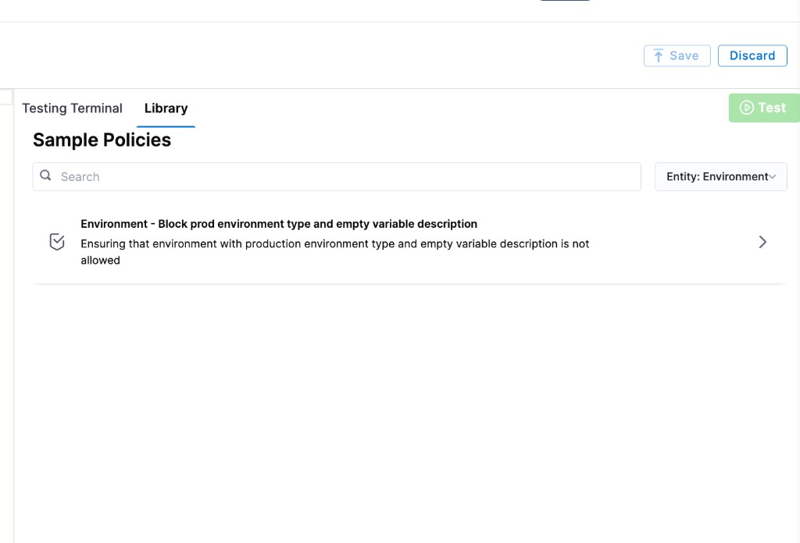

Harness provides governance using Open Policy Agent (OPA), Policy Management, and Rego policies.

You can create a policy and apply it to all [environments](/docs/continuous-delivery/x-platform-cd-features/environments/create-environments) in your Account, Org, or Project. The policy is evaluated on environment-level events:

- **On Save** — evaluated when an environment is created or updated.

For more details, see the [Harness Governance Quickstart](/docs/platform/governance/policy-as-code/harness-governance-quickstart).

## Prerequisites

- [Harness Governance Overview](/docs/platform/governance/policy-as-code/harness-governance-overview)
- [Harness Governance Quickstart](/docs/platform/governance/policy-as-code/harness-governance-quickstart)
- Policies use the OPA authoring language Rego. For more information, see [OPA Policy Authoring](https://academy.styra.com/courses/opa-rego).

## Step 1: Add a policy

1. In Harness, go to **Account Settings** → **Policies** → **New Policy**.

2. Enter a **Name** for your policy and click **Apply**.

3. Add your Rego policy in the editor.

   You can write your own Rego policy or use a sample from the **Library** panel. Select the **Library** tab, choose **Entity: Environment** from the dropdown, and pick one of the built-in samples:

   

   Harness ships a sample policy for environments:

   - **Environment – Block prod environment type and empty variable description:** Prevents creating a production environment that has an empty variable description.

   Below is an example Rego policy you can use as a starting point.

#### Block production environment type and empty variable descriptions

```
package environment

deny[msg] {
  input.environmentEntity.type == "Production"
  msg := "Production type environment is not allowed"
}

deny[msg] {
  input.environmentEntity.variables[_].description == ""
  msg := "Variable description is required but not provided"
}
```

4. Click **Save**.

## Step 2: Add the policy to a policy set

After creating your policy, add it to a Policy Set before it can be enforced on environments.

1. Go to **Policies** → **Policy Sets** → **New Policy Set**.

2. Enter a **Name** and optional **Description** for the Policy Set.

3. In **Entity type**, select **Environment**.

4. In **On what event should the Policy Set be evaluated**, select **On Save**.

5. Click **Continue**.

   :::note
   Existing environments are not automatically evaluated against new policies. Policies are applied only when an environment is saved (created or updated).
   :::

6. In **Policy evaluation criteria**, click **Add Policy**.

7. In the **Select Policy** dialog, choose the scope (**Project**, **Org**, or **Account**) and select the policy you created.

   

8. Select the severity and action for policy violations:

   - **Warn & continue** — a warning is displayed if the policy is not met, but the environment is saved and you can proceed.
   - **Error and exit** — an error is displayed and the environment is not saved if the policy is not met.

9. Click **Apply**, then click **Finish**.

10. The Policy Set is automatically set to **Enforced**. To disable enforcement, toggle off the **Enforced** button.

## Step 3: Apply the policy to an environment

After creating and enforcing your Policy Set, it is automatically evaluated whenever an environment is saved.

1. Go to **Deployments** → **Environments** → **New Environment** (or edit an existing environment).

2. Configure the environment and click **Save**.

3. Based on your selection in the Policy Evaluation criteria:

   - If the environment meets the policy, it is saved successfully.
   - If the environment violates the policy and the severity is **Warn & continue**, it is saved with a warning.
   - If the environment violates the policy and the severity is **Error and exit**, the save is blocked and an error is displayed.

## See also

- [Harness Governance Overview](/docs/platform/governance/policy-as-code/harness-governance-overview)
- [Policy Samples](/docs/platform/governance/policy-as-code/sample-policy-use-case)
