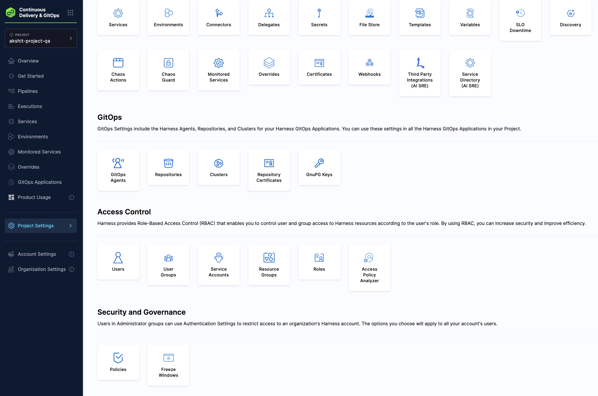
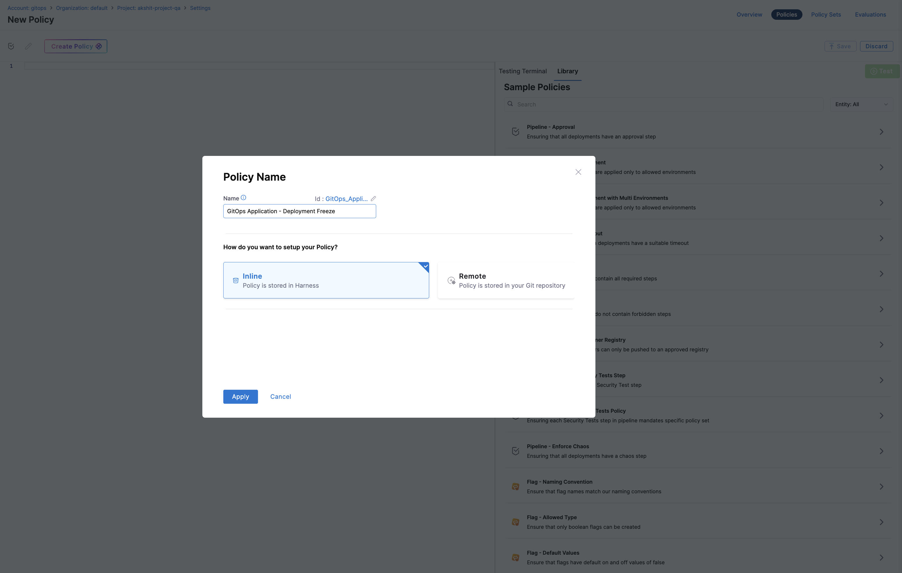
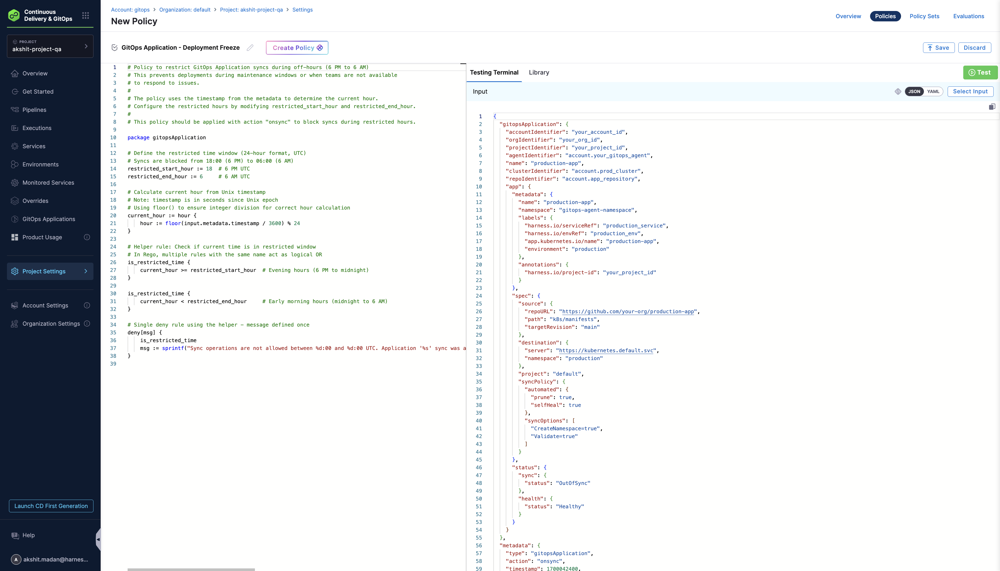
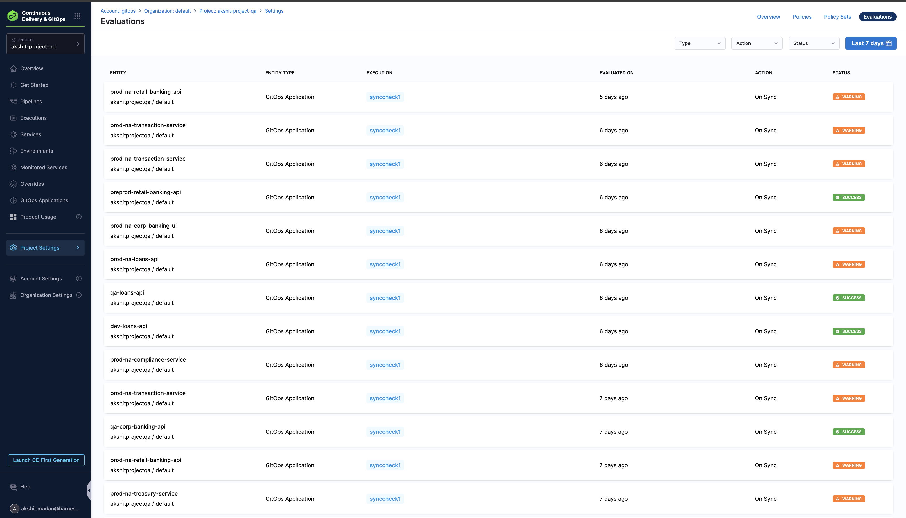
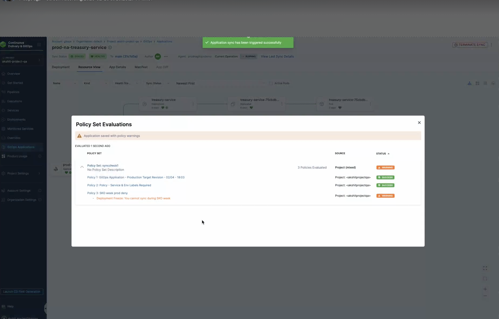

Harness supports Open Policy Agent (OPA) policies for GitOps Applications, allowing you to enforce governance rules and compliance requirements during GitOps operations such as syncing applications.

With OPA policy support, you can:

- **Enforce deployment freezes:** Prevent syncing GitOps Applications during maintenance windows or specific time periods
- **Control production deployments:** Restrict manual syncs for production applications based on naming conventions or labels
- **Validate application configurations:** Ensure GitOps Applications meet organizational standards before syncing
- **Implement time-based restrictions:** Block or allow syncs based on specific time windows

For a comprehensive overview of Harness Policy As Code and OPA, see [Harness Policy As Code overview](/docs/platform/governance/policy-as-code/harness-governance-overview).

## How OPA policies work for GitOps Applications

When you create a policy for GitOps Applications, the policy is evaluated against the GitOps Application entity during specific events:

- **On Save:** Policies are evaluated when a GitOps Application is saved or updated.
- **On Sync:** Policies are evaluated when a sync operation is initiated for a GitOps Application.

The policy receives the GitOps Application configuration as input, including:
- Application metadata (name, namespace, labels)
- Application source configuration
- Application destination configuration
- Sync operation details

:::info Important considerations

- **OPA policies do not apply to auto-syncs.** Policies are evaluated only when a sync is initiated through the Harness UI or API, not during automatic sync operations triggered by Argo CD.
- **OPA policies do not prevent syncs triggered directly on the cluster.** If a user logs into the cluster and triggers a sync from the command line (for example, using `argocd app sync`), Harness OPA policies are not evaluated.
- **You can prevent auto-syncs using OPA.** Because the `syncPolicy` is set at the application level, you can write an **On Save** policy that denies applications configured with auto-sync enabled, effectively preventing auto-sync from being set on the application.

:::

## Prerequisites

Before creating OPA policies for GitOps Applications, ensure you have:

- **GitOps Applications configured:** At least one GitOps Application must exist in your project.
- **Policy permissions:** Appropriate permissions to create and manage policies in Harness.
- **Understanding of Rego:** Basic knowledge of the Rego policy language used by OPA.

For more information about writing Rego policies, see [OPA Policy Language](https://www.openpolicyagent.org/docs/latest/policy-language/) and the [Rego Cheatsheet](https://dboles-opa-docs.netlify.app/docs/v0.10.7/rego-cheatsheet/).

## Step 1: Navigate to policies

1. In Harness, go to **Settings**.
2. Under **Security and Governance**, click **Policies**.



## Step 2: Create a new policy

1. Click **+ New Policy**.
2. Enter a name for your policy (for example, "GitOps Application - Deployment Freeze").
3. Select **Inline** or **Remote** for policy storage.
4. Click **Apply**.



## Step 3: Define the policy

In the policy editor, write your Rego policy. The policy should use the `gitopsApplication` package and access the application data through the `input.gitopsApplication` object. You can also search `GitOps` in the Sample Policies and pick the template best suited for the use case.



## Step 4: Add policy to a policy set

1. Go to **Policy Sets**.
2. Create a new Policy Set or edit an existing one.
3. Set the **Entity Type** to **GitOps Application**.
4. Select the event (**On Save** or **On Sync**).
5. Add your policy to the Policy Set.
6. Set the policy severity (**Error and Exit** or **Warn and Continue**).
7. Save the Policy Set.

## Sample policies

### Restrict sync during off-hours

This policy prevents GitOps Application syncs during off-hours (for example, between 6 PM and 6 AM UTC):

```rego
package gitopsApplication

restricted_start_hour := 18
restricted_end_hour := 6

current_hour := hour {
    hour := floor(input.metadata.timestamp / 3600) % 24
}

is_restricted_time {
    current_hour >= restricted_start_hour
}

is_restricted_time {
    current_hour < restricted_end_hour
}

deny[msg] {
    is_restricted_time
    msg := sprintf("Sync operations are not allowed between %d:00 and %d:00 UTC. Application '%s' sync was attempted at hour %d:00 UTC. Please schedule your sync during business hours.", [restricted_start_hour, restricted_end_hour, input.gitopsApplication.name, current_hour])
}
```

### Require service and environment labels

This policy ensures that GitOps Applications have required Harness labels before syncing:

```rego
package gitopsApplication

deny[msg] {
    not input.gitopsApplication.app.metadata.labels["harness.io/serviceRef"]
    msg := sprintf("Application '%s' is missing required label 'harness.io/serviceRef'. Please add the Harness Service reference label to track deployments.", [input.gitopsApplication.name])
}

deny[msg] {
    input.gitopsApplication.app.metadata.labels["harness.io/serviceRef"] == ""
    msg := sprintf("Application '%s' has an empty 'harness.io/serviceRef' label. Please provide a valid Harness Service identifier.", [input.gitopsApplication.name])
}

deny[msg] {
    not input.gitopsApplication.app.metadata.labels["harness.io/envRef"]
    msg := sprintf("Application '%s' is missing required label 'harness.io/envRef'. Please add the Harness Environment reference label to track deployments.", [input.gitopsApplication.name])
}

deny[msg] {
    input.gitopsApplication.app.metadata.labels["harness.io/envRef"] == ""
    msg := sprintf("Application '%s' has an empty 'harness.io/envRef' label. Please provide a valid Harness Environment identifier.", [input.gitopsApplication.name])
}
```

### Block protected namespaces

This policy prevents GitOps Applications from deploying to protected system namespaces:

```rego
package gitopsApplication

blocked_namespaces := [
    "kube-system",
    "kube-public",
    "kube-node-lease",
    "default",
    "argocd",
    "gitops-system",
    "istio-system",
    "cert-manager",
    "monitoring",
    "logging"
]

is_blocked_namespace(ns) {
    blocked_namespaces[_] == ns
}

deny[msg] {
    ns := input.gitopsApplication.app.spec.destination.namespace
    is_blocked_namespace(ns)
    msg := sprintf("Application '%s' cannot deploy to protected namespace '%s'. Protected namespaces are reserved for system components. Please use a different destination namespace.", [input.gitopsApplication.name, ns])
}

deny[msg] {
    ns := input.gitopsApplication.app.spec.destination.namespace
    startswith(ns, "kube-")
    msg := sprintf("Application '%s' cannot deploy to Kubernetes reserved namespace '%s'. Namespaces starting with 'kube-' are reserved for Kubernetes system components.", [input.gitopsApplication.name, ns])
}

deny[msg] {
    ns := input.gitopsApplication.app.spec.destination.namespace
    startswith(ns, "openshift-")
    msg := sprintf("Application '%s' cannot deploy to OpenShift reserved namespace '%s'. Namespaces starting with 'openshift-' are reserved for OpenShift system components.", [input.gitopsApplication.name, ns])
}
```

## Testing policies

You can test your policies before applying them:

1. In the policy editor, use the **Testing Terminal** tab.
2. Select a sample GitOps Application payload or use a previous evaluation.
3. Run the test to see if the policy evaluates correctly.
4. Review the results and adjust the policy as needed.

For more information about testing policies, see [Harness Policy As Code quickstart](/docs/platform/governance/policy-as-code/harness-governance-quickstart).

## Policy input schema

The input payload for GitOps Application policies follows this structure:

```json
{
  "gitopsApplication": {
    "app": {
      "metadata": {
        "name": "application-name",
        "namespace": "argocd",
        "labels": {
          "harness.io/serviceRef": "service-id",
          "harness.io/envRef": "environment-id"
        }
      },
      "spec": {
        "source": {
          "repoURL": "https://github.com/example/repo",
          "targetRevision": "main",
          "path": "manifests"
        },
        "destination": {
          "server": "https://kubernetes.default.svc",
          "namespace": "default"
        }
      },
      "operation": {
        "sync": {
          "syncStrategy": {
            "hook": {}
          }
        }
      }
    }
  },
  "metadata": {
    "action": "onsync",
    "user": {
      "email": "user@example.com",
      "uuid": "user-uuid"
    }
  }
}
```

## View policy evaluation results

### View evaluations in Policies

To view all policy evaluations across your GitOps Applications:

1. Go to **Settings** > **Policies** > **Evaluations**.
2. Filter evaluations by:
   - **Type:** Select "GitOps Application"
   - **Action:** Select "On Save" or "On Sync"
   - **Status:** Filter by SUCCESS, WARNING, or FAILED
   - **Time range:** Select the date range (for example, "Last 7 days")

The evaluations table shows:
- **ENTITY:** The GitOps Application name and path
- **ENTITY TYPE:** "GitOps Application"
- **EXECUTION:** The Policy Set name that was evaluated
- **EVALUATED ON:** When the evaluation occurred
- **ACTION:** The event that triggered the evaluation ("On Sync" or "On Save")
- **STATUS:** The evaluation result (SUCCESS, WARNING, or FAILED)



This view allows you to audit policy evaluations over time and identify patterns in policy violations across all your GitOps Applications.

### View evaluation results during sync

When you sync a GitOps Application, the **Policy Set Evaluations** modal appears automatically if policies are evaluated. This modal shows:

- **Evaluation timestamp:** When the policies were evaluated
- **Policy Set information:** The name and scope of the Policy Set
- **Overall status:** The combined status of all policies (SUCCESS, WARNING, or FAILED)
- **Individual policy results:** Each policy's status with specific messages

The modal displays a warning banner if any policies generate warnings, and shows detailed results for each policy in the Policy Set. Policies with **SUCCESS** status are marked with a green checkmark, while policies with **WARNING** or **FAILED** status show the specific error message from the policy evaluation.



## Best practices

- **Use descriptive policy names:** Name your policies clearly to indicate their purpose (for example, "GitOps Application - Production Deployment Freeze").
- **Test policies thoroughly:** Use the Testing Terminal to verify policies work as expected before applying them.
- **Start with warnings:** Initially set policies to "Warn and Continue" to monitor behavior before enforcing with "Error and Exit".
- **Update time windows regularly:** If using time-based policies, ensure maintenance windows and time restrictions are kept up to date.
- **Review evaluation results:** Regularly review policy evaluation results to ensure policies are working as intended and to identify areas for improvement.

## See also

- [Harness Policy As Code overview](/docs/platform/governance/policy-as-code/harness-governance-overview)
- [Policy samples](/docs/platform/governance/policy-as-code/sample-policy-use-case)
- [Manage GitOps Applications](/docs/continuous-delivery/gitops/application/manage-gitops-applications)
