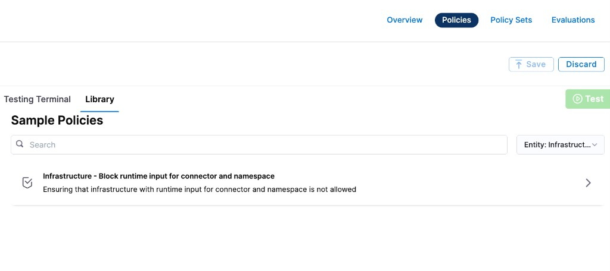

Harness provides governance using Open Policy Agent (OPA), Policy Management, and Rego policies.

You can create a policy and apply it to all [infrastructure definitions](/docs/continuous-delivery/overview#infrastructure-definition) in your Account, Org, or Project. The policy is evaluated on infrastructure-level events:

- **On Save** — evaluated when an infrastructure definition is created or updated.
- **On Run** — evaluated when a pipeline that references the infrastructure definition is executed.

For more details, see the [Harness Governance Quickstart](/docs/platform/governance/policy-as-code/harness-governance-quickstart).

## Prerequisites

- [Harness Governance Overview](/docs/platform/governance/policy-as-code/harness-governance-overview)
- [Harness Governance Quickstart](/docs/platform/governance/policy-as-code/harness-governance-quickstart)
- Policies use the OPA authoring language Rego. For more information, see [OPA Policy Authoring](https://academy.styra.com/courses/opa-rego).

## Step 1: Add a policy

1. In Harness, go to **Account Settings** → **Policies** → **New Policy**.

2. Enter a **Name** for your policy and click **Apply**.

3. Add your Rego policy in the editor.

   You can write your own Rego policy or use a sample from the **Library** panel. Select the **Library** tab, choose **Entity: Infrastructure** from the dropdown, and pick one of the built-in samples:

   

   Harness ships a sample policy for infrastructure definitions:

   - **Infrastructure – Block runtime input for connector and namespace:** Prevents infrastructure definitions from using runtime inputs (`<+input>`) for the connector or namespace fields.

   Below is the Rego policy for this sample.

#### Block runtime inputs for connector and namespace

This policy denies infrastructure definitions that use runtime inputs for the `connectorRef` or `namespace` fields. This ensures that teams explicitly set these values rather than deferring them to pipeline execution time.

```
package infra

deny[msg] {
  input.infrastructureEntity.spec.connectorRef == "<+input>"
  msg := "Runtime input is not allowed for connector"
}

deny[msg] {
  input.infrastructureEntity.spec.namespace == "<+input>"
  msg := "Runtime input is not allowed for namespace"
}
```

4. Click **Save**.

## Step 2: Add the policy to a policy set

After creating your policy, add it to a Policy Set before it can be enforced on infrastructure definitions.

1. Go to **Policies** → **Policy Sets** → **New Policy Set**.

2. Enter a **Name** and optional **Description** for the Policy Set.

3. In **Entity type**, select **Infrastructure**.

4. In **On what event should the Policy Set be evaluated**, select **On Save**, **On Run**, or both depending on when you want the policy enforced.

   - **On Save** — the policy is evaluated every time a user creates or updates the infrastructure definition.
   - **On Run** — the policy is evaluated when a pipeline that uses the infrastructure definition is executed.

5. Click **Continue**.

   :::note
   Existing infrastructure definitions are not automatically evaluated against new policies. Policies are applied only when an infrastructure definition is saved (created or updated) or when a pipeline referencing it is run.
   :::

6. In **Policy evaluation criteria**, click **Add Policy**.

7. In the **Select Policy** dialog, choose the scope (**Project**, **Org**, or **Account**) and select the policy you created.

   

8. Select the severity and action for policy violations:

   - **Warn & continue** — a warning is displayed if the policy is not met, but the infrastructure definition is saved and you can proceed.
   - **Error and exit** — an error is displayed and the infrastructure definition is not saved if the policy is not met.

9. Click **Apply**, then click **Finish**.

10. The Policy Set is automatically set to **Enforced**. To disable enforcement, toggle off the **Enforced** button.

## Step 3: Apply the policy to an infrastructure definition

After creating and enforcing your Policy Set, it is automatically evaluated whenever an infrastructure definition event matches the configured trigger.

1. Go to **Deployments** → **Environments** → select an environment → **Infrastructure Definitions**.

2. Create or edit an infrastructure definition and click **Save**.

3. Based on your selection in the Policy Evaluation criteria:

   - If the infrastructure definition meets the policy, it is saved successfully.
   - If the infrastructure definition violates the policy and the severity is **Warn & continue**, it is saved with a warning.
   - If the infrastructure definition violates the policy and the severity is **Error and exit**, the save is blocked and an error is displayed.

## See also

- [Harness Governance Overview](/docs/platform/governance/policy-as-code/harness-governance-overview)
- [Policy Samples](/docs/platform/governance/policy-as-code/sample-policy-use-case)
