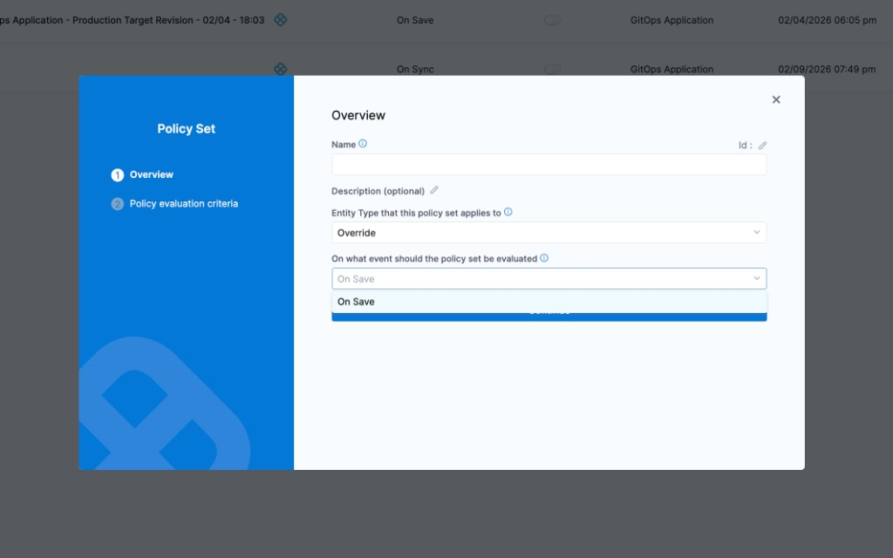
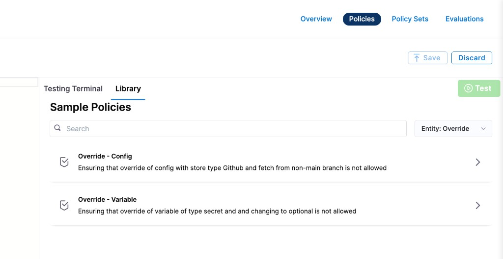

Harness provides governance using Open Policy Agent (OPA), Policy Management, and Rego policies.

You can create a policy and apply it to all [overrides](/docs/continuous-delivery/x-platform-cd-features/overrides-v2) in your Account, Org, or Project. The policy is evaluated on override-level events:

- **On Save** — evaluated when an override is created or updated.



For more details, see the [Harness Governance Quickstart](/docs/platform/governance/policy-as-code/harness-governance-quickstart).

## Prerequisites

- [Harness Governance Overview](/docs/platform/governance/policy-as-code/harness-governance-overview)
- [Harness Governance Quickstart](/docs/platform/governance/policy-as-code/harness-governance-quickstart)
- Policies use the OPA authoring language Rego. For more information, see [OPA Policy Authoring](https://academy.styra.com/courses/opa-rego).

## Step 1: Add a policy

1. In Harness, go to **Account Settings** → **Policies** → **New Policy**.

2. Enter a **Name** for your policy and click **Apply**.

3. Add your Rego policy in the editor.

   You can write your own Rego policy or use a sample from the **Library** panel. Select the **Library** tab, choose **Entity: Override** from the dropdown, and pick one of the built-in samples:

   

   Harness ships two sample policies for overrides:

   - **Override – Config:** Ensures that overriding config files with store type GitHub or fetching from a non-main branch is not allowed.
   - **Override – Variable:** Ensures that overriding a variable of type Secret or changing it to optional is not allowed.

   Below are the Rego policies for both samples.

#### Block config file overrides from GitHub or non-main branches

This policy prevents overriding config files when the store type is GitHub, and also blocks fetching config files from any branch other than `main`.

```
package override

deny[msg] {
  input.overrideEntity.configFiles[_].configFile.spec.store.type == "Github"
  msg := "Cannot override config files to fetch from Github"
}

deny[msg] {
  input.overrideEntity.configFiles[_].configFile.spec.store.spec.branch != "main"
  msg := "Cannot override config files to fetch from non main branch"
}
```

#### Block variable overrides that are optional or of type Secret

This policy prevents overriding variables to make them optional, and blocks overriding variables of type Secret.

```
package override

deny[msg] {
  input.overrideEntity.variables[_].required == false
  msg := "Cannot override variables to optional"
}

deny[msg] {
  input.overrideEntity.variables[_].type == "Secret"
  msg := "Cannot override secret variable type"
}
```

4. Click **Save**.

## Step 2: Add the policy to a policy set

After creating your policy, add it to a Policy Set before it can be enforced on overrides.

1. Go to **Policies** → **Policy Sets** → **New Policy Set**.

2. Enter a **Name** and optional **Description** for the Policy Set.

3. In **Entity type**, select **Override**.

4. In **On what event should the Policy Set be evaluated**, select **On Save**.

5. Click **Continue**.

   :::note
   Existing overrides are not automatically evaluated against new policies. Policies are applied only when an override is saved (created or updated).
   :::

6. In **Policy evaluation criteria**, click **Add Policy**.

7. In the **Select Policy** dialog, choose the scope (**Project**, **Org**, or **Account**) and select the policy you created.

   

8. Select the severity and action for policy violations:

   - **Warn & continue** — a warning is displayed if the policy is not met, but the override is saved and you can proceed.
   - **Error and exit** — an error is displayed and the override is not saved if the policy is not met.

9. Click **Apply**, then click **Finish**.

10. The Policy Set is automatically set to **Enforced**. To disable enforcement, toggle off the **Enforced** button.

## Step 3: Apply the policy to an override

After creating and enforcing your Policy Set, it is automatically evaluated whenever an override is saved.

1. Go to **Deployments** → **Environments** → select an environment → **Service Overrides** (or configure overrides at the appropriate scope).

2. Create or edit an override and click **Save**.

3. Based on your selection in the Policy Evaluation criteria:

   - If the override meets the policy, it is saved successfully.
   - If the override violates the policy and the severity is **Warn & continue**, it is saved with a warning.
   - If the override violates the policy and the severity is **Error and exit**, the save is blocked and an error is displayed.

## See also

- [Harness Governance Overview](/docs/platform/governance/policy-as-code/harness-governance-overview)
- [Policy Samples](/docs/platform/governance/policy-as-code/sample-policy-use-case)
