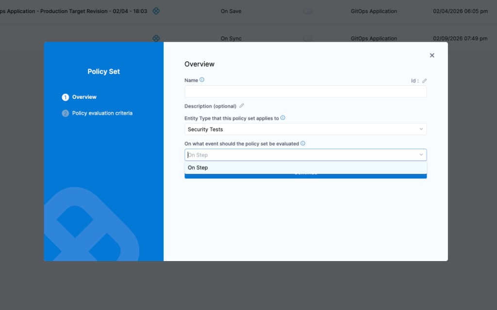
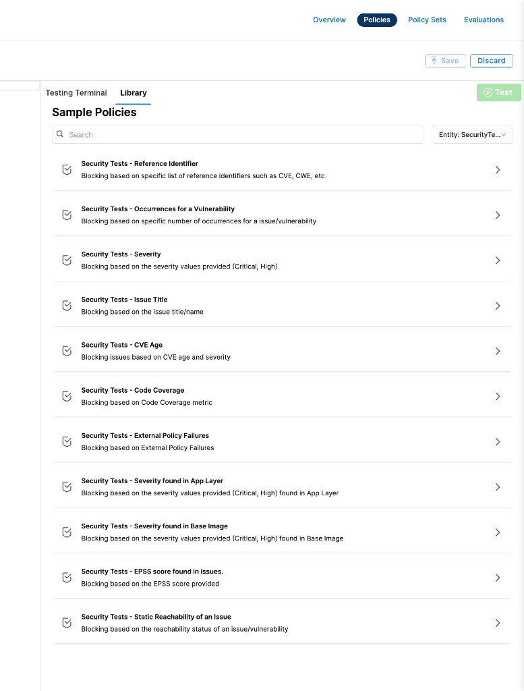
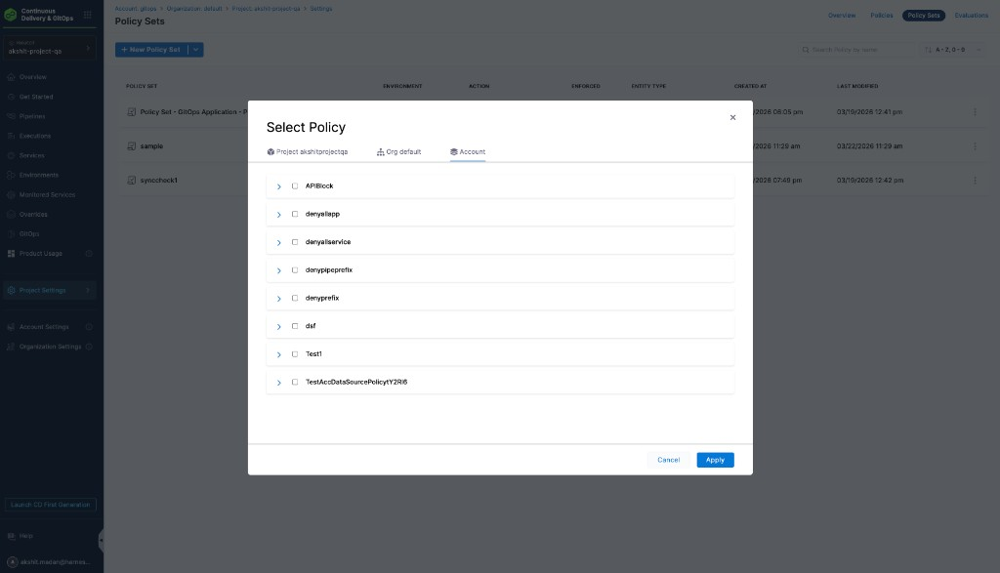

Harness provides governance using Open Policy Agent (OPA), Policy Management, and Rego policies.

You can create a policy and apply it to security test results in your Account, Org, or Project. The policy is evaluated on security test events:

- **On Step** — evaluated after a scan step completes in a pipeline.

Security Tests policies let you enforce governance on scan results produced by [Harness Security Testing Orchestration (STO)](/docs/security-testing-orchestration/overview). Common use cases include:

- Blocking pipelines when critical or high-severity vulnerabilities are found
- Warning or blocking based on specific CVE reference IDs
- Enforcing code coverage thresholds
- Filtering vulnerabilities by age, EPSS score, or reachability

For more details, see the [Harness Governance Quickstart](/docs/platform/governance/policy-as-code/harness-governance-quickstart).

## Prerequisites

- [Harness Governance Overview](/docs/platform/governance/policy-as-code/harness-governance-overview)
- [Harness Governance Quickstart](/docs/platform/governance/policy-as-code/harness-governance-quickstart)
- A pipeline with at least one [STO scan step](/docs/security-testing-orchestration/overview) configured
- Policies use the OPA authoring language Rego. For more information, see [OPA Policy Authoring](https://academy.styra.com/courses/opa-rego).

## Step 1: Add a policy

1. In Harness, go to **Account Settings** → **Policies** → **New Policy**.

2. Enter a **Name** for your policy and click **Apply**.

3. Add your Rego policy in the editor.

   You can write your own Rego policy or use a sample from the **Library** panel. Select the **Library** tab, choose **Entity: Security Tests** from the dropdown:

   

   Harness ships many built-in sample policies for security tests:

   | Sample policy | Description |
   |---|---|
   | **Security Tests – Reference Identifier** | Blocks based on specific reference identifiers such as CVE, CWE, etc. |
   | **Security Tests – Occurrences for a Vulnerability** | Blocks based on specific number of occurrences for an issue/vulnerability |
   | **Security Tests – Severity** | Blocks based on severity values (Critical, High) |
   | **Security Tests – Issue Title** | Blocks based on the issue title/name |
   | **Security Tests – CVE Age** | Blocks issues based on CVE age and severity |
   | **Security Tests – Code Coverage** | Blocks based on code coverage metric |
   | **Security Tests – External Policy Failures** | Blocks based on external policy failures |
   | **Security Tests – Severity found in App Layer** | Blocks based on severity values (Critical, High) found in application layer |
   | **Security Tests – Severity found in Base Image** | Blocks based on severity values (Critical, High) found in base image |
   | **Security Tests – EPSS score found in issues** | Blocks based on the EPSS score provided |
   | **Security Tests – Static Reachability of an Issue** | Blocks based on the reachability status of an issue/vulnerability |

   For the full Rego code of each sample policy, see [Security Tests policy samples](/docs/platform/governance/policy-as-code/sample-policy-use-case#security-tests-policy-samples).

   For a detailed walkthrough on creating Security Tests OPA policies, see [Create OPA policies for STO](/docs/security-testing-orchestration/policies/create-opa-policies).

4. Click **Save**.

## Step 2: Add the policy to a policy set

After creating your policy, add it to a Policy Set before it can be enforced on security test results.

1. Go to **Policies** → **Policy Sets** → **New Policy Set**.

2. Enter a **Name** and optional **Description** for the Policy Set.

3. In **Entity type**, select **Security Tests**.

4. In **On what event should the Policy Set be evaluated**, select **On Step**.

5. Click **Continue**.

6. In **Policy evaluation criteria**, click **Add Policy**.

7. In the **Select Policy** dialog, choose the scope (**Project**, **Org**, or **Account**) and select the policy you created.

   

8. Select the severity and action for policy violations:

   - **Warn & continue** — a warning is displayed if the policy is not met, but the pipeline continues.
   - **Error and exit** — the pipeline fails if the policy is not met.

9. Click **Apply**, then click **Finish**.

10. The Policy Set is automatically set to **Enforced**. To disable enforcement, toggle off the **Enforced** button.

## Step 3: Apply the policy to a scan step

After creating and enforcing your Policy Set, it is automatically evaluated after any scan step completes in a pipeline.

1. Go to **Pipelines** and open a pipeline with an STO scan step.

2. Run the pipeline.

3. After the scan step completes, the policy is evaluated against the scan results:

   - If the results meet the policy, the pipeline continues.
   - If the results violate the policy and the severity is **Warn & continue**, the pipeline continues with a warning.
   - If the results violate the policy and the severity is **Error and exit**, the pipeline fails with an error.

## See also

- [Create OPA policies for STO](/docs/security-testing-orchestration/policies/create-opa-policies)
- [Security Tests policy samples](/docs/platform/governance/policy-as-code/sample-policy-use-case#security-tests-policy-samples)
- [Harness Governance Overview](/docs/platform/governance/policy-as-code/harness-governance-overview)
