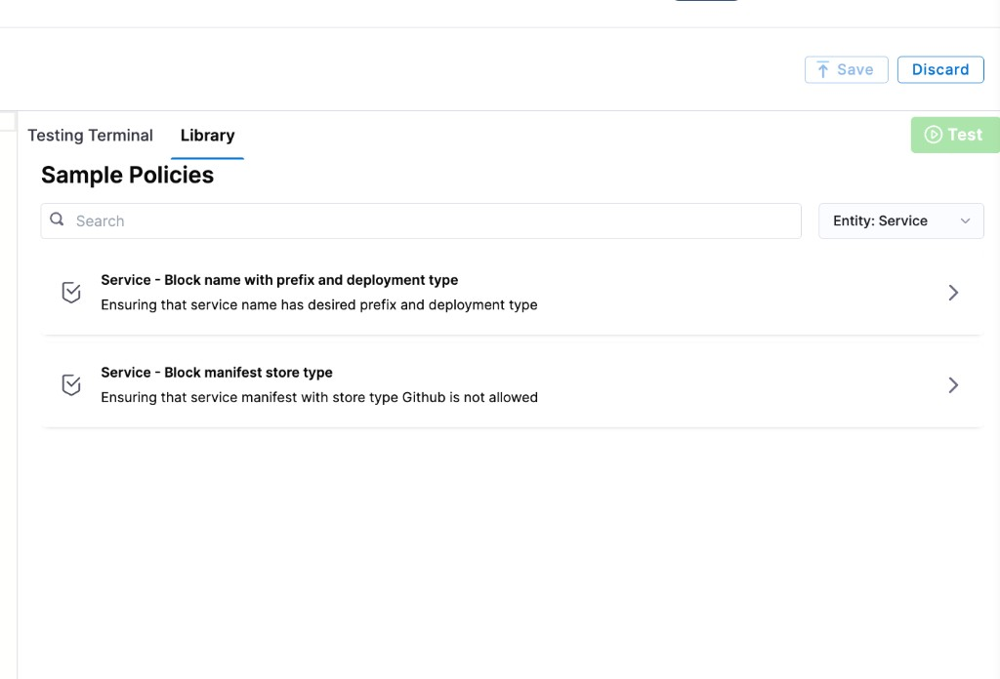

Harness provides governance using Open Policy Agent (OPA), Policy Management, and Rego policies.

You can create a policy and apply it to all [services](/docs/continuous-delivery/x-platform-cd-features/services/create-services) in your Account, Org, or Project. The policy is evaluated on service-level events:

- **On Save** — evaluated when a service is created or updated.
- **On Run** — evaluated when a pipeline that references the service is executed.

For more details, see the [Harness Governance Quickstart](/docs/platform/governance/policy-as-code/harness-governance-quickstart).

## Prerequisites

- [Harness Governance Overview](/docs/platform/governance/policy-as-code/harness-governance-overview)
- [Harness Governance Quickstart](/docs/platform/governance/policy-as-code/harness-governance-quickstart)
- Policies use the OPA authoring language Rego. For more information, see [OPA Policy Authoring](https://academy.styra.com/courses/opa-rego).

## Step 1: Add a policy

1. In Harness, go to **Account Settings** → **Policies** → **New Policy**.

2. Enter a **Name** for your policy and click **Apply**.

3. Add your Rego policy in the editor.

   You can write your own Rego policy or use a sample from the **Library** panel. Select the **Library** tab, choose **Entity: Service** from the dropdown, and pick one of the built-in samples:

   

   Harness ships two sample policies for services:

   - **Service – Block name with prefix and deployment type:** Ensures a service name contains a required prefix and uses an allowed deployment type.
   - **Service – Block manifest store type:** Prevents services from using a specific manifest store type (for example, GitHub).

   Below are example Rego policies you can use as a starting point.

#### Block services by deployment type or name prefix

```
package service

deny[msg] {
  input.serviceEntity.serviceDefinition.type == "Kubernetes"
  msg := "Service with Kubernetes deployment type is not allowed"
}

deny[msg] {
  startswith(input.serviceEntity.name, "BLOCKED_SERVICE_NAME")
  msg := "Service which starts with BLOCKED_SERVICE_NAME prefix is not allowed"
}
```

#### Block services that use a forbidden manifest store type

```
package service

deny[msg] {
  input.serviceEntity.serviceDefinition.spec.manifests[0].manifest.spec.store.type == "Github"
  msg := "Service with Github store type is not allowed for manifest"
}
```

4. Click **Save**.

## Step 2: Add the policy to a policy set

After creating your policy, add it to a Policy Set before it can be enforced on services.

1. Go to **Policies** → **Policy Sets** → **New Policy Set**.

2. Enter a **Name** and optional **Description** for the Policy Set.

3. In **Entity type**, select **Service**.

4. In **On what event should the Policy Set be evaluated**, select **On Save**, **On Run**, or both depending on when you want the policy enforced.

   - **On Save** — the policy is evaluated every time a user creates or updates the service.
   - **On Run** — the policy is evaluated when a pipeline that uses the service is executed.

5. Click **Continue**.

   :::note
   Existing services are not automatically evaluated against new policies. Policies are applied only when a service is saved (created or updated) or when a pipeline referencing the service is run.
   :::

6. In **Policy evaluation criteria**, click **Add Policy**.

7. In the **Select Policy** dialog, choose the scope (**Project**, **Org**, or **Account**) and select the policy you created.

   

8. Select the severity and action for policy violations:

   - **Warn & continue** — a warning is displayed if the policy is not met, but the service is saved and you can proceed.
   - **Error and exit** — an error is displayed and the service is not saved if the policy is not met.

9. Click **Apply**, then click **Finish**.

10. The Policy Set is automatically set to **Enforced**. To disable enforcement, toggle off the **Enforced** button.

## Step 3: Apply the policy to a service

After creating and enforcing your Policy Set, it is automatically evaluated whenever a service event matches the configured trigger.

1. Go to **Deployments** → **Services** → **New Service** (or edit an existing service).

2. Configure the service and click **Save**.

3. Based on your selection in the Policy Evaluation criteria:

   - If the service meets the policy, it is saved successfully.
   - If the service violates the policy and the severity is **Warn & continue**, it is saved with a warning.
   - If the service violates the policy and the severity is **Error and exit**, the save is blocked and an error is displayed.

## See also

- [Harness Governance Overview](/docs/platform/governance/policy-as-code/harness-governance-overview)
- [Policy Samples](/docs/platform/governance/policy-as-code/sample-policy-use-case)
