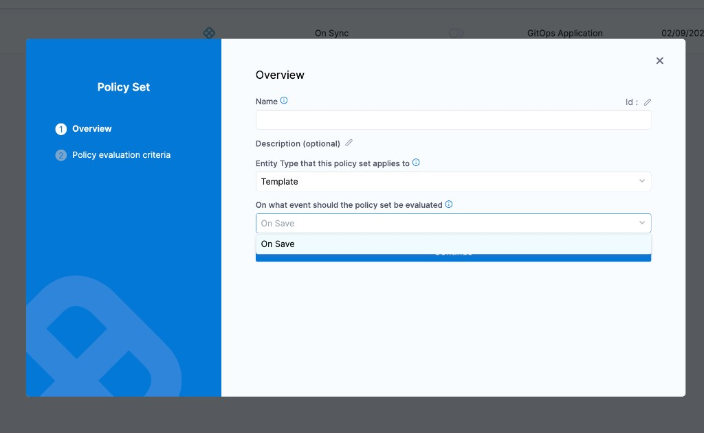
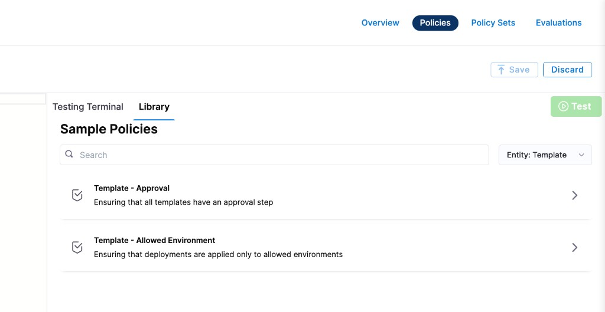

Harness provides governance using Open Policy Agent (OPA), Policy Management, and Rego policies.

You can create a policy and apply it to all [templates](/docs/platform/templates/template) in your Account, Org, or Project. The policy is evaluated on template-level events:

- **On Save** — evaluated when a template is created or updated.



For more details, see the [Harness Governance Quickstart](/docs/platform/governance/policy-as-code/harness-governance-quickstart).

## Prerequisites

- [Harness Governance Overview](/docs/platform/governance/policy-as-code/harness-governance-overview)
- [Harness Governance Quickstart](/docs/platform/governance/policy-as-code/harness-governance-quickstart)
- Policies use the OPA authoring language Rego. For more information, see [OPA Policy Authoring](https://academy.styra.com/courses/opa-rego).

## Step 1: Add a policy

1. In Harness, go to **Account Settings** → **Policies** → **New Policy**.

2. Enter a **Name** for your policy and click **Apply**.

3. Add your Rego policy in the editor.

   You can write your own Rego policy or use a sample from the **Library** panel. Select the **Library** tab, choose **Entity: Template** from the dropdown, and pick one of the built-in samples:

   

   Harness ships two sample policies for templates:

   - **Template – Approval:** Ensures that all templates have an approval step.
   - **Template – Allowed Environment:** Ensures that deployments are applied only to allowed environments.

   Below are the Rego policies for both samples.

#### Require an approval step in deployment stages

This policy denies templates that contain a deployment stage without a `HarnessApproval` step. This enforces a review gate before any deployment proceeds.

```
package template

deny[msg] {
  input.template.spec.stages[i].stage.type == "Deployment"
  not stages_with_approval[i]
  msg := sprintf("deployment stage '%s' does not have a HarnessApproval step", [input.template.spec.stages[i].stage.name])
}

stages_with_approval[i] {
  input.template.spec.stages[i].stage.spec.execution.steps[_].step.type == "HarnessApproval"
}
```

#### Restrict deployments to allowed environments

This policy denies templates that deploy to environments outside an approved list, and also blocks templates where the environment reference is missing entirely.

```
package template

deny[msg] {
  stage = input.template.spec.stages[_].stage
  stage.type == "Deployment"
  not contains(allowed_environments, stage.spec.environment.infrastructureDefinitions[i].identifier)
  msg := sprintf("deployment stage '%s' cannot be deployed to environment '%s'", [stage.name, stage.spec.environment.infrastructureDefinitions[i].identifier])
}

deny[msg] {
  stage = input.template.spec.stages[_].stage
  stage.type == "Deployment"
  not stage.spec.environment.environmentRef
  msg := sprintf("deployment stage '%s' has no environment identifier", [stage.name])
}

allowed_environments = ["prod", "stage"]

contains(arr, elem) {
  arr[_] = elem
}
```

4. Click **Save**.

## Step 2: Add the policy to a policy set

After creating your policy, add it to a Policy Set before it can be enforced on templates.

1. Go to **Policies** → **Policy Sets** → **New Policy Set**.

2. Enter a **Name** and optional **Description** for the Policy Set.

3. In **Entity type**, select **Template**.

4. In **On what event should the Policy Set be evaluated**, select **On Save**.

5. Click **Continue**.

   :::note
   Existing templates are not automatically evaluated against new policies. Policies are applied only when a template is saved (created or updated).
   :::

6. In **Policy evaluation criteria**, click **Add Policy**.

7. In the **Select Policy** dialog, choose the scope (**Project**, **Org**, or **Account**) and select the policy you created.

   

8. Select the severity and action for policy violations:

   - **Warn & continue** — a warning is displayed if the policy is not met, but the template is saved and you can proceed.
   - **Error and exit** — an error is displayed and the template is not saved if the policy is not met.

9. Click **Apply**, then click **Finish**.

10. The Policy Set is automatically set to **Enforced**. To disable enforcement, toggle off the **Enforced** button.

## Step 3: Apply the policy to a template

After creating and enforcing your Policy Set, it is automatically evaluated whenever a template is saved.

1. Go to **Account Settings** → **Templates** (or navigate to templates within your Project or Org).

2. Create or edit a template and click **Save**.

3. Based on your selection in the Policy Evaluation criteria:

   - If the template meets the policy, it is saved successfully.
   - If the template violates the policy and the severity is **Warn & continue**, it is saved with a warning.
   - If the template violates the policy and the severity is **Error and exit**, the save is blocked and an error is displayed.

## See also

- [Harness Governance Overview](/docs/platform/governance/policy-as-code/harness-governance-overview)
- [Policy Samples](/docs/platform/governance/policy-as-code/sample-policy-use-case)
