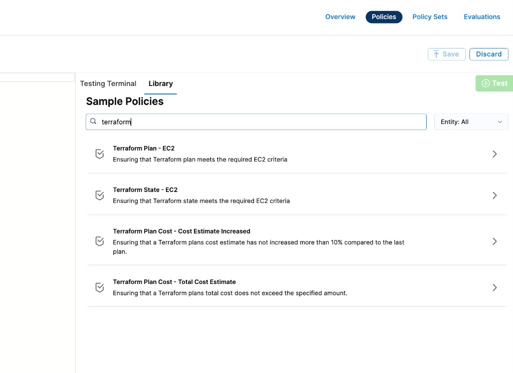
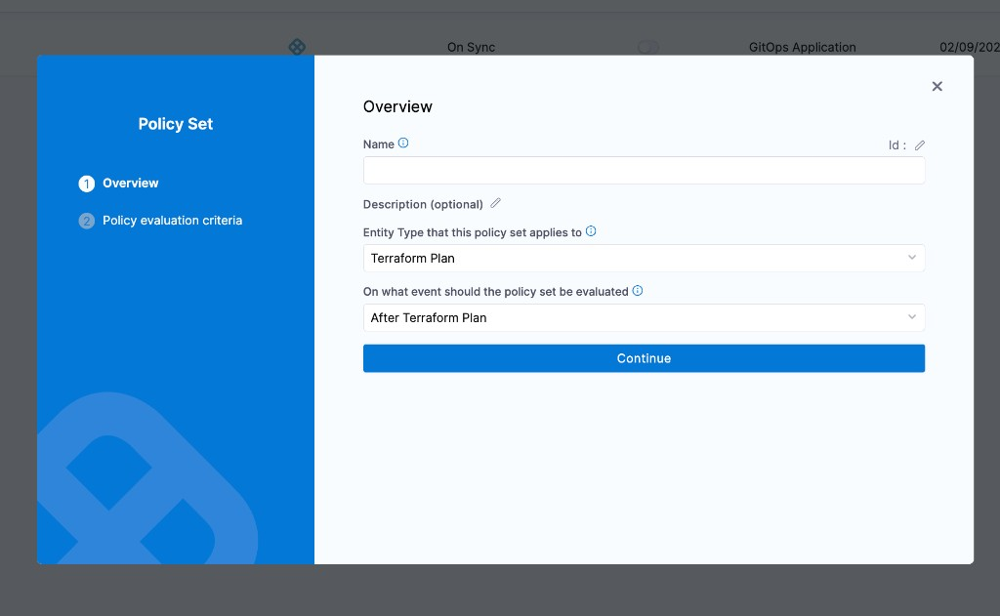
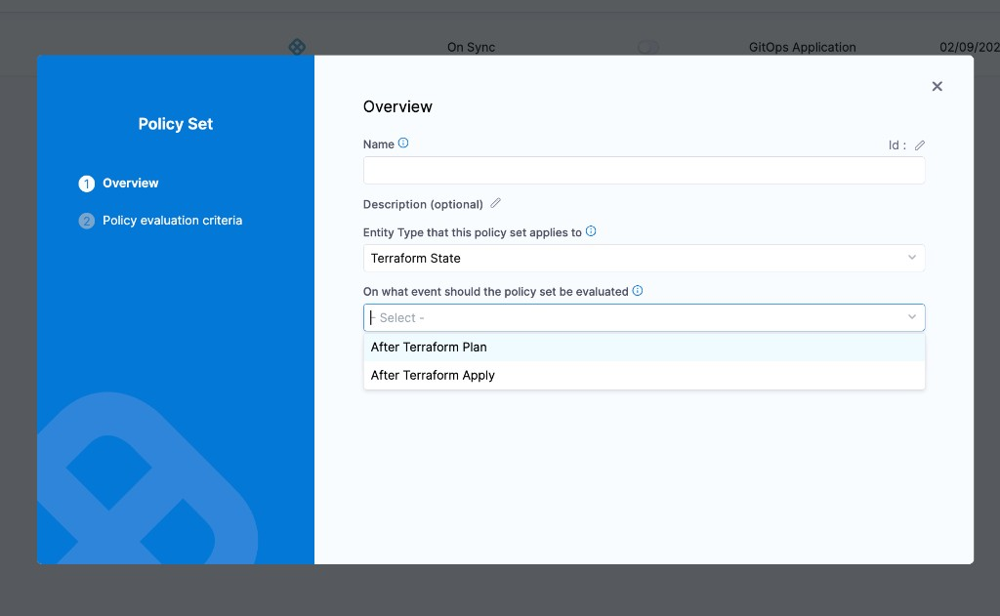
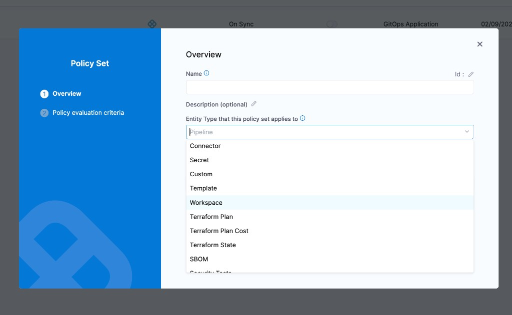

Harness provides governance using Open Policy Agent (OPA), Policy Management, and Rego policies.

Harness supports three Terraform-related entity types for policy evaluation. Each entity type has its own set of evaluation events, letting you enforce governance at different stages of your Terraform workflow.

| Entity type | Evaluation event | When it runs |
|---|---|---|
| **Terraform Plan** | After Terraform Plan | After a Terraform Plan step completes in a pipeline |
| **Terraform Plan Cost** | After Terraform Plan | After a Terraform Plan step completes (evaluates the cost estimate) |
| **Terraform State** | After Terraform Plan / After Terraform Apply | After a Terraform Plan or Terraform Apply step completes |

For more details, see the [Harness Governance Quickstart](/docs/platform/governance/policy-as-code/harness-governance-quickstart).

## Prerequisites

- [Harness Governance Overview](/docs/platform/governance/policy-as-code/harness-governance-overview)
- [Harness Governance Quickstart](/docs/platform/governance/policy-as-code/harness-governance-quickstart)
- Policies use the OPA authoring language Rego. For more information, see [OPA Policy Authoring](https://academy.styra.com/courses/opa-rego).

## Sample policies in the Library

Harness ships four built-in sample policies for Terraform entities. You can find them in the **Library** panel by searching for "terraform":



| Sample policy | Entity type | Description |
|---|---|---|
| **Terraform Plan – EC2** | Terraform Plan | Ensures the Terraform plan meets required EC2 criteria |
| **Terraform State – EC2** | Terraform State | Ensures the Terraform state meets required EC2 criteria |
| **Terraform Plan Cost – Cost Estimate Increased** | Terraform Plan Cost | Ensures cost estimate has not increased more than 10% compared to the last plan |
| **Terraform Plan Cost – Total Cost Estimate** | Terraform Plan Cost | Ensures the total cost does not exceed a specified amount |

## Terraform Plan

### Overview

A Terraform Plan policy evaluates the planned infrastructure changes before they are applied. Use this to enforce rules on what resources can be created, modified, or destroyed.

The policy is evaluated on the event:

- **After Terraform Plan** — evaluated after a Terraform Plan step completes in a pipeline.



### Step 1: Add a policy

1. In Harness, go to **Account Settings** → **Policies** → **New Policy**.

2. Enter a **Name** for your policy and click **Apply**.

3. Add your Rego policy in the editor. You can use a sample from the **Library** (search "Terraform Plan") or write your own.

   Below is an example that blocks plans creating EC2 instances of a disallowed type:

```
package terraform_plan

deny[msg] {
  resource := input.plan.resource_changes[_]
  resource.type == "aws_instance"
  resource.change.after.instance_type == "t2.micro"
  msg := sprintf("Resource '%s' uses instance type 't2.micro' which is not allowed. Use 't3.micro' or larger.", [resource.address])
}
```

4. Click **Save**.

### Step 2: Add the policy to a policy set

1. Go to **Policies** → **Policy Sets** → **New Policy Set**.

2. Enter a **Name** and optional **Description**.

3. In **Entity type**, select **Terraform Plan**.

4. In **On what event should the Policy Set be evaluated**, select **After Terraform Plan**.

5. Click **Continue**.

6. In **Policy evaluation criteria**, click **Add Policy** and select your policy.

7. Select the severity:

   - **Warn & continue** — a warning is displayed but the pipeline continues.
   - **Error and exit** — the pipeline fails if the policy is not met.

8. Click **Apply**, then click **Finish**.

## Terraform Plan Cost

### Overview

A Terraform Plan Cost policy evaluates the estimated cost of planned infrastructure changes. Use this to set cost guardrails and prevent unexpected spending.

The policy is evaluated on the event:

- **After Terraform Plan** — evaluated after a Terraform Plan step completes, using the cost estimate data.


### Step 1: Add a policy

1. In Harness, go to **Account Settings** → **Policies** → **New Policy**.

2. Enter a **Name** for your policy and click **Apply**.

3. Add your Rego policy in the editor. Below are two examples matching the built-in samples.

#### Block cost increases over 10%

```
package terraform_plan_cost

deny[msg] {
  currentCost := input.costs.totalMonthlyCost
  previousCost := input.costs.pastTotalMonthlyCost
  previousCost > 0
  increase := ((currentCost - previousCost) / previousCost) * 100
  increase > 10
  msg := sprintf("Terraform plan cost increased by %.1f%%, which exceeds the 10%% threshold. Previous: $%.2f, Current: $%.2f", [increase, previousCost, currentCost])
}
```

#### Block plans exceeding a total cost limit

```
package terraform_plan_cost

deny[msg] {
  totalCost := input.costs.totalMonthlyCost
  totalCost > 1000
  msg := sprintf("Terraform plan total monthly cost estimate is $%.2f, which exceeds the $1000 limit.", [totalCost])
}
```

4. Click **Save**.

### Step 2: Add the policy to a policy set

1. Go to **Policies** → **Policy Sets** → **New Policy Set**.

2. Enter a **Name** and optional **Description**.

3. In **Entity type**, select **Terraform Plan Cost**.

4. In **On what event should the Policy Set be evaluated**, select **After Terraform Plan**.

5. Click **Continue**.

6. In **Policy evaluation criteria**, click **Add Policy** and select your policy.

7. Select the severity (**Warn & continue** or **Error and exit**).

8. Click **Apply**, then click **Finish**.

## Terraform State

### Overview

A Terraform State policy evaluates the current state of your Terraform-managed infrastructure. Use this to audit existing resources and ensure ongoing compliance.

The policy is evaluated on the events:

- **After Terraform Plan** — evaluated after a Terraform Plan step completes.
- **After Terraform Apply** — evaluated after a Terraform Apply step completes.



### Step 1: Add a policy

1. In Harness, go to **Account Settings** → **Policies** → **New Policy**.

2. Enter a **Name** for your policy and click **Apply**.

3. Add your Rego policy in the editor. Below is an example that checks EC2 instance types in the current state:

```
package terraform_state

deny[msg] {
  resource := input.state.resources[_]
  resource.type == "aws_instance"
  instance := resource.instances[_]
  instance.attributes.instance_type == "t2.micro"
  msg := sprintf("Resource '%s' uses instance type 't2.micro' in the current state. Migrate to 't3.micro' or larger.", [resource.name])
}
```

4. Click **Save**.

### Step 2: Add the policy to a policy set

1. Go to **Policies** → **Policy Sets** → **New Policy Set**.

2. Enter a **Name** and optional **Description**.

3. In **Entity type**, select **Terraform State**.

4. In **On what event should the Policy Set be evaluated**, select **After Terraform Plan** or **After Terraform Apply**.

5. Click **Continue**.

6. In **Policy evaluation criteria**, click **Add Policy** and select your policy.

7. Select the severity (**Warn & continue** or **Error and exit**).

8. Click **Apply**, then click **Finish**.

## Policy set entity type selection

When creating a policy set, the **Entity Type** dropdown lists all three Terraform entity types separately:



Each entity type must have its own policy set — you cannot mix Terraform Plan, Terraform Plan Cost, and Terraform State policies in a single policy set.

## See also

- [Harness Governance Overview](/docs/platform/governance/policy-as-code/harness-governance-overview)
- [Policy Samples](/docs/platform/governance/policy-as-code/sample-policy-use-case)
