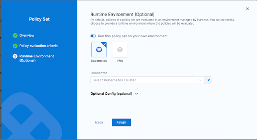
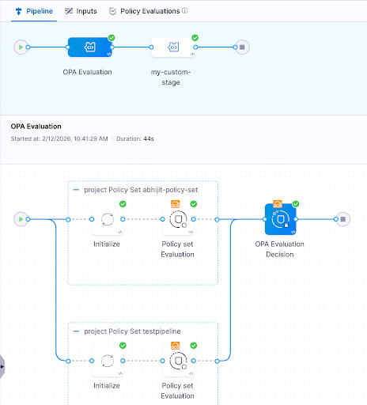

By default, Harness evaluates OPA policies on Harness-managed infrastructure (SaaS). However, there are scenarios where evaluating policies on your own infrastructure is necessary or preferred:

- **Secrets and external service access:** If your policies make HTTP requests to external systems such as ServiceNow, Jira, or internal databases, those policies need secrets or tokens to connect. Running evaluations on your infrastructure ensures that secrets never leave your trust boundary.
- **Large evaluation payloads:** Some workloads — such as large IACM plans or database procedures — produce payloads that are too large to evaluate efficiently on Harness SaaS. Offloading evaluation to your infrastructure avoids latency and size constraints.
- **Network-restricted environments:** If your policies need to reach endpoints that are only accessible within your private network, customer-side evaluation is required.

With this feature, you can configure specific policy sets to run on a Kubernetes cluster or VM in your environment, while other policy sets continue to run on Harness SaaS.

:::info note
This feature is behind the feature flag `OPA_RUN_ON_CUSTOMER_INFRA`. Contact [Harness Support](mailto:support@harness.io) to enable the feature.

This feature is only available for policy sets configured to run for entity type **Pipeline** with the **On Run** action. Policy sets enabled for any other entity type/action pair currently run exclusively on Harness SaaS.
:::

## Why On Run only

Customer-infrastructure evaluation is limited to the **On Run** action for pipelines. **On Save** evaluations are not supported for the following reasons:

- **Delegate availability:** A save operation should not be blocked if no delegate or infrastructure is available. Without this restriction, users could be unable to save a pipeline simply because the evaluation infrastructure is temporarily unreachable.
- **Save latency:** Save operations are expected to be fast. Routing an evaluation through customer infrastructure (via delegate communication) would introduce unacceptable latency for save workflows.

## Combine SaaS and customer-infrastructure policy sets

You can use a combination of SaaS-evaluated and customer-infrastructure-evaluated policy sets on the same pipeline. For example:

- **SaaS policy sets** for lightweight governance checks such as naming conventions, required approvals, or tag enforcement.
- **Customer-infrastructure policy sets** for policies that require secrets, call external services, or process large payloads.

Both types of policy sets are evaluated during the pipeline run, and the pipeline proceeds only if all policy sets pass.

## Configure a policy set to run in your environment

After deciding which policies you want to run in your own environment, create a policy set that contains those policies. When you configure the policy set for a **Pipeline** entity type with an **On Run** action, the **Runtime Environment** option appears on the policy set configuration screen.

Toggle the **Run this policy set on your own environment** option and choose either a **Kubernetes** cluster or a **VM** as the target infrastructure for running these policies. Expand the **Optional Config** section to fine-tune the Kubernetes cluster settings for your use case.

## How this feature works

Once you run a pipeline that has policy sets configured to run on your infrastructure, an **OPA Evaluation** stage is automatically added to the pipeline execution. This stage handles the entire evaluation lifecycle on the infrastructure you specified.

The stage consists of individual step groups, one for each policy set. Each step group includes:

- **Initialize:** Sets up the evaluation environment on your infrastructure.
- **Policy Set Evaluation:** Evaluates the policies in that policy set. This step passes regardless of the policy evaluation result, because the final decision is deferred to the decision step.

After all step groups complete, a final **OPA Evaluation Decision** step computes the overall result of all the policies that were run in your environment. If any policy set evaluation returned a failure, the decision step fails and blocks the pipeline.

:::warning important
If you have policy sets running on both Harness SaaS and your own infrastructure, both must pass for the pipeline to proceed. A passing **OPA Evaluation Decision** step (customer infrastructure) does not override a failing SaaS-evaluated policy set, and vice versa.
:::

## Use secrets in policies

When policies run on your own infrastructure, you can reference Harness secrets in your Rego policies. This enables use cases such as authenticating with external services (for example, querying ServiceNow for policy exceptions) without exposing secrets to Harness SaaS.

Secrets are resolved on the customer's infrastructure at evaluation time, ensuring they never leave your trust boundary.

<!-- TODO: Add sample Rego policy demonstrating secret/expression usage, and screenshots showing how secrets are stored and referenced. Blocked on input from the engineering team. -->

## Resource requirements

When running policy sets on your own infrastructure, ensure your Kubernetes cluster or VM has sufficient resources to execute the OPA evaluation steps.

### Lite-engine container specifications

**Each policy set evaluation step group** requires the following resources for its lite-engine container:

- **CPU:** 600m (600 millicores) — Request & Limit
- **Memory:** 600Mi (600 MiB) — Request & Limit

:::info note
Resources are allocated **per step group** (one step group per policy set), not at the stage level. If you have multiple policy sets running in parallel, each step group requires its own 600m CPU and 600Mi memory allocation.
:::

### Resource calculation

Lite-engine container resources are calculated as: **Step Resource Limit + Base Overhead**

- **Base overhead:** 100m CPU and 100Mi memory (required for gRPC communication, log streaming, secret resolution, and container orchestration)
- **Step resource limit:** 500m CPU and 500Mi memory (default for OPA evaluation workload — Rego policy evaluation, policy set processing, JSON parsing)
- **Total per step group:** 600m CPU + 600Mi memory

### Guaranteed Quality of Service (QoS)

Lite-engine uses the same value for requests and limits, achieving Kubernetes **Guaranteed Quality of Service (QoS)**. This ensures:

- **Prevents OOM kills:** Guaranteed memory prevents Kubernetes from evicting the container during memory pressure.
- **Predictable performance:** Guaranteed CPU prevents throttling, ensuring consistent Rego evaluation performance.
- **Stability for critical operations:** Essential for reliable Rego policy evaluation and secret resolution.

## Recommendations

- **Isolate evaluation infrastructure:** Dedicate a Kubernetes cluster or VM specifically for running OPA policy evaluations. This prevents policy evaluation workloads from interfering with your application workloads.
- **Ensure access for all pipeline executors:** Whoever or whatever runs the pipeline — whether an individual user or a trigger — must have access to the specified Kubernetes cluster or VM. Their credentials are used to access the infrastructure and execute the policies.
- **Start with SaaS, move selectively:** Keep lightweight policies on Harness SaaS and only move policies to customer infrastructure when they require secrets, external service access, or handle large payloads.
- **Monitor evaluation performance:** Since evaluation runs on your infrastructure, ensure the cluster or VM has sufficient resources to handle policy evaluation without introducing excessive latency into your pipeline runs.
