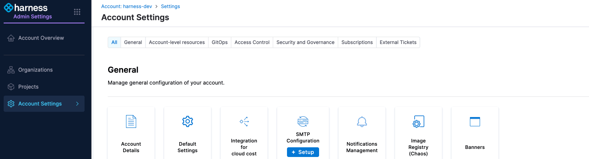
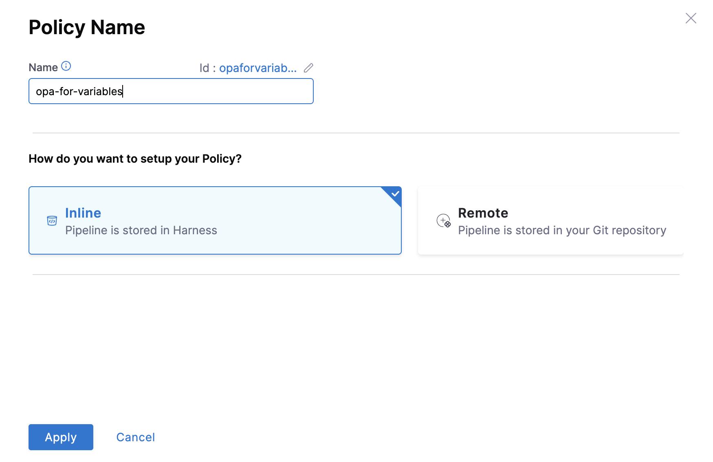
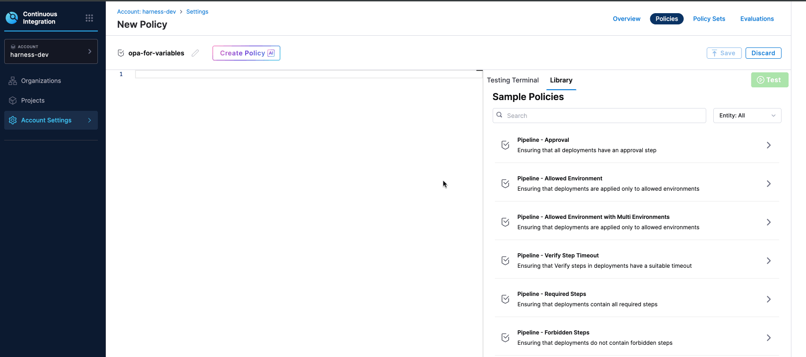
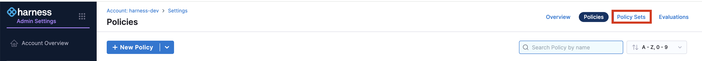
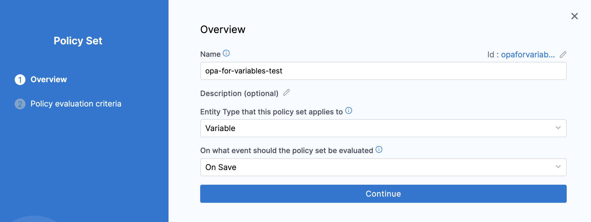
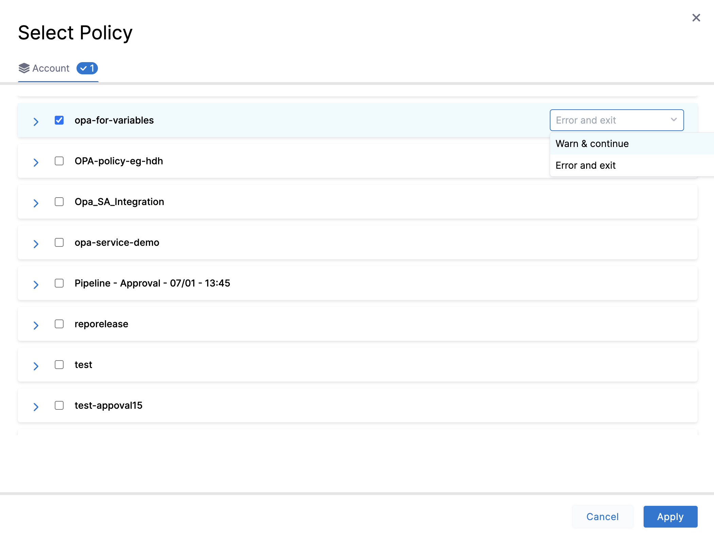
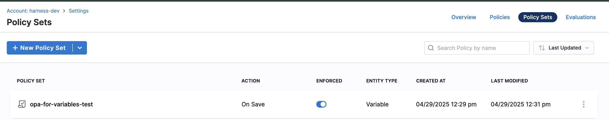
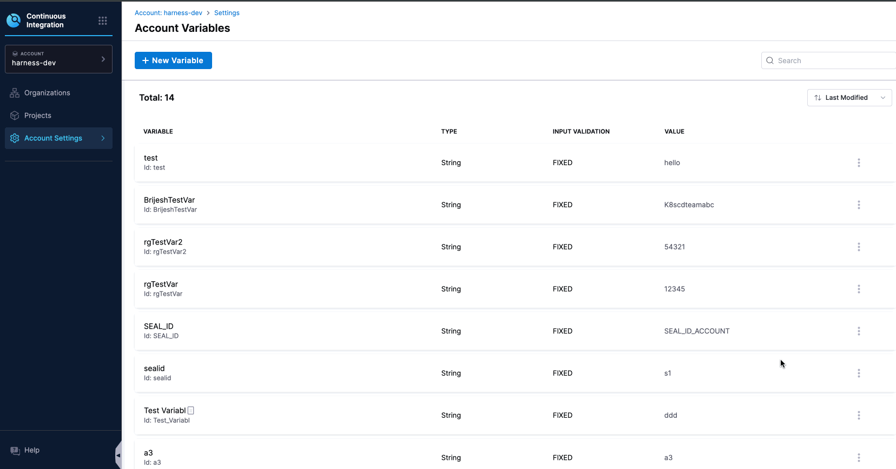
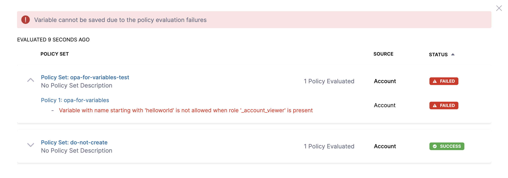

:::note Feature flag details

 This feature is currently behind the feature flag `PL_ENABLE_OPA_FOR_VARIABLES`. Contact [Harness Support](mailto:support@harness.io) to enable the feature.

:::

Harness provides governance and compliance controls through integration with Open Policy Agent (OPA), Policy Management, and Rego policies.

You can define and enforce custom policies on Variables across account, organization, and project [scopes](https://developer.harness.io/docs/platform/role-based-access-control/rbac-in-harness#permissions-hierarchy-scopes). These policies will be evaluated during the **On Save** event (when a Variable is created or updated). This ensures that Variable configurations meet your organization's security, naming, or value standards before they are persisted.

### Prerequisites

* [Harness Governance Overview](/docs/platform/governance/policy-as-code/harness-governance-overview)
* [Harness Governance Quickstart](/docs/platform/governance/policy-as-code/harness-governance-quickstart)
* Policies use OPA authoring language Rego. For more information, go to [OPA Policy Authoring](https://academy.styra.com/courses/opa-rego).

### Step 1: Add a Policy 

1. In Harness, go to **Account Settings** → **Policies** → **New Policy**.

    

2. The **New Policy** settings will appear. Enter a **Name** for your policy → click **Apply**.

    

3. **Add your Rego policy.**

    3.1 Use Your Own Rego Policy: You can add a custom Rego policy based on your requirements. For example, let's add a policy to restrict the creation or updation of Variables starting with `helloworld` by users with the Account viewer role:

        ```
            package variable

            deny[msg] {
                startswith(input.variable.name, "helloworld")

                some i
                input.metadata.roleAssignmentMetadata[i].roleIdentifier == "_account_viewer"
    
                msg := "Variable with name starting with 'helloworld' is not allowed when role '_account_viewer' is present"
            }
        ```
    3.2.  Use an existing Rego Policy from the Harness Policy Library: To select an existing policy, go to the Library, search for variables, select the **Variable - Deny Edit** template, and click **Use This Sample** at the bottom. 

        

4. **Test** your policy against a sample input, and then click **Save**.

### Step 2: Add the Policy to a Policy Set

After creating your policy, add it to a Policy Set before applying it to your Variable.

1. In **Policies**, click **Policy Sets**.

    

2. Click **New Policy Set**. Enter a **Name** and **Description**(optional) for the Policy Set. In **Entity type**, select **Variable**, and for **On what event should the Policy Set be evaluated**, select **On save.**

    Click **Continue** to proceed.

   

### Step 3: Select Policy evaluation criteria

1. Click **Add Policy** in **Policy evaluation criteria**. Select the policy from the list.

2. Choose the severity for policy violations and click **Apply**. Currently, only one option is supported: **Error and exit**.

    `Error and exit` – On saving a variable, if the policy is violated, an error will be shown and you won't be allowed to proceed.

     
    
3. Click **Finish**.

### Step 4: Policy Enforcement.

    Toggle on the **Enforced** button, to enforce the policy.

    

### Step 5: Evaluate a Policy to a Variable

    After creating your Policy Set and adding policies, let's try it out.

1. Go to **Account Settings** → **Account-level resources** → **Variables**. Click **New Variable**.  

    

2. Try using a variable name denied by your policy, e.g., **"helloworld-123"**.

    Once you try to save the variable the Policy will be evaluated, and you will receive an error.

    

### Explore More on Harness Policy as code.

* [Harness Policy As Code Overview](/docs/feature-flags/troubleshoot-ff/harness-policy-engine)