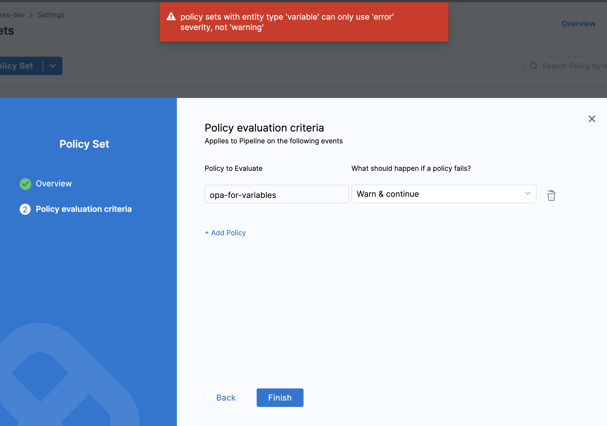

Harness provides governance and compliance controls through integration with Open Policy Agent (OPA), Policy Management, and Rego policies.

You can define and enforce custom policies on Variables across account, organization, and project [scopes](https://developer.harness.io/docs/platform/role-based-access-control/rbac-in-harness#permissions-hierarchy-scopes). These policies are evaluated automatically during Variable lifecycle events, such as On Save (when a Variable is created or updated). This ensures that Variable configurations meet your organization's security, naming, or value standards before they are persisted.

### Prerequisites

* [Harness Governance Overview](/docs/platform/governance/policy-as-code/harness-governance-overview)
* [Harness Governance Quickstart](/docs/platform/governance/policy-as-code/harness-governance-quickstart)
* Policies use OPA authoring language Rego. For more information, go to [OPA Policy Authoring](https://academy.styra.com/courses/opa-rego).

### Step 1: Add a Policy 

1. In Harness, go to **Account Settings** → **Policies** → **New Policy**.

    

2. The **New Policy** settings will appear.  

    Enter a **Name** for your policy → click **Apply**.

    

3. Add your Rego policy.

    Here, you can add a policy based on your requirements. For example, let's add a policy to restrict the recreation of Variables starting with `helloworld` by users with the `roleIdentifier` as `_account_viewer`, as shown below.

    ```
        package variable

        deny[msg] {
            startswith(input.variable.name, "helloworld")

            some i
            input.metadata.roleAssignmentMetadata[i].roleIdentifier == "_account_viewer"
  
            msg := "Variable with name starting with 'helloworld' is not allowed when role '_account_viewer' is present"
        }
    ```

    You can create a policy by using one of the available sample templates. Go to the Library, search for variables, select the **Variable - Deny Edit** template, and click **Use This Sample** at the bottom. 
    
    Then, update the policy as needed, click **Test** to verify your changes, and click **Save**.

    

### Step 2: Add the Policy to a Policy Set

After creating your policy, add it to a Policy Set before applying it to your Variable.

1. In **Policies**, click **Policy Sets**.

    

2. Click **New Policy Set**, Enter a **Name** and **Description** for the Policy Set.

   In **Entity type**, select **Variable**.

   

   In **On what event should the Policy Set be evaluated**, select **On save.** → **Continue**.

### Step 3: Select Policy evaluation criteria

1. Click **Add Policy** in **Policy evaluation criteria**.  

   Select the policy from the list, Click **Apply**.

     

2. Choose the severity and action for policy violations

    Currently, only one option is supported: **Error and exit**.

    `Error and exit` – If the policy is violated when the Variable is evaluated, an error is shown and the Variable won't be saved.

    :::warning    
        
        `Warn and continue` is not supported at this time. If you select it, you won’t be able to complete the policy setup.
            
            
    :::
    
    Click **Finish**.

### Step 4: Policy Enforcement.

1. Now, your Policy Set is automatically set to Enforced, to make it unenforced, toggle off the **Enforced** button.

    

### Step 5: Apply a Policy to a Service Account

  After creating your Policy Set and adding policies, apply it to a Variable.

  You can add a [Variable](/docs/platform/variables-and-expressions/add-a-variable#define-variables) from any module in your Project in Project setup, or in your Organization, or Account Resources. 

1. Go to **Account Settings** → **Account-level resources** → **Variables**

    click **New Variable**.  

    

    Try using a variable name denied by your policy, e.g., **"helloworld"**.

    Based on your selection in the Policy Evaluation criteria, you will either receive a warning or an error.

    

### Explore More on Harness Policy as code.

* [Harness Policy As Code Overview](/docs/feature-flags/troubleshoot-ff/harness-policy-engine)