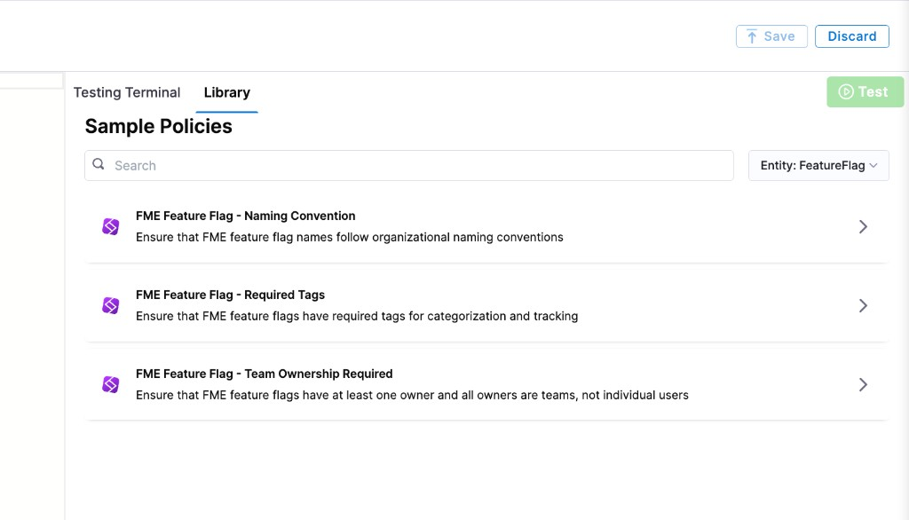

Harness provides governance using Open Policy Agent (OPA), Policy Management, and Rego policies.

You can create a policy and apply it to FME (Feature Management & Experimentation) feature flags and feature flag definitions in your Account, Org, or Project. Harness supports two FME entity types:

- **FME Feature Flag** — the feature flag itself (name, description, status, owners, tags).
- **FME Feature Flag Definition** — the per-environment definition of a feature flag (treatments, targeting rules, flag sets).

Both entity types are evaluated on the **On Save** trigger, which fires whenever a feature flag or definition is created, updated, deleted, or archived.

For complete documentation on FME policy setup including input payload reference, see [Using Harness Policy As Code with FME](/docs/feature-management-experimentation/policies).

## Prerequisites

- [Harness Governance Overview](/docs/platform/governance/policy-as-code/harness-governance-overview)
- [Harness Governance Quickstart](/docs/platform/governance/policy-as-code/harness-governance-quickstart)
- Policies use the OPA authoring language Rego. For more information, see [OPA Policy Authoring](https://academy.styra.com/courses/opa-rego).

## FME Feature Flag policies

### Step 1: Add a policy

1. In Harness, go to **Account Settings** → **Policies** → **New Policy**.

2. Enter a **Name** for your policy and click **Apply**.

3. Add your Rego policy in the editor.

   You can write your own Rego policy or use a sample from the **Library** panel. Select the **Library** tab, choose **Entity: FeatureFlag** from the dropdown:

   

   Harness ships three sample policies for FME feature flags:

   - **FME Feature Flag – Naming Convention:** Ensures that FME feature flag names follow organizational naming conventions.
   - **FME Feature Flag – Required Tags:** Ensures that FME feature flags have required tags for categorization and tracking.
   - **FME Feature Flag – Team Ownership Required:** Ensures that FME feature flags have at least one owner and all owners are teams, not individual users.

   Below are the Rego policies for all three samples.

#### Enforce naming conventions

This policy ensures feature flag names start with `ff_`, contain only lowercase letters, numbers, and underscores, and are between 5 and 100 characters.

```
package fme_feature_flags

deny[msg] {
  not regex.match("^ff_[a-z0-9][a-z0-9_]*$", input.featureFlag.name)
  msg := sprintf("FME Feature Flag name '%s' must start with 'ff_' and contain only lowercase letters, numbers, and underscores", [input.featureFlag.name])
}

deny[msg] {
  count(input.featureFlag.name) < 5
  msg := sprintf("FME Feature Flag name '%s' is too short (minimum 5 characters)", [input.featureFlag.name])
}

deny[msg] {
  count(input.featureFlag.name) > 100
  msg := sprintf("FME Feature Flag name '%s' is too long (maximum 100 characters)", [input.featureFlag.name])
}
```

#### Require tags for categorization

This policy ensures every feature flag has at least one tag and includes required tags for `owner`, `team`, `service`, and `component`.

```
package fme_feature_flags

deny[msg] {
  count(input.featureFlag.tags) == 0
  msg := sprintf("FME Feature Flag '%s' must have at least one tag", [input.featureFlag.name])
}

deny[msg] {
  not contains_required_tag("owner")
  msg := sprintf("FME Feature Flag '%s' must have an 'owner' tag", [input.featureFlag.name])
}

deny[msg] {
  not contains_required_tag("team")
  msg := sprintf("FME Feature Flag '%s' must have a 'team' tag", [input.featureFlag.name])
}

deny[msg] {
  not contains_required_tag("service")
  msg := sprintf("FME Feature Flag '%s' must have a 'service' tag", [input.featureFlag.name])
}

deny[msg] {
  not contains_required_tag("component")
  msg := sprintf("FME Feature Flag '%s' must have a 'component' tag", [input.featureFlag.name])
}

contains_required_tag(tag_name) {
  input.featureFlag.tags[_] == tag_name
}

warn[msg] {
  input.featureFlag.description == ""
  msg := sprintf("FME Feature Flag '%s' should have a description for better documentation", [input.featureFlag.name])
}
```

#### Enforce team ownership

This policy ensures every feature flag has at least one owner and that all owners are teams rather than individual users.

```
package fme_feature_flags

deny[msg] {
  count(input.entityMetadata.owners) == 0
  msg := sprintf("FME Feature Flag '%s' must have at least one owner", [input.featureFlag.name])
}

deny[msg] {
  some i
  owner := input.entityMetadata.owners[i]
  owner.ownerType == "user"
  owner_name := object.get(owner, "ownerName", owner.ownerId)
  msg := sprintf("FME Feature Flag '%s' has an individual user owner '%s'. Owners must be teams, not individual users", [input.featureFlag.name, owner_name])
}
```

4. Click **Save**.

### Step 2: Add the policy to a policy set

1. Go to **Policies** → **Policy Sets** → **New Policy Set**.

2. Enter a **Name** and optional **Description** for the Policy Set.

3. In **Entity type**, select **FME Feature Flag**.

4. In **On what event should the Policy Set be evaluated**, select **On Save**.

5. Click **Continue**.

   :::note
   Existing feature flags are not automatically evaluated against new policies. Policies are applied only when a feature flag is saved (created, updated, deleted, or archived).
   :::

6. In **Policy evaluation criteria**, click **Add Policy**.

7. In the **Select Policy** dialog, choose the scope (**Project**, **Org**, or **Account**) and select the policy you created.

   

8. Select the severity and action for policy violations:

   - **Warn & continue** — a warning is displayed if the policy is not met, but the feature flag is saved and you can proceed.
   - **Error and exit** — an error is displayed and the feature flag is not saved if the policy is not met.

9. Click **Apply**, then click **Finish**.

10. The Policy Set is automatically set to **Enforced**. To disable enforcement, toggle off the **Enforced** button.

## FME Feature Flag Definition policies

FME Feature Flag Definition policies govern the per-environment configuration of feature flags — treatments, targeting rules, and flag sets.

When creating a Policy Set for definitions, select **FME Feature Flag Definition** as the entity type. The evaluation trigger is **On Save**.

For FME Feature Flag Definition policy samples (require default treatment to be off, require flag sets for production), see [FME Feature Flag Definition policies](/docs/platform/governance/policy-as-code/sample-policy-use-case#fme-feature-flag-definition-policies).

## See also

- [Using Harness Policy As Code with FME](/docs/feature-management-experimentation/policies)
- [FME Feature Flag policy samples](/docs/platform/governance/policy-as-code/sample-policy-use-case#fme-feature-flag-policies)
- [FME Feature Flag Definition policy samples](/docs/platform/governance/policy-as-code/sample-policy-use-case#fme-feature-flag-definition-policies)
- [Harness Governance Overview](/docs/platform/governance/policy-as-code/harness-governance-overview)
