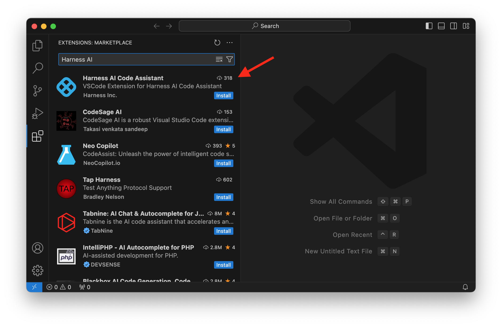
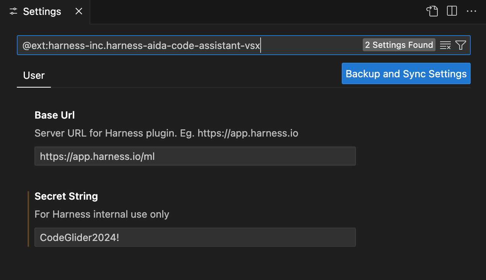
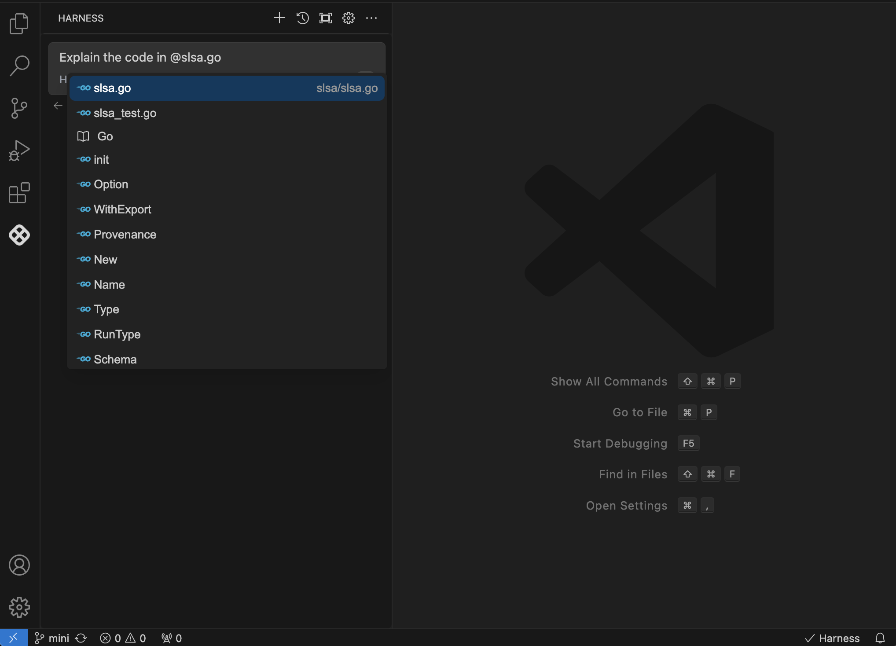

Harness AI Code Agent consists of a set of tools that enhance coding experience by providing features such as intelligent code generation, real-time code suggestions, automated test generation, contextual code explanations, and a chat feature for coding queries.

Harness AI Code Agent is designed to seamlessly integrate with your development workflow and it is available as an extension for popular Integrated Development Environments (IDEs). It exploits th power of Large Language Models to understand the context and generate relevant code/comment
tailored to your specific needs.

For instructions on how to install and configure the Harness AI Code Agent. extension see the installation section below.

## Installation and Setup
Harness AI Code Agent is currently available as an extension for Visual Studio Code and JetBrains IDEs. It can be installed directly from their respective marketplaces.

### VS Code


<!--- ### JetBrains
 --->

<!-- ### Configuration
 -->

### Authentication
After installing the extension, you will need to login to your Harness account within the IDE to enable the Harness models. You can trigger the authentication flow by clicking on the Harness icon at the bottom right corner of your IDE and selecting 'Harness login' from the dropdown menu.


Once you click the login button, you will be redirected to the Harness login page to enter your credentials.


## Using Harness AI Code Agent: Main Features 
After installing the Harness extension and completing the login process, you can immediately begin using the powerful features of the Harness AI DevOps Agent within your IDE.

Harness AI Code Agent offers four key features: Code Generation, Chat feature and Inline Editing. Below, we provide a detailed explanation of each feature.

### Code Generation
Code generation works by showing real-time inline code suggestions. The suggestions are generated based on the context of the code being written, and additional information such as relevant files and code snippets in the workspace.
Once a suggestion is shown to the user, they can accept it fully or word by word, allowing for customization before finalizing the code.


### Popup Menu
When you select code in the editor and right click, a popup menu will appear, providing options to add selected code to a chat session, fix grammar or spelling, fix the code, optimize the code, write a docstring or add comments to the code.


### Harness AI Code Agent's Chat feature
Harness AI provides a powerful interactive chat feature that can answer coding queries, provide explanations, generate new files, write tests, and assist with debugging. You can access the chat feature by clicking on the Harness icon on the left sidebar of your IDE. This will open a chat window where you can type your questions or requests, and the code agent will respond with relevant information or code suggestions.


## Harness AI Code Agent's Chat: Features and Usage
In this section we will explain some of the key features of the Harness AI Code Agent's Chat feature and how to effectively utilize them for your coding needs.

### Shortcut Keys
You can see a list of shortcut keys by clicing on `...` at the top of your chat window.


### Reference the entire codebase
Harness AI Code Agent indexes all of the code in your current workspace when VS Code launches. This semantic index makes the entire codebase available as context your chat session. By defualt, the chat feature uses the context of the current file to provide relevant suggestions and answers. You can reference the entire codebase by clicking cmd + enter when entering your prompt. Alternatively, you can reference the entire codebase with `@codebase` in your prompt. 

You can refresh the codebase index by clicking on `...` at the top of your chat window


### Adding References
 You can enhance the code agent's capabilities by adding references to specific files or libraries that are relevant to your query to get a more specific response. In order to add references, simply type `@' in the chat window and a pop-up will appear allowing you to select the files or libraries you want to reference.


### Context providers

Context providers allow you to feed relevant content to the agent as input context for your queries. Harness supports several context providers, which can be used alongside the code agent to improve response accuracy.

Examples include:

- @Codebase: Reference the most relevant snippets from your codebase.

- @File: Reference any file in your current workspace.

- @Search: Reference the results of a codebase search, similar to what you'd see in VS Code search.

To explore all available context providers, type `@` in the **Harness extension → Open Chat** window.

## Troubleshooting

### Networking Issues

#### Configure Certificates
If your network requires custom certificates, you will need to configure them in config.json. 

To open the config.json file for Harness AI Code Agent click on the gear icon in the Harness chat window.


In each "models" array entry for "Harness" add requestOptions.caBundlePath like this:

```
{
  "models": [
    {
      "title": "Harness",
    ...
      "requestOptions": {
        "caBundlePath": "/path/to/cert.pem"
      }
    }
  ],
  ...
}
```

You may also set requestOptions.caBundlePath to an array of paths to multiple certificates.

#### VS Code Proxy Settings

If you are using VS Code and require requests to be made through a proxy, you are likely already set up through VS Code's Proxy Server Support. To double-check that this is enabled, use cmd/ctrl + , to open settings and search for "Proxy Support". Unless it is set to "off", then VS Code is responsible for making the request to the proxy.

## Frequently Asked Questions

### What information does Harnes AI Code Agent use to generate code suggestions?
Harness AI Code Agent uses the content of the current file, the context of the code being written, and any relevant libraries or frameworks that are referenced in the project to generate accurate code suggestions. Furthmore, it uses relevant code snippets and patterns from the workspace to enhance its suggestions and provide context-aware assistance.

### Do I need to select a piece of code when asking questions in the chat feature?
No, you do not need to select a piece of code when asking questions in the chat feature. The chat feature by defualt uses the visible code to the user to provide context for generating relevant answers and suggestions. However, you may select specific code snippets if you want to focus the agent's responses on particular sections of your code specially if the selection is outside the visible area of the editor.

### Does Harness store any of my code or personal data?
No, Harness AI Code Agent does not store any of your code or personal data. The tool is designed with privacy in mind, ensuring that all code suggestions and interactions are processed locally within your IDE. Any data used for generating suggestions is not sent to external servers, maintaining the confidentiality of your work.

### Which Large Language Models does Harness AI Code Agent utilize?
Harness AI Code Agent utilizes advanced Large Language Models such as OpenAI's gpt-4 and Gemini Flash. These models are designed to understand and generate human-like text, enabling the code agent to provide accurate and contextually relevant code suggestions and explanations.

### What programming languages does Harness AI Code Agent support?
Harness AI Code Agent supports a wide range of programming languages including but not limited to JavaScript, Python, Java, C#, Ruby, Go, and TypeScript. The tool is designed to understand the syntax and semantics of these languages, enabling it to provide accurate code suggestions and generation tailored to the specific language being used.

### What is a language server and how does it work?
The language server is component of Harness AI Code Agent that runs on the user's machine and communicates with the IDE. The role of the language server is to generate the context that is needed to respond to user queries by gathering and processing information from the current open tabs and files in the workspace. The language server is also responsible for generating and sending requests to the Harness AI backend.

### What context information is used by the chat feature?
The context used when utilizing the chat feature includes the visible code in the current file, any relevant libraries or frameworks referenced in the project, and the user's previous interactions within the chat, and the selected code snippets if applicable. This allows the code agent to provide tailored responses based on the specific coding environment and the user's ongoing work. Additionally, users can enhance the context by adding references to other files or libraries as needed.