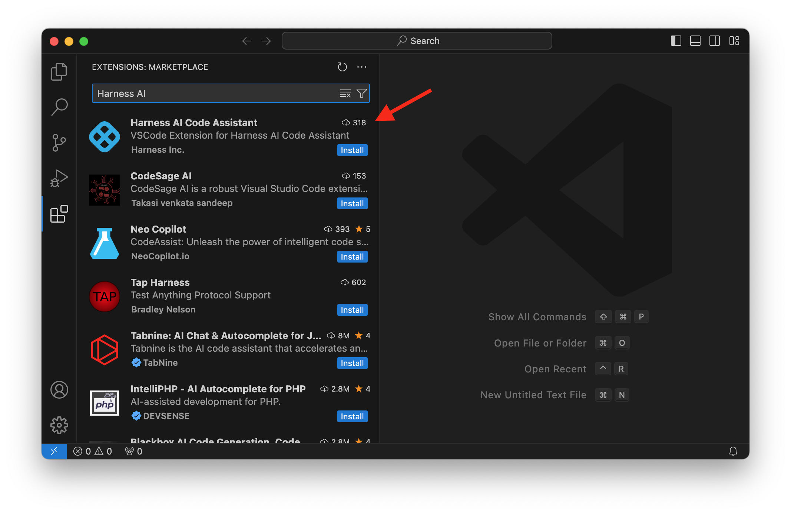
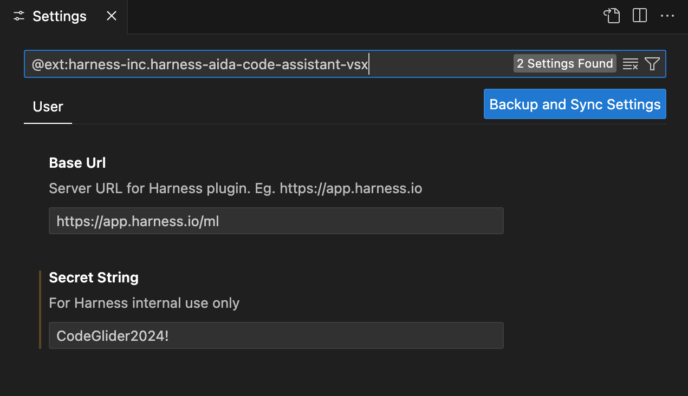
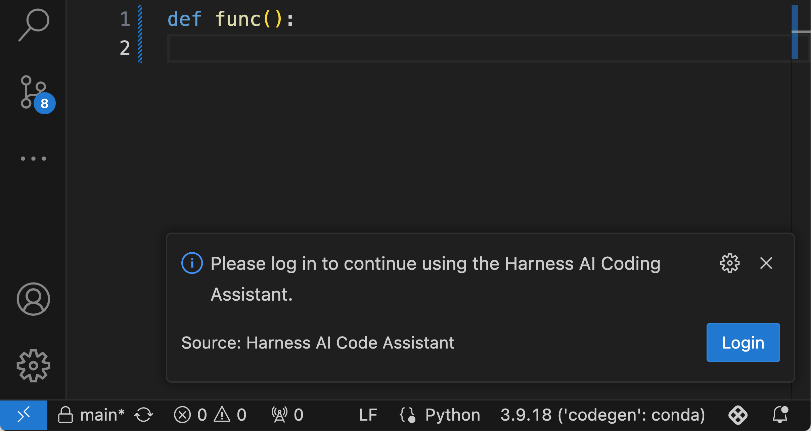
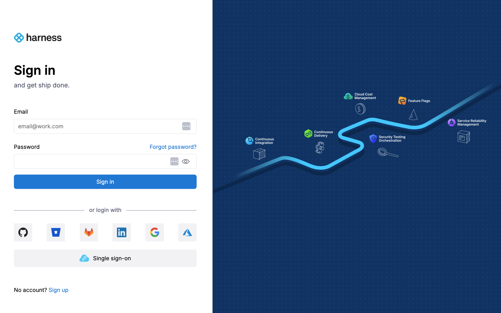
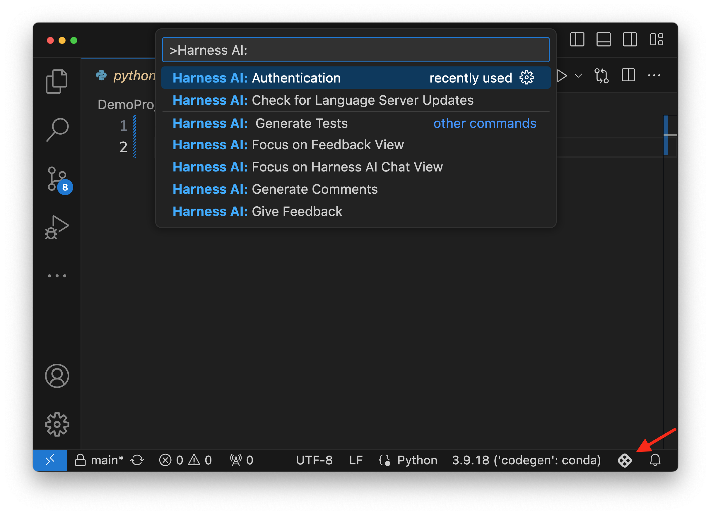
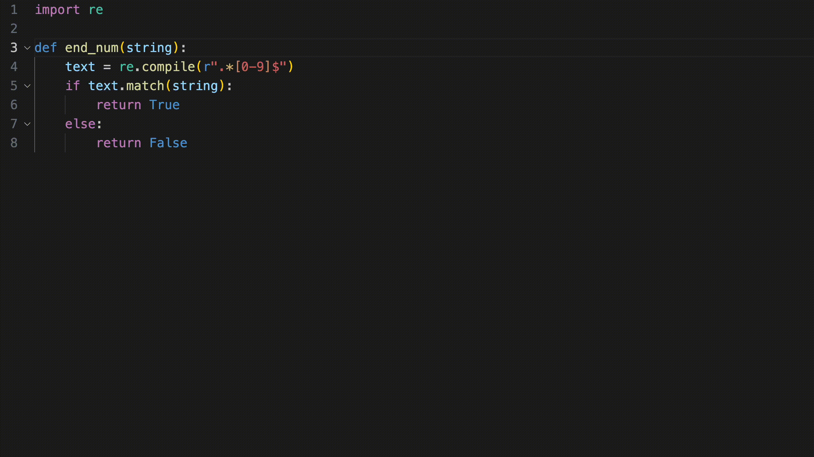
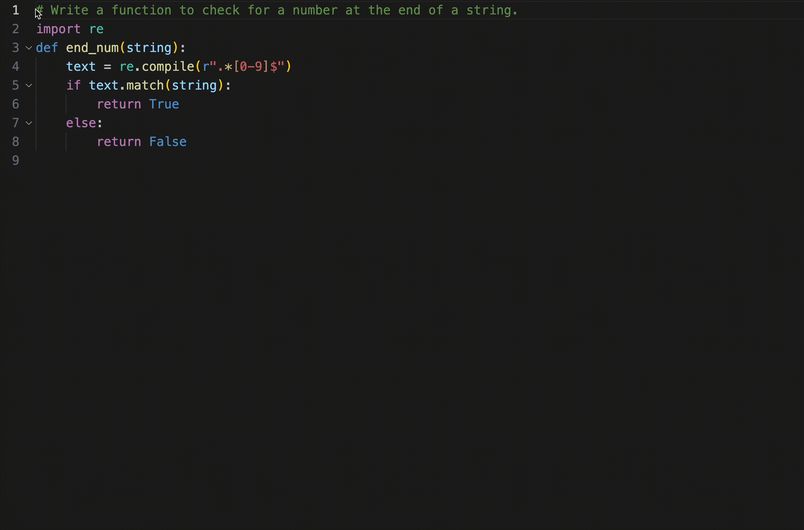
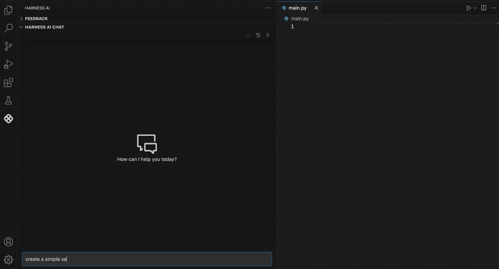
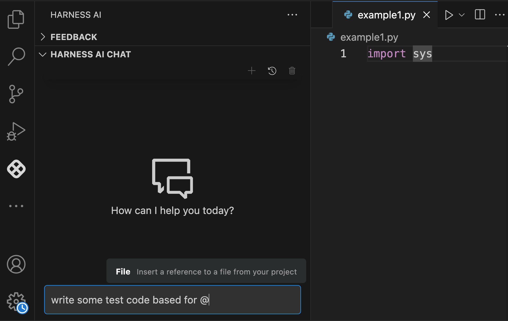
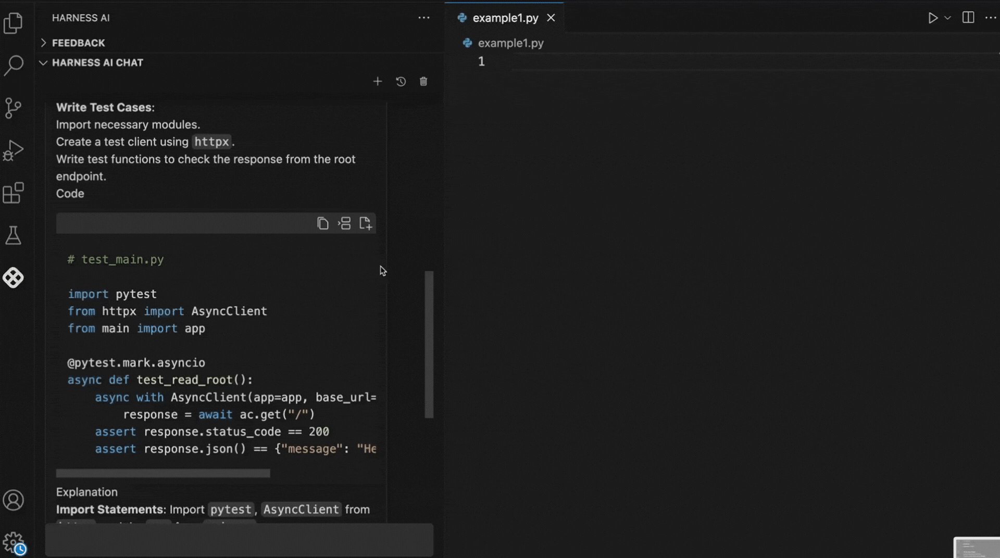

Harness AI code assistant consists of a set of tools that enhance coding experience by providing features such as intelligent code generation, real-time code suggestions, automated test generation, contextual code explanations, and a chat assistant for coding queries.

Harness AI code assistant is designed to seamlessly integrate with your development workflow and it is available as an extension for popular Integrated Development Environments (IDEs). It exploits th power of Large Language Models to understand the context and generate relevant code/comment
tailored to your specific needs.

For instructions on how to install and configure the Harness AI Code Assistant extension see the installation section below.

## Installation and Setup
Harness AI code assistant is currently available as an extension for Visual Studio Code. It can be installed directly from the Visual Studio Code Marketplace.

<!-- ### Configuration
 -->

### Authentication
After installing the extension, you will automatically be prompted to authenticate your account by logging in with your Harness credentials. A pop-up window will appear at the bottom right corner of your IDE, guiding you through the authentication process.

Once you click the login button, you will be redirected to the Harness login page to enter your credentials.

If the login window does not appear automatically, or if you want to redo 
the authentication process at any time, you can manually trigger the authentication flow by clicking on the Harness icon at the bottom right corner of your IDE and selecting `Harness AI: Authentication' from the dropdown menu.

## Using Harness AI Code Assistant: Main Features 
After installing the Harness extension and completing the login process, you can immediately begin using the powerful features of the Harness AI Code Assistant within your IDE.

Harness AI Code Assistant offers four key features: Code Generation, Comment Generation, Test Generation, and a Chat Assistant. Below, we provide a detailed explanation of each feature.

### Code Generation
Code generation works by showing real-time inline code suggestions. The suggestions are generated based on the context of the code being written, and additional information such as relevant files and code snippets in the workspace.
Once a suggestion is shown to the user, they can accept it fully or word by word, allowing for customization before finalizing the code.

### Comment Geeration
Harness AI code assistant can be used to generate inline comments that explain the purpose and functionality of the user code, making it more understandable for future reference and for other developers who may work on the code. The user can invoke the comment generation feature by selecting the relevant code block and choosing the generate comments option from the right-click menu.

### Test Generation
Test generation allows developers to automatically create unit tests for their code. By analyzing the existing code structure and logic, Harness AI code assistant can suggest comprehensive test cases that cover various scenarios, including edge cases. Test generation can be initiated by selecting the function or code block for which tests are needed and choosing the generate tests option from the right-click menu.

### Chat Assistant 
Harness AI provides an interactive chat assistant that can answer coding queries, provide explanations, and assist with debugging. You can access the chat assistant by clicking on the Harness icon on the left sidebar of your IDE. This will open a chat window where you can type your questions or requests, and the assistant will respond with relevant information or code suggestions.

## Harness AI Chat: Features and Usage
In this section we will explain some of the key features of the Harness AI Chat Assistant and how to effectively utilize them for your coding needs.

### Adding References
By defualt, the chat assistant uses the context of the current file to provide relevant suggestions and answers. You can enhance the assistant's capabilities by adding references to other files or libraries that are relevant to your query. In order to add references, simply type `@' in the chat window and a pop-up will appear allowing you to select the files or libraries you want to reference.

### Inserting Code Snippets
The Harness AI chat is an interactive tool designed to help users ask questions and receive responses in the form of code snippets or detailed text explanations. Recognizing that users often want to integrate the suggested code into their own projects, the Harness Chat Assistant simplifies this process. It provides a convenient toolbar above each code snippet, allowing users to effortlessly insert the suggested code at their current cursor position or into a new file, streamlining the workflow.

## Frequently Asked Questions

### What information does Harness AI Code Assistant use to generate code suggestions?
Harness AI Code Assistant uses the content of the current file, the context of the code being written, and any relevant libraries or frameworks that are referenced in the project to generate accurate code suggestions. Furthmore, it uses relevant code snippets and patterns from the workspace to enhance its suggestions and provide context-aware assistance.

### Do I need to select a piece of code when asking questions in the chat assistant?
No, you do not need to select a piece of code when asking questions in the chat assistant. The chat assistant by defualt uses the visible code to the user to provide context for generating relevant answers and suggestions. However, you may select specific code snippets if you want to focus the assistant's responses on particular sections of your code specially if the selection is outside the visible area of the editor.

### Does Harness store any of my code or personal data?
No, Harness AI Code Assistant does not store any of your code or personal data. The tool is designed with privacy in mind, ensuring that all code suggestions and interactions are processed locally within your IDE. Any data used for generating suggestions is not sent to external servers, maintaining the confidentiality of your work.

### Which Large Language Models does Harness AI Code Assistant utilize?
Harness AI Code Assistant utilizes advanced Large Language Models such as OpenAI's gpt-4 and Gemini Flash. These models are designed to understand and generate human-like text, enabling the assistant to provide accurate and contextually relevant code suggestions and explanations.

### What programming languages does Harness AI Code Assistant support?
Harness AI Code Assistant supports a wide range of programming languages including but not limited to JavaScript, Python, Java, C#, Ruby, Go, and TypeScript. The tool is designed to understand the syntax and semantics of these languages, enabling it to provide accurate code suggestions and generation tailored to the specific language being used.

### What is language server and how does it work?
The language server is component of Harness AI Code Assistant that runs on the user's machine and communicates with the IDE. The role of the language server is to generate the context that is needed to respond to user queries by gathering and processing information from the current open tabs and files in the workspace. The language server is also responsible for generating and sending requests to the Harness AI backend.

### What context information is used by the chat assistant?
The context used when utilizing the chat assistant includes the visible code in the current file, any relevant libraries or frameworks referenced in the project, and the user's previous interactions within the chat, and the selected code snippets if applicable. This allows the assistant to provide tailored responses based on the specific coding environment and the user's ongoing work. Additionally, users can enhance the context by adding references to other files or libraries as needed.