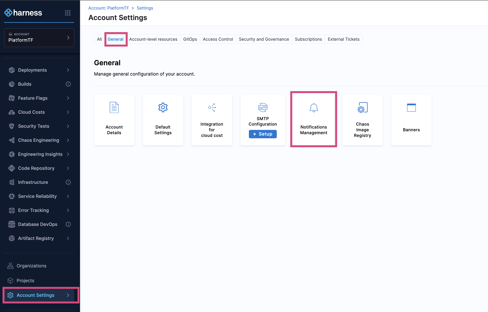
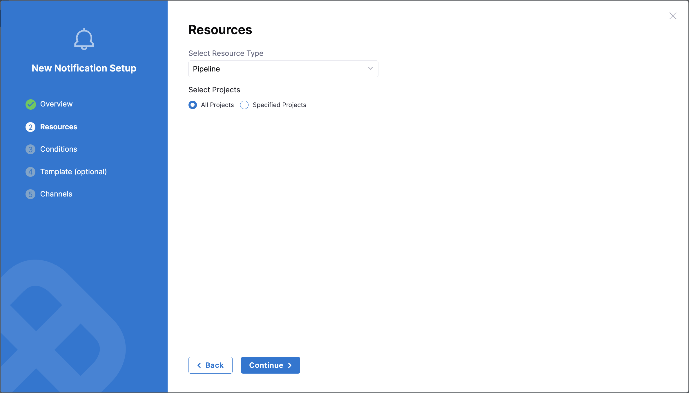
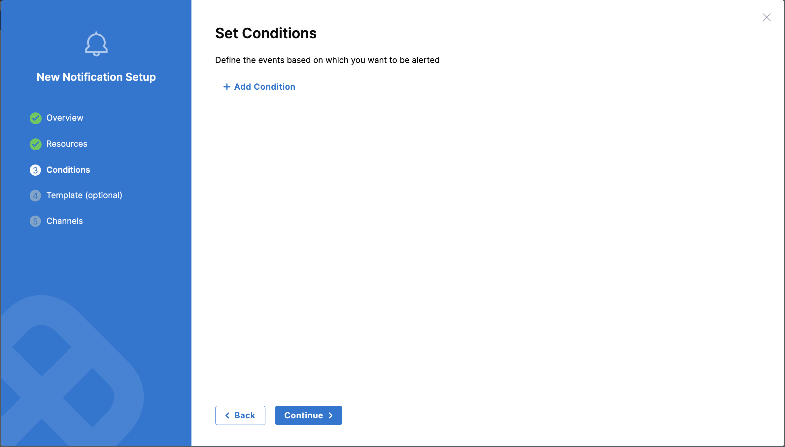
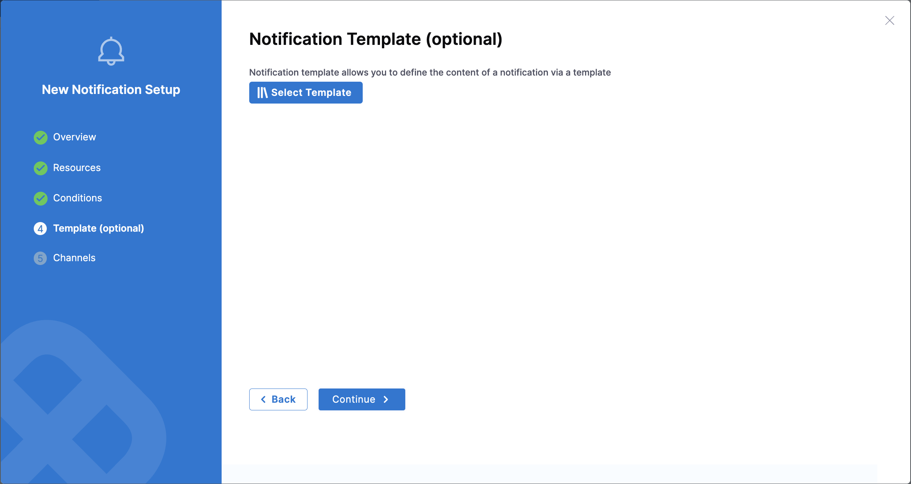
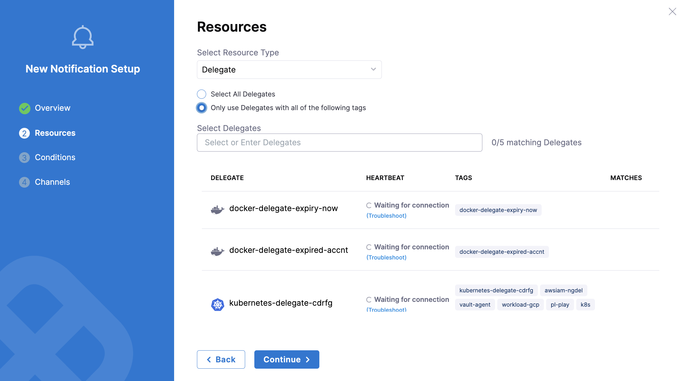
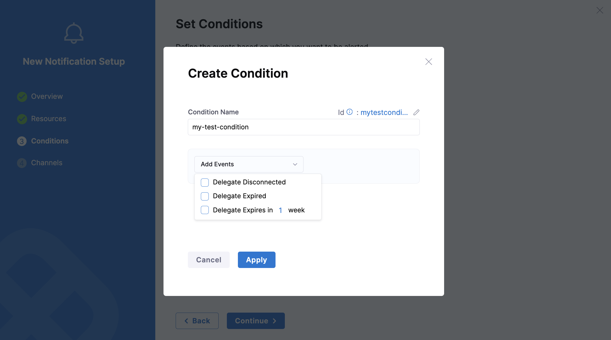
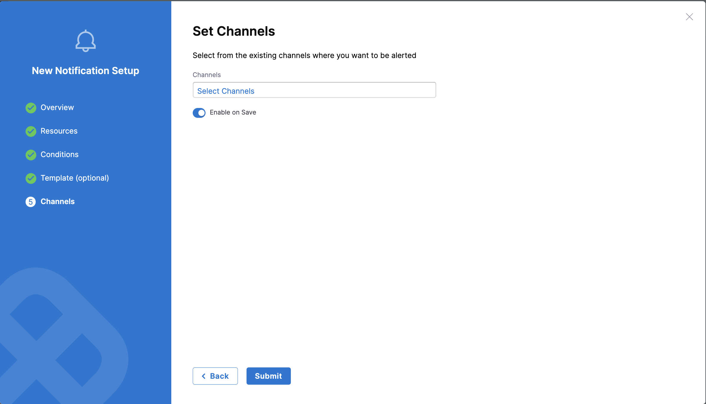
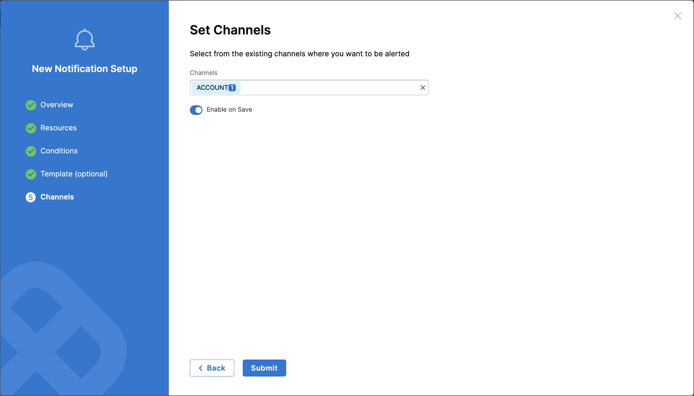

import PipeEvents from './static/set_pipeline_events.png';
import Tabs from '@theme/Tabs';
import TabItem from '@theme/TabItem';

:::info Prerequisites

Before you begin, ensure you have the following feature flags enabled:

- **`PL_CENTRAL_NOTIFICATIONS`**: Required for centralised notification functionality
- **`PIPE_CENTRALISED_NOTIFICATION`**: Required for pipeline-specific notifications

Contact [Harness Support](mailto:support@harness.io) to enable these feature flags.
:::

## Overview

Harness Centralised Notifications allow you to send notifications based on rules and conditions across pipelines and delegates. You can configure and manage alerts to stay informed about critical events in your Harness environment.

You can configure centralised notifications for:

- **Pipelines**: Get notified about pipeline events like success, failure, or stage completion
- **Delegates**: Receive alerts when delegates disconnect, expire, or are about to expire

This guide explains how to configure notifications across different [scopes](/docs/platform/role-based-access-control/rbac-in-harness/#permissions-hierarchy-scopes) (Account, Organization, or Project).

## Configuration Steps

This guide uses the Account scope as an example, but the steps apply to Organization and Project scopes as well.

### Step 1: Access Notification Management

1. Navigate to **Account Settings** → **General** → **Notifications Management**

   

### Step 2: Create a New Notification

1. In the **Overview** section, provide a **Notification Name** and click **Continue**.

2. Select the appropriate **Resource Type** (Pipeline or Delegate). Proceed with the configuration based on your selected resource type.

### Step 3: Configure Resource-Specific Settings

<Tabs>
<TabItem queryString="pipeline" value="Pipeline" Label="pipeline" default>

### Pipeline Notifications

1. Select **Pipeline** as the **Resource Type** in the **Resources** section.

        

2. Choose the project scope:
   
   - **All Projects** under the Organization
   
   - **Specified Project** to target particular projects

   Click **Continue** to move to the condition setup.

        

3. Click **+ Add Condition** to define when notifications should be triggered based on pipeline events

   

   :::info Note
   Stage start, success, and failure events apply to all stages in a pipeline. For more granular control over specific stages, consider using [pipeline-level notifications](/docs/continuous-delivery/x-platform-cd-features/cd-steps/notify-users-of-pipeline-events.md).
   :::

4. Provide a **Condition Name**, select relevant **Pipeline Events**, and click **Continue**

   

5. (Optional) Add a **Notification Template** for custom notifications based on the event. Learn more about [Custom Notification templates for Pipeline Notifications](/docs/platform/templates/customized-notification-template)

           

</TabItem>

<TabItem value="Delegate" label="Delegate">

### Delegate Notifications

1. Choose **Delegate** as the **Resource Type**

2. Select the delegate scope:
   
   - **All Delegates**: Notify for all delegates

   - **Specific Tags**: Notify only for delegates matching specific tags (up to five supported)

        

3. Click **+ Add Condition** to set up alerts based on delegate events

4. Enter a **Condition Name** and select from the following **Delegate Events**:
   
   - **Delegate Disconnected**: Notification sent once when disconnection occur.
   
   - **Delegate Expired**: Notification sent once daily for expired delegates.
   
   - **Delegate Expires in [X] Weeks**: Notification sent once when the delegate is about to expire (you can select the specific timeframe from 1 to 4 weeks, where X represents your chosen timeframe).

           

5. Click **Continue** to proceed to channel configuration

</TabItem>
</Tabs>

### Step 4: Configure Notification Channels

1. In the **Set Channels** section, select the channels where you want notifications to be sent

   

2. Choose from existing channels at your current scope, or create a [new channel](/docs/platform/notifications/notification-settings.md)

3. Click **Submit** to save your notification configuration

   

