:::note
Currently, this feature is behind the feature flag `PL_CENTRAL_NOTIFICATIONS`. Contact [Harness Support](mailto:support@harness.io) to enable the feature.
:::

With notifications management, you can configure notifications for the following resource types:

1. Pipeline
2. Delegate
3. Chaos Experiment 

You can set up rules to receive notifications based on specific events or conditions for each of these resource types.

We are going to discuss about setting up notification via notification management for Pipeline at a given scope. 

You can set up notification for Pipeline at following [scope](https://developer.harness.io/docs/platform/role-based-access-control/rbac-in-harness/#permissions-hierarchy-scopes): **Account**, **Organization** and **Project Level**. 

### **Account Level**

At account level, you will be able to configure notifications for pipelines across a **Specific Organization** or **All Organization**.

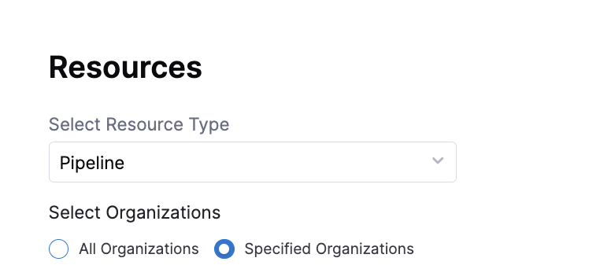

### **Organization Level**

At Organization level, you will be able to configure notifications for pipeline across a **Specific Project** or **All Projects**.

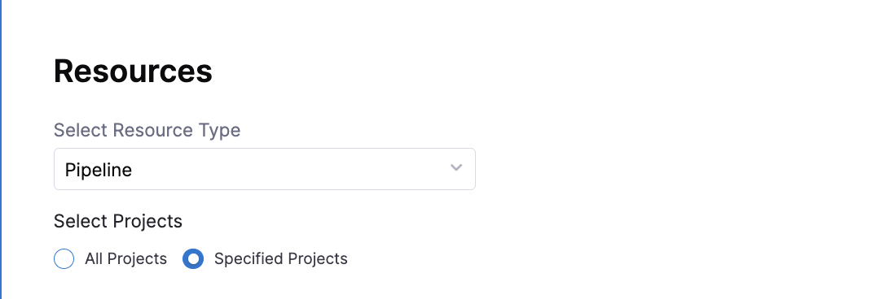

### **Project Level**

At the pipeline level, you can configure notifications for **All Pipelines**.

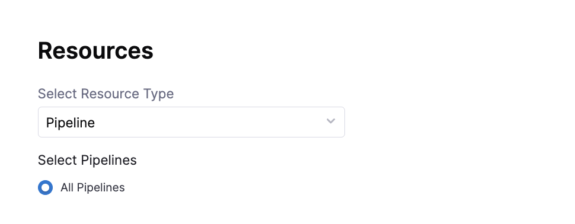

## Setting Up Notifications Management

In this example, we are going to discuss setting up notification management of Pipeline resource at Organization Level:-

1. In Harness, go to **Organization Settings**.
2. Under **General**, select **Notifications Management**. 

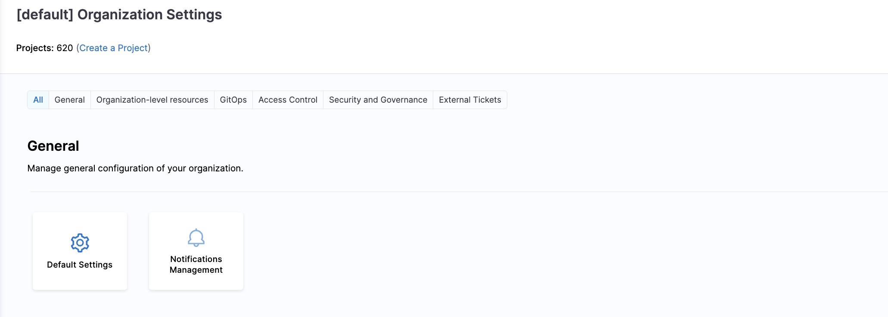

3. Under **Overview**, provide **Notification Name** and **Continue** to select Resource type.

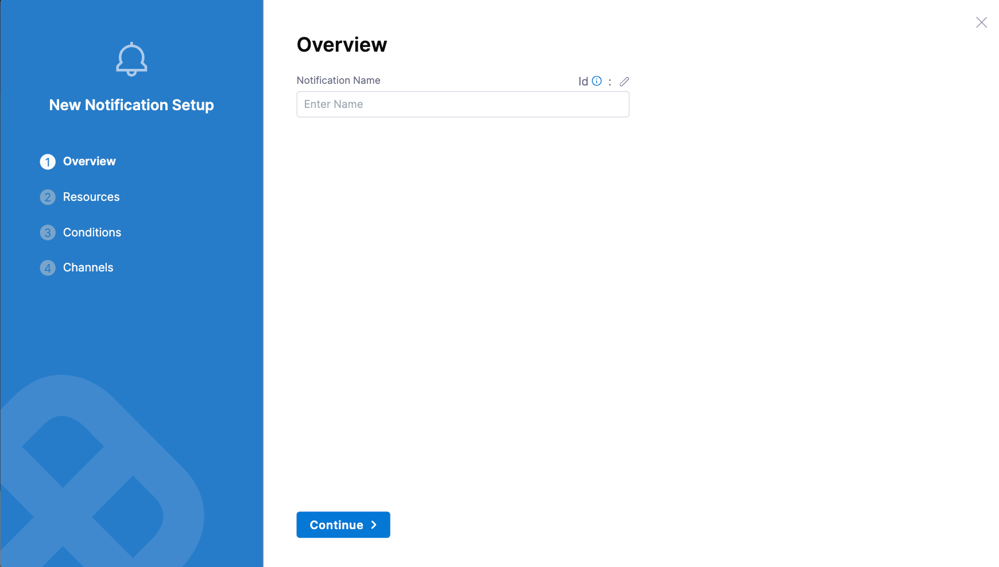

4. Under **Resources**, Select Resource Type as **Pipeline**. 

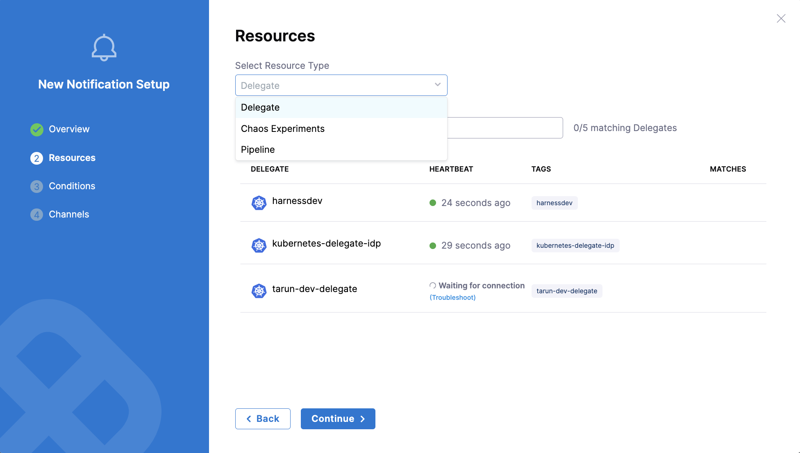

Under **Select Project** you can either select **All Projects** under the organization or you can select **Specified Project** if you want to configure notification for specific projects within the organization. Click on **Continue** to set conditions for notification.

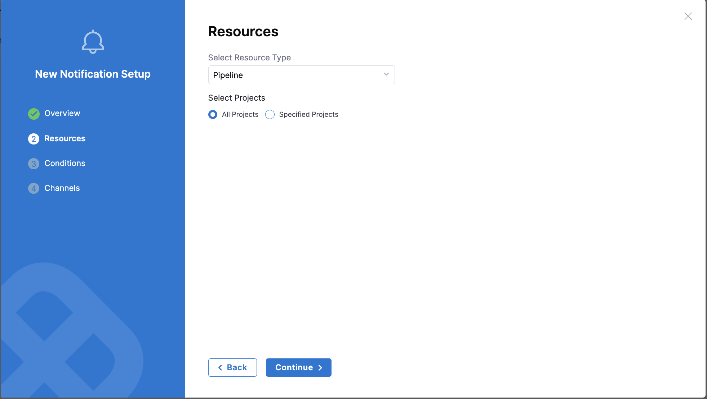

5. Under **Condition** , select **+ Add Condition** to define pipeline events based on which you want to be notified.

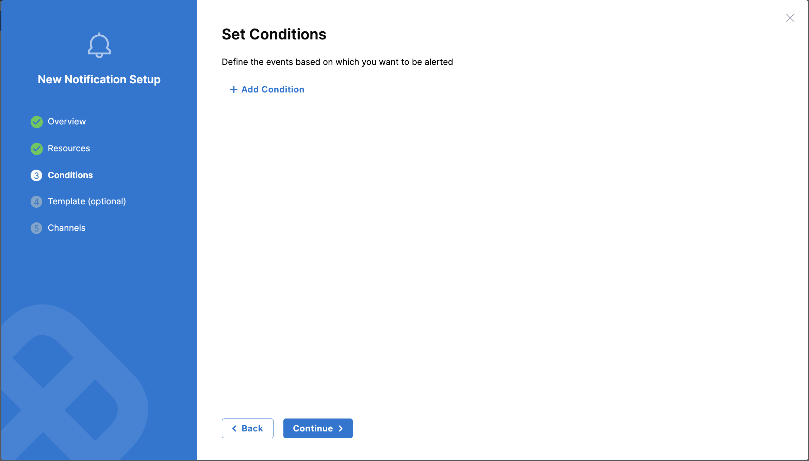

Under events you can select the following **pipeline events**:-

1. Pipeline Start
2. Pipeline Success
3. Pipeline Failed
4. Stage Start
5. Stage Success
5. Stage Failed

:::info note
Stage start/success/failed events will apply to all stages within a pipeline. There is no option to configure notifications for specific stages, if you want to do that you can configure it via [Pipeline level notification](/docs/continuous-delivery/x-platform-cd-features/cd-steps/notify-users-of-pipeline-events.md).
:::

Under **Create Condition** provide, Condition Name and **Select Pipeline Events**. Click on **Continue** to set channel where you want to send the notification.

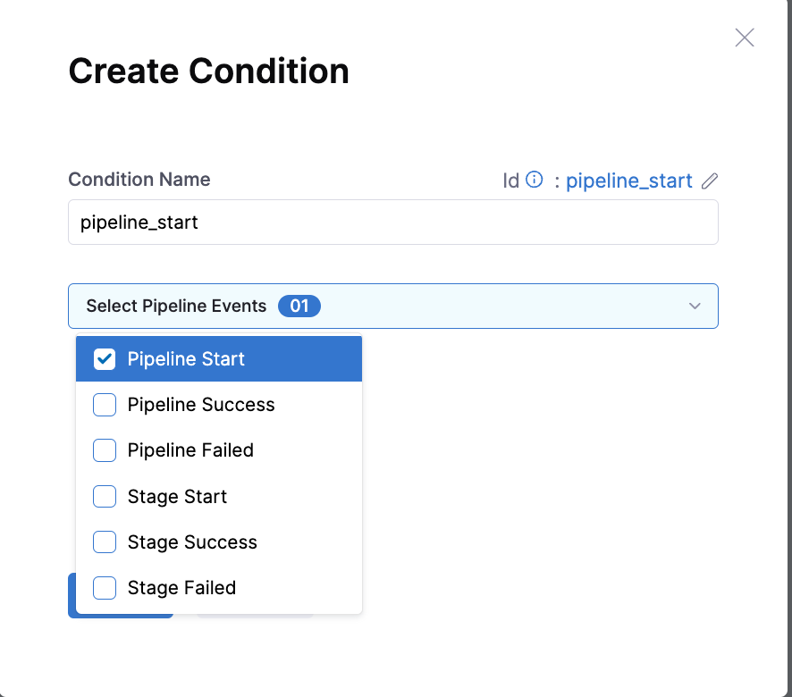

6. Under **Set Channels**, **Select Channels** where you want notification to be sent.

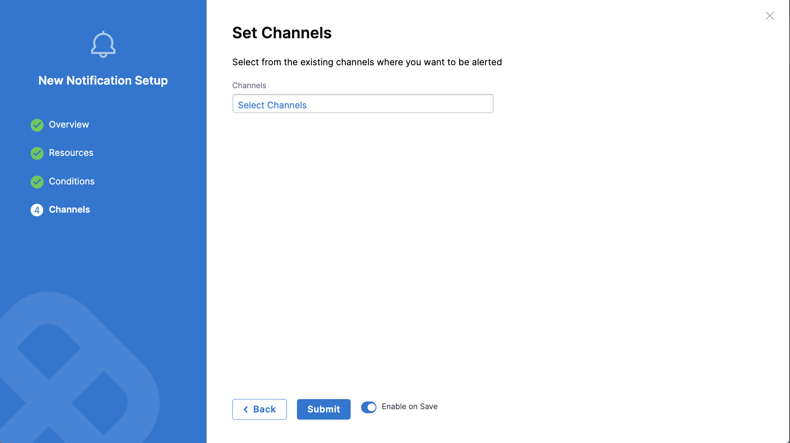

Under **Select Channel** you can chose the already created channel at that scope or you can create a [**New Channel**](/docs/platform/notifications/notification-settings.md).

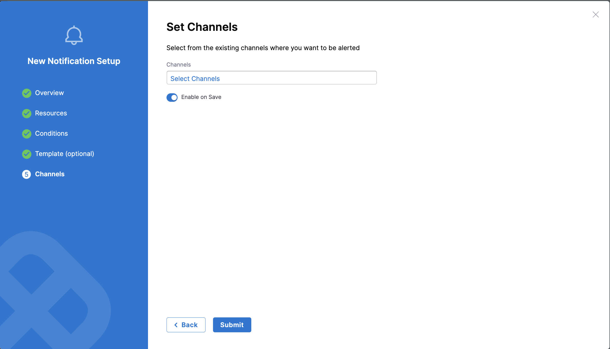

Under **New Channel** provide **Channel Name** and select [**Channel Type**](/docs/platform/notifications/notification-settings#configure-pipeline-notifications).

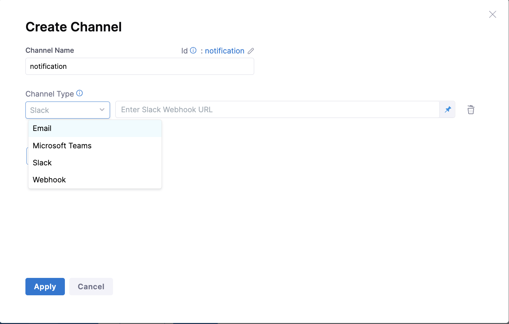

7. Select **Submit** to save your notification configuration.

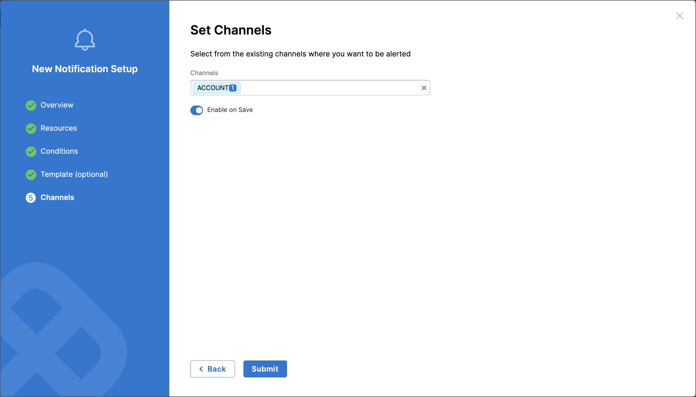

You can set up notification at [Account](#account-level) and [Project Level](#project-level) following the same steps outlined above.

