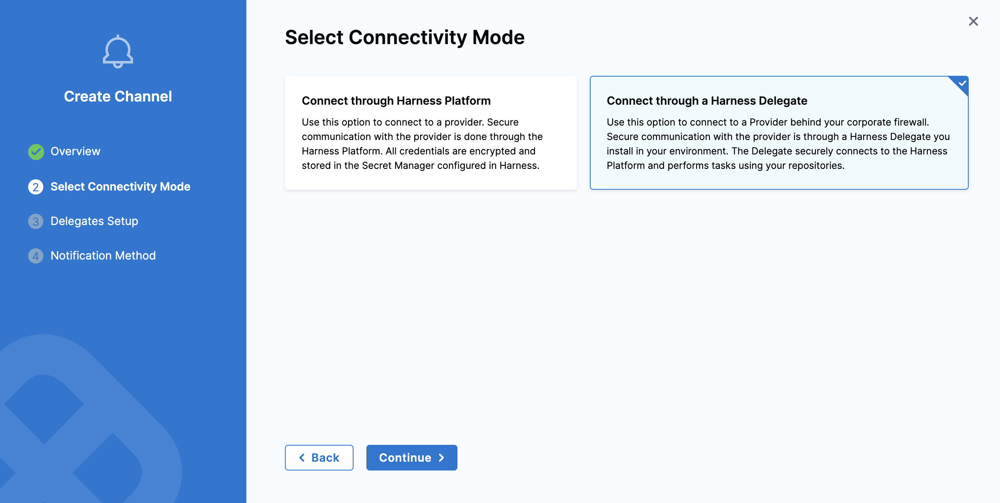

import PipeEvents from './static/set_pipeline_events.png';
import Tabs from '@theme/Tabs';
import TabItem from '@theme/TabItem';

:::info Note
Currently, the Centralised Notification feature is behind the feature flag `PL_CENTRAL_NOTIFICATIONS`. Contact [Harness Support](mailto:support@harness.io) to enable them.
:::

Harness Centralized Notifications enable you to send notifications based on rules and conditions across pipelines, delegates, and other Harness modules. With notifications management, you can easily configure and manage alerts to stay informed about critical events in your workflows.

Centralized notifications can be configured for the following resource types:

1. Pipeline 
2. Delegate 
3. Chaos Experiment
4. Service Level Objectives

This article explains how to configure notifications for Pipelines and Delegates across different [scopes](/docs/platform/role-based-access-control/rbac-in-harness/#permissions-hierarchy-scopes): Account, Organization, and Project.

To configure notifications at the Account, Organization, or Project level:  
 - For Account-level, go to Account Settings → General → Notification. 

   
 
 - For Organization or Project-level, go to the respective Organization/Project → select Organization/Project → Settings → General → Notification.
 
   

Let’s walk through an example to set up notification management. In this example, we’ll configure notifications for Pipelines and Delegates, following the step-by-step guide below.

For now, we’ll configure notifications at the Account level, but you can follow similar steps to configure them at the Organization or Project level as well.

1. In Harness, go to **Account Settings**.
2. Under **General**, select **Notifications Management**. 

        

3. Under **Overview**, provide **Notification Name** and **Continue** to select Resource type. Based on your selection, choose the next option either **Pipeline** or **Delegate** from the tabs below.

        

<Tabs>
<TabItem queryString="pipeline" value="Pipeline" Label="pipeline" default>
## Centralized notification for Pipeline 

:::info Note
  Pipeline specific notifications are behind `PIPE_CENTRALISED_NOTIFICATION`. 
:::

4. Under **Resources**, Select Resource Type as **Pipeline**. 

        

        Under **Select Project** you can either select **All Projects** under the organization or you can select **Specified Project** if you want to configure notification for specific projects within the organization. Click on **Continue** to set conditions for notification.

        

5. Under **Condition** , select **+ Add Condition** to define pipeline events based on which you want to be notified.
    
        

        :::info note
                Stage start/success/failed events will apply to all stages within a pipeline. There is no option to configure notifications for specific stages, if you want to do that you can configure it via [Pipeline level notification](/docs/continuous-delivery/x-platform-cd-features/cd-steps/notify-users-of-pipeline-events.md).
        :::

        Under **Create Condition** provide, Condition Name and **Select Pipeline Events**. Click on **Continue** to set channel where you want to send the notification.

        
</TabItem>
<TabItem value="Delegate" Label="delegate" default>
## Centralized notification for Delegate 

4. Under **Resources**, Select Resource Type as **Delegate**. Here, you can configure notifications for all Delegates by selecting the **Select All Delegates** option. 

   Alternatively, you can target Delegates with specific tags—up to a maximum of **five tags** can be added, as shown below.

   

5. Under **Condition** , select **+ Add Condition** to define delegate events based on which you want to be alerted.

   

   Under **Create Condition**, provide a **Condition Name** and select the appropriate **Delegate Events**. There are three types of Delegate events that can be configured:
    
    - Delegate Disconnected.
    - Delegate Expired.
    - Delegate Expiring in 1 to 4 Weeks.

   Click Continue to choose the channel where you want to send the notifications.

</TabItem>
</Tabs>

6. Optionally you can add **Notification Template** to get custom notifications based on the event. To learn more, go to [Custom Notification templates for Pipeline Notifications](/docs/platform/templates/customized-notification-template).

        

7. Under **Set Channels**, **Select Channels** where you want notification to be sent.

        

        Under **Select Channel** you can choose the already created channel at that scope or you can create a [**New Channel**](/docs/platform/notifications/notification-settings.md).

        To configure a New Channel, click New Channel and enter a Channel Name.
            
            

            Next, choose a Connectivity Mode—you can send notifications either directly through the Harness Platform or via a Harness Delegate.

                

            If you choose to send notifications through a Harness Delegate, select the appropriate delegate in the Delegate Setup window.

                

            Once the connectivity mode is configured, select the [**Channel Type**](/docs/platform/notifications/notification-settings#configure-pipeline-notifications) and add details related to the channel type to proceed.
            
            :::note
            If you select the Connectivity Mode as "Connect through a Harness Delegate" and Channel Type as "Email", ensure to add an [SMTP configuration](https://developer.harness.io/docs/platform/notifications/add-smtp-configuration) to which the Harness delegate has access. If this is not done, then the Email notifications will fail.
            :::

                

8. Select **Submit** to save your notification configuration.

        

