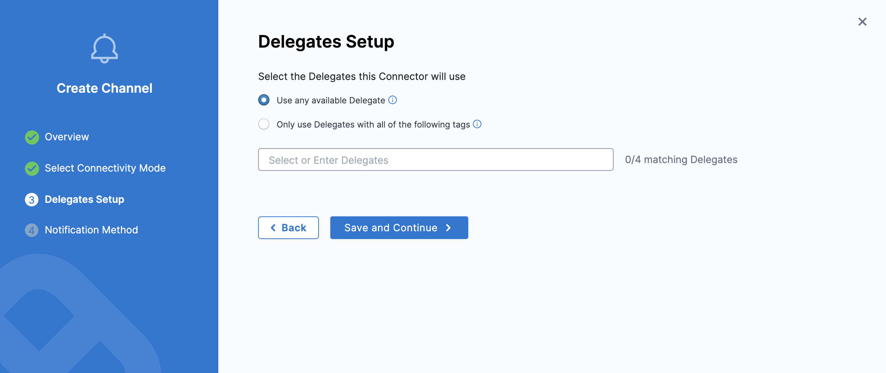

import PipeEvents from './static/set_pipeline_events.png';

:::info Note
Currently, the Centralised Notification feature is behind the feature flag `PL_CENTRAL_NOTIFICATIONS`. Contact [Harness Support](mailto:support@harness.io) to enable them.
:::

Harness Centralized Notifications enable you to send notifications based on predefined rules and conditions across pipelines, delegates, and other Harness components. With notifications management, you can easily configure and manage alerts to stay informed about critical events in your workflows.

Centralized notifications can be configured for the following resource types:

1. Pipeline 
2. Delegate 
3. Chaos Experiment 

To receive notifications for these resource types, You can configure rules and choose notification channels across [scopes](/docs/platform/role-based-access-control/rbac-in-harness/#permissions-hierarchy-scopes): Account, Organization, or Project.

### **Account Level**

At account level, you will be able to configure notifications for pipelines across a **Specific Organization** or **All Organization**.

### **Organization Level**

At Organization level, you will be able to configure notifications for pipeline across a **Specific Project** or **All Projects**.

### **Project Level**

At the pipeline level, you can configure notifications for **All Pipelines**.

## Configure centralized notification for Pipeline 

:::info Note
  Pipeline specific notifications are behind `PIPE_CENTRALISED_NOTIFICATION`. 
:::

### Setting Up Notifications Management

In this example, we are going to discuss setting up notification management of Pipeline resource at Organization Level:-

1. In Harness, go to **Organization Settings**.
2. Under **General**, select **Notifications Management**. 

        

3. Under **Overview**, provide **Notification Name** and **Continue** to select Resource type.

        

4. Under **Resources**, Select Resource Type as **Pipeline**. 

        

        Under **Select Project** you can either select **All Projects** under the organization or you can select **Specified Project** if you want to configure notification for specific projects within the organization. Click on **Continue** to set conditions for notification.

        

5. Under **Condition** , select **+ Add Condition** to define pipeline events based on which you want to be notified.
    
        

        Under events you can select the following **pipeline events**:-

        1. Pipeline Start
        2. Pipeline Success
        3. Pipeline Failed
        4. Stage Start
        5. Stage Success
        5. Stage Failed

        :::info note
        Stage start/success/failed events will apply to all stages within a pipeline. There is no option to configure notifications for specific stages, if you want to do that you can configure it via [Pipeline level notification](/docs/continuous-delivery/x-platform-cd-features/cd-steps/notify-users-of-pipeline-events.md).
        :::

        Under **Create Condition** provide, Condition Name and **Select Pipeline Events**. Click on **Continue** to set channel where you want to send the notification.

        

6. Under **Set Channels**, **Select Channels** where you want notification to be sent.

        

        Under **Select Channel** you can choose the already created channel at that scope or you can create a [**New Channel**](/docs/platform/notifications/notification-settings.md).

        To configure a New Channel, click New Channel and enter a Channel Name.
            
            

            Next, choose a Connectivity Mode—you can send notifications either directly through the Harness Platform or via a Harness Delegate.

                

            If you choose to send notifications through a Harness Delegate, select the appropriate delegate in the Delegate Setup window.

                

            Once the connectivity mode is configured, select the [**Channel Type**](/docs/platform/notifications/notification-settings#configure-pipeline-notifications) and add details related to the channel type to proceed.

                

7. Select **Submit** to save your notification configuration.

        

You can set up notification at [Account](#account-level) and [Project Level](#project-level) following the same steps outlined above.

