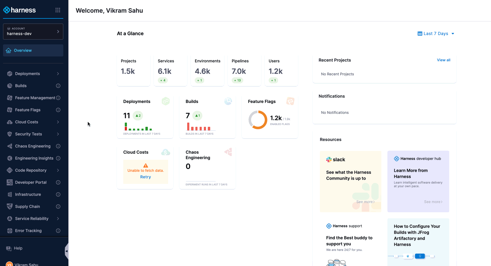
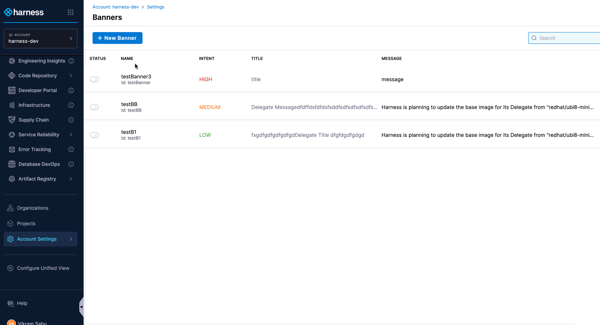
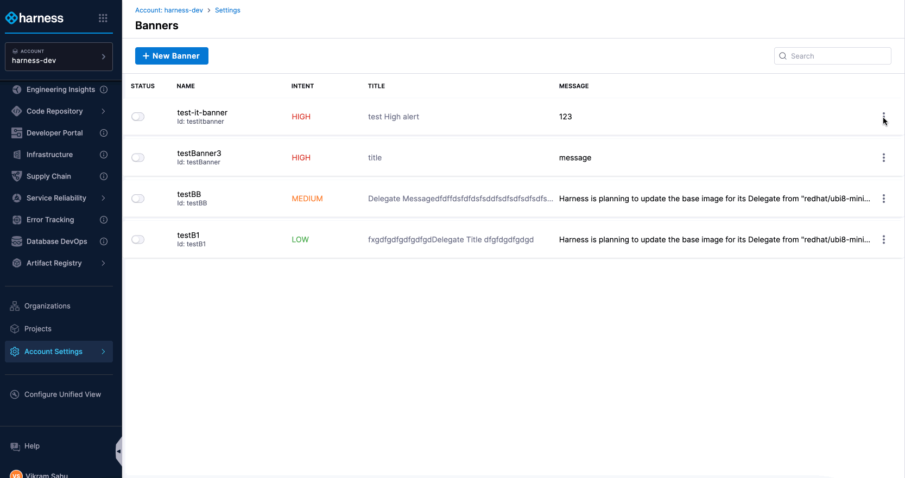
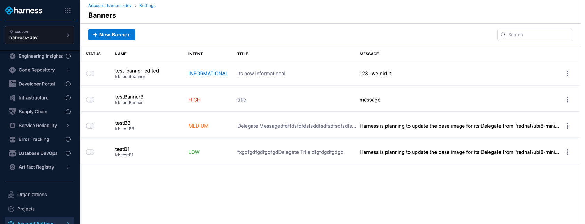
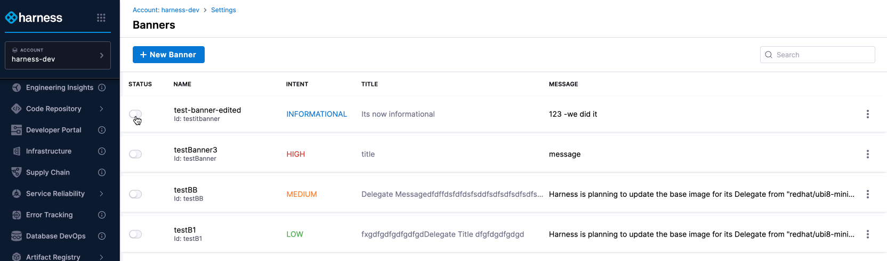

:::note[ The Banners feature is currently gated by the feature flag `PL_CUSTOM_BANNERS`, which must be enabled to access this functionality.]
:::

## Overview

The banners, lets admins or users with the right permissions share important messages, like maintenance schedules or downtime, with everyone. These banners appear at the top of the Harness UI and are visible to all users across different areas when active.

Account administrators, who have appropriate access can manage the banner type, message and optional call-to-action (CTA)s. **A maximum of 5 banners can be active at a time**. 

## Getting Started with Banners

To get started with banners in Harness, you can choose from different banner types—informational, high, medium, and low severity—and add a title, message, and optional CTAs (maximum 2). Additionally, you can enable, disable and customize as needed.

***Reference to Create, Customize, Publish Banners.***

### Create a banner

To create a banner in Harness, you need a role with create banner [permissions](https://developer.harness.io/docs/platform/role-based-access-control/permissions-reference).

 1. Go to **Accounts Settings** in Harness.
 2. Under **General**, select **Banners**.
 3. Click **New Banner**.
 4. Enter a **Banner Name**.
 5. Click **Continue** to proceed with the **Customize Banner** step.  

 ### Customize Your Banner

1. Choose a Banner Type: Select one of the four types based on the message’s urgency.
    - **Informational**: For general updates.
    - **High**: For critical events like **downtime annoucements**.
    - **Medium**: For warnings or important notices.
    - **Low**: To highlight key points.

2. Add Title and Message: Create a clear and impactful title and message for your banner to grab your customers' attention.

3. Optional - Add CTAs (Call to action):
    - You can add upto two CTAs
    - To add a CTA, click **Add Call To Action(CTA)**
    - Enter a label (e.g., Learn more) and the corresponding URL

4. Click **Continue** to proceed with the **Summary** step

### Publish a Banner

1. In the **Summary** section, turn on **Enable on Save** to publish the banner automatically after it's created.
2. Click **Submit** to finalize and create the banner.

## Banner Actions

Manage banners in Harness with ease. Edit, delete, or enable/disable banners directly from the **Account Settings > General > Banners** section with appropriate permissions.

### Edit a Banner

To edit a banner in Harness, ensure you have a role with edit banner [permissions](https://developer.harness.io/docs/platform/role-based-access-control/permissions-reference).

 1. Go to **Accounts Settings** in Harness.
 2. Under **General**, select **Banners**.
 3. On the Banners page, you'll see a list of existing banners with their details, such as Name, Title, etc.
 4. For the banner you want to edit, click on the vertical ellipsis (three dots) on the right and select **Edit**.
 5. Make the necessary changes.

 ### Delete a banner

To delete a banner in Harness, ensure you have a role with delete banner [permissions](https://developer.harness.io/docs/platform/role-based-access-control/permissions-reference).

 1. Go to **Accounts Settings** in Harness.
 2. Under **General**, select **Banners**.
 3. On the Banners page, find the list of existing banners with their details, such as Name, Title, etc.
 4. Locate the banner you want to delete, click on the vertical ellipsis (three dots) on the right and choose **Delete**.
 5. On confirmation model:
    - Click **Delete** to confirm and remove the banner.
    - Else, Click **Cancel** to keep the banner.

### Enable or Disable a Banner

To enable or disable a banner in Harness, ensure you have a role with proper banner [permissions](https://developer.harness.io/docs/platform/role-based-access-control/permissions-reference). 

 1. Go to **Accounts Settings** in Harness.
 2. Under **General**, select **Banners**.
 3. On the Banners page, view the list of existing banners with their details, such as Name, Title, etc.
 4. In the Status column, toggle the switch to:
    - ON to enable a disabled banner.
    - OFF to disable an enabled banner.

