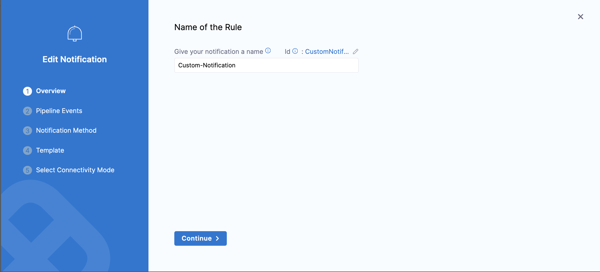
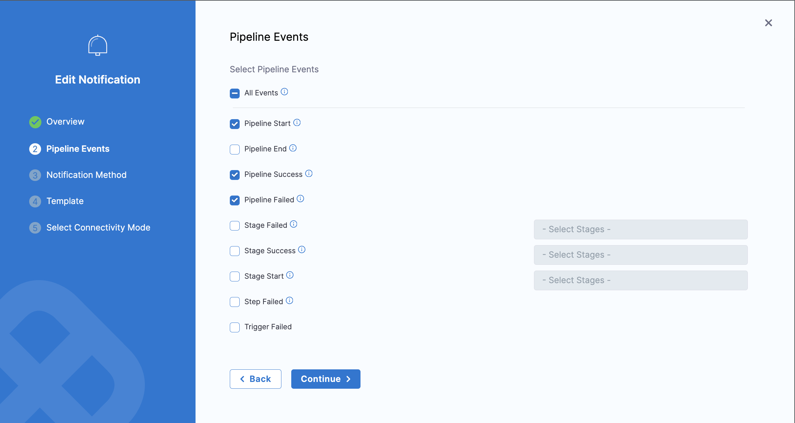
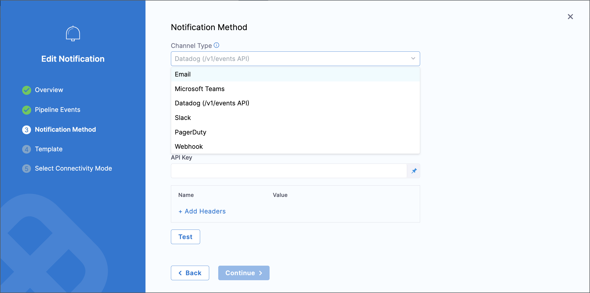
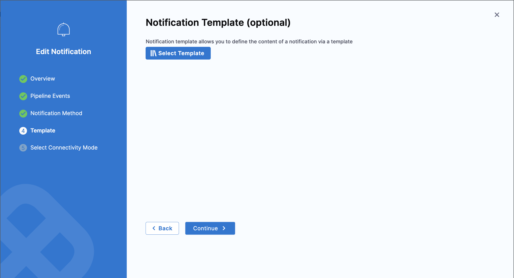
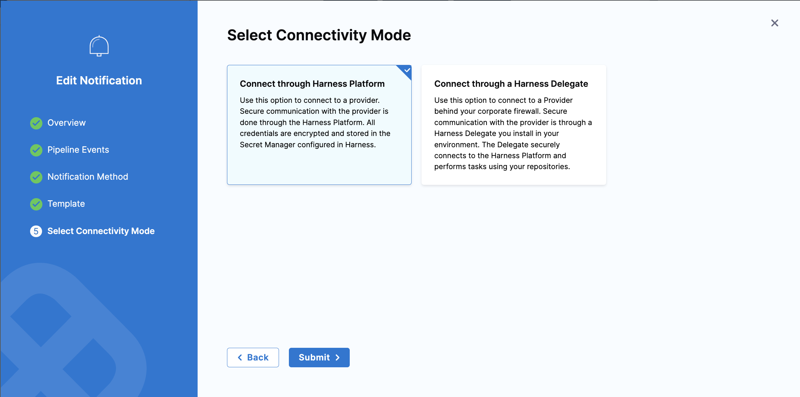
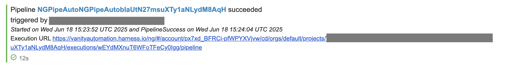

import Tabs from '@theme/Tabs';
import TabItem from '@theme/TabItem';

:::info Note
This feature is currently behind the feature flag `PIPE_CUSTOM_NOTIFICATION_TEMPLATES`.

Since this depends on centralized notifications, you'll also need the `PL_CENTRAL_NOTIFICATIONS` and `PIPE_CENTRALISED_NOTIFICATION` feature flags enabled. Please contact [Harness Support](mailto:support@harness.io) to enable these features.
:::

You can configure custom notifications to receive alerts for pipeline events such as **Pipeline Start**, **Pipeline Success**, **Pipeline Failure**, and more.

This feature is especially useful when you want to:

- Include specific details like pipeline variables, stage outputs, or build inputs in your notifications.
- Send concise notifications that highlight only the most relevant information.
- Format the notification payload to match internal standards or custom structures.

### Supported Notification Channels

You can send notifications via:

1. Email/Webhook
2. Microsoft Teams
3. Datadog (`/v1/events` API)
4. Slack
5. PagerDuty
6. Webhook

## Set Up Custom Notifications for a Pipeline

Follow these steps to configure custom notifications:

1. Navigate to the pipeline where you want to configure the custom notification.  
   Click the **Notify** button in the right panel of the Pipeline Studio.

2. In the **Notify** tab, click **+ New Notification**.

3. On the **Overview** page, enter a name for your notification and click **Continue**.

   

4. On the **Pipeline Events** page, select the pipeline events you'd like to receive notifications for.  
   You can choose **All Events** or specific events.

   

5. On the **Notification Method** page, select the method you'd like to use.

   

   You can choose from the supported channels:

   - **Email/Webhook**  
     Provide a list of recipient email addresses or select user groups.

   - **Microsoft Teams**  
     Provide a webhook URL or select user groups to notify.

   - **Datadog (`/v1/events` API)**  
     Enter the Datadog URL (e.g., `https://app.datadoghq.com/api/v1/events/`) and the API key for the associated Datadog agent.

   - **Slack**  
     Provide the webhook URL or select user groups.

   - **PagerDuty**  
     Provide the integration key or select user groups.

   - **Webhook**  
     Provide the webhook URL and any required headers.

   Click **Continue**.

6. On the **Notification Template** page, select a notification template to customize the message format (optional).  
   If you skip this step, the default template will be used.

   To learn more, see [Custom Notification Templates](/docs/platform/templates/customized-notification-template/).

   

   Click **Continue**.

7. On the **Select Connectivity Mode** page, choose how Harness should send the notification:

   - **Connect through Harness Platform** (default)  
     Notifications are sent using the Harness Platform.

   - **Connect through Delegate**  
     Notifications are sent using the Harness Delegate.

   Click **Submit**.

   

## Sample Notification

Here’s an example of a custom notification for the **Pipeline Start** event:

