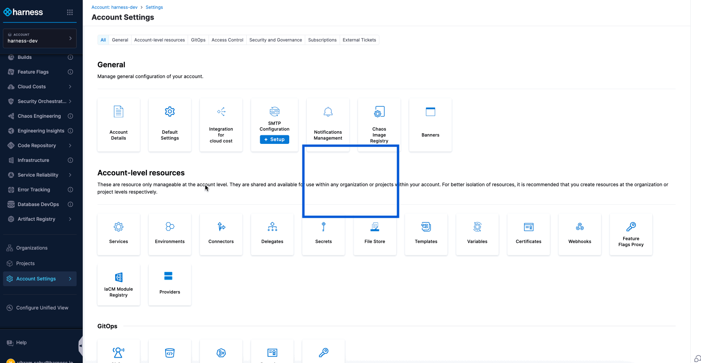

The Default Notification Template lets you set a template that automatically applies when no specific template is chosen for a notification rule. This ensures consistent, complete information in every notification—without requiring manual selection.

You can configure default notification template at different scopes (Account, Organization, Project) and for specific event types and channel types (such as Email, Slack, and Microsoft Teams), giving you greater control over notification content.

:::note Feature Availability
   The Default Notification Template feature is controlled by the `PL_DEFAULT_NOTIFICATION_TEMPLATE_SET_SUPPORT` feature flag. Contact Harness Support to enable it.
:::

## **Steps to Configure Default Notification Template**

### 1: Access the Default Templates Tab

- Go to **Settings** at your preferred scope (**Account, Organization, or Project**). Navigate to **General** → **Notification Management**.
        
- Click the **Default Template Sets** tab.

    

### 2: Create a New Default Template Set

- Click **+ Default Template Set**, and in the Overview section, enter the name and add an optional description and tags. Click Continue to proceed

        

### 3: Select Resource and Channel Type

- **Resource Type**: Automatically set to **Pipeline** (currently the only supported resource).

        

- **Channel Type**: Select one from the dropdown (Email, Microsoft Teams, Slack, PagerDuty, Webhook). Click Continue to proceed.

        

### 4: Define Event-Template Combinations

- Select one or more **Pipeline Event Types** from the list shown below.

        

- Click **Select Template** and choose the template that will serve as the default for the selected event type. If the template includes runtime input variables, enter the required values.

        

- Repeat the process for any additional event and channel combinations you want to configure as shown below.

        

- Click **Submit** to save the default template set. After saving, you can view the number of events and templates configured for this set on the Default Templates page.

        

### **How Harness Chooses the Final Notification Template**

Harness follows this priority order when selecting a template for each **event type + channel type** combination:

1. **Template selected in the notification rule**
   If you choose a template while creating or editing the rule, Harness always uses it.

2. **Default template at the same scope**
   If no template is selected, Harness checks for a default at the same scope (Project, Org, or Account).

3. **Default template at a higher scope**
   If none exists at the current scope, Harness checks the next higher level in this order:
   **Project → Organization → Account**.

4. **Harness static template**
   If no custom or default templates are found, Harness uses its built-in static template.

For Example: You create a **notification rule at the Project scope** for:

    * **Event Type**: Pipeline Failed
    * **Channel**: Slack
    * No template selected in the rule

Here’s how Harness decides which template to use:

1. First, it checks if you selected a template in the rule. You didn’t, so it moves to the next option.

2. Next, it checks if there’s a **default template for Pipeline Failed + Slack at the Project scope**. If it finds one, like **Template B**, it uses that. If not, it moves up.

3. Then, it checks at the **Organization scope** for the same combination. If it finds one, like **Template C**, it uses that. If not, it moves up again.

4. Finally, it checks at the **Account scope**. If it finds one, like **Template D**, it uses that.

5. If none exist, Harness uses its **static template**.

