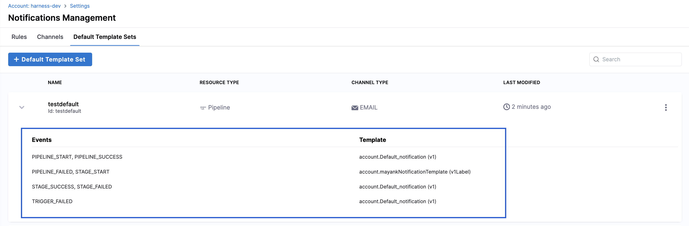

import Tabs from '@theme/Tabs';
import TabItem from '@theme/TabItem';

The Default Notification Template lets you set a template that automatically applies when no specific template is chosen for a notification rule. This ensures consistent, complete information in every notification—without requiring manual selection.

You can configure default notification template at different scopes (Account, Organization, Project) and for specific event types and channel types (such as Email, Slack, and Microsoft Teams), giving you greater control over notification content.

:::note Feature Availability
   The Default Notification Template feature is available behind the `PL_DEFAULT_NOTIFICATION_TEMPLATE_SET_SUPPORT` feature flag. Contact [Harness Support](mailto:support@harness.io) to enable it.
:::

## **Steps to Configure Default Notification Template**

### 1: Access the Default Templates Sets

- Go to **Settings** at your preferred scope (**Account, Organization, or Project**). Navigate to **General** → **Notification Management**.
        
- Click the **Default Template Sets** tab.

    

### 2: Create a New Default Template Set

- Click **+ Default Template Set**, and in the Overview section, enter the name and add an optional description and tags. Click Continue to proceed

        

### 3: Select Resource and Channel Type

- **Resource Type**: Automatically set to **Pipeline** (currently the only supported resource).

        

- **Channel Type**: Select one from the dropdown (Email, Microsoft Teams, Slack, PagerDuty, Webhook). Click Continue to proceed.

        

### 4: Define Event-Template Combinations

- Select one or more **Pipeline Event Types** from the list shown below.

        

- Click **Select Template** and choose the template that will serve as the default for the selected event type. If the template includes runtime input variables, enter the required values.

        

- Repeat the process for any additional event, channel and template combinations you want to configure as shown below.

        

- Click **Submit** to save the default template set. After saving, you can view the number of events and templates configured for this set on the Default Templates page.

        

### **How Harness Chooses the Final Notification Template**

Harness follows this priority order when selecting a template for each event type and channel type combination:

**1. Template selected in the notification rule**:If you choose a template while creating or editing the rule, Harness always uses it.

**2. Default template at the same scope**: If no template is selected, Harness checks for a default at the same scope (Project, Org, or Account).

**3. Default template at a higher scope**: If none exists at the current scope, Harness checks the next higher level in this order: Project → Organization → Account.

**4. Harness static template**: If no custom or default templates are found, Harness uses its built-in static template.

Let’s walk through a few examples, starting from simple scenarios and progressing to more complex ones.

<Tabs>
  <TabItem value="simple" label="Simple" default>
    For Example: You create a Notification rule at the Project scope for:

        * **Event Type**: Pipeline Failed
        * **Channel**: Slack
        * No template selected in the rule

    In this scenario, Harness selects the template as follows:

    1. First, it checks if you selected a template in the rule. You didn’t, so it moves to the next option.
    2. Next, it checks if there’s a default template for Pipeline Failed + Slack at the Project scope. If it finds one, like Template B, it uses that. If not, it moves up.
    3. Then, it checks at the Organization scope for the same combination. If it finds one, like Template C, it uses that. If not, it moves up again.
    4. Finally, it checks at the Account scope. If it finds one, like Template D, it uses that.
    5. If none exist, Harness uses its static template.
  </TabItem>
  <TabItem value="Intermediate" label="Intermediate">

    Let's assume a scenario. We'll start with the first case: Project P1 under Organization O1 with default settings, where the event and channel use a specific template (e.g., Pipeline Success + Slack uses Template A). You can interpret the following cases similarly.

        * **Project P1 (under Org O1)** → Defaults:
            * **Pipeline Success + Slack** → TmpA
            * **Pipeline Failed + Email** → TmpC

        * **Project P2 (under Org O1)** → **No defaults**

        * **Org O1** → Defaults for Email:
            * **Pipeline Success + Email** → TmpC
            * **Pipeline Failed + Email** → TmpD

        * **Account scope** → Defaults for all combinations:
            * **Pipeline Start (Email, Slack)** → TmpA
            * **Pipeline Success (Email, Slack)** → TmpB
            * **Pipeline Failed (Email, Slack)** → TmpB

    **Scenario: Notification Rule at Proj P2**

    This example assumes a notification rule is created for Pipeline Start, Pipeline Success, and Pipeline Failed events on Email and Slack, without any template selected. Harness then determines the template based on its priority order: Rule → Project → Org → Account → Static.

        | **Event Type**   | **Channel** | **Template Used** | **Why This Template Was Picked**                      |
        | ---------------- | ----------- | ----------------- | ----------------------------------------------------- |
        | Pipeline Start   | Email       | TmpA (Account)    | No project/org defaults → fallback to Account default |
        | Pipeline Start   | Slack       | TmpA (Account)    | No project/org defaults → fallback to Account default |
        | Pipeline Success | Email       | TmpC (Org O1)     | Org O1 default overrides Account default              |
        | Pipeline Success | Slack       | TmpB (Account)    | No project/org defaults → fallback to Account default |
        | Pipeline Failed  | Email       | TmpD (Org O1)     | Org O1 default overrides Account default              |
        | Pipeline Failed  | Slack       | TmpB (Account)    | No project/org defaults → fallback to Account default |

  </TabItem>
  <TabItem value="Complex" label="Complex">

    Let's assume a scenario. We'll start with the first case: Project P1 under Organization O1 with default settings, where the event and channel use a specific template (e.g., Pipeline Success + Slack uses Template A). You can interpret the following cases similarly.

        * **Project P1 (under Org O1)** → Defaults:
            * **Pipeline Success + Slack** → TmpP1S
            * **Pipeline Failed + Email** → TmpP1F

        * **Project P2 (under Org O1)** → **No defaults**

        * **Org O1** → Defaults:
            * **Pipeline Start + MS Teams** → TmpO1T
            * **Pipeline Failed + Email** → TmpO1F

        * **Org O2** → **No defaults**, but...

        * **Project P3 (under Org O2)** → Defaults:
            * **Pipeline Start + Email** → TmpP3Start
            * **Pipeline Success + Slack** → TmpP3Success

        * **Account scope** → Defaults:
            * **Pipeline Start (Email, Slack)** → TmpAccStart
            * **Pipeline Success (Email, Slack)** → TmpAccSuccess
            * **Pipeline Failed (Email, Slack)** → TmpAccFailed
            * **No MS Teams defaults at Account level**

    **Scenario: Notification Rule at Project P2**

    Rule includes **Pipeline Start**, **Pipeline Success**, **Pipeline Failed** for **Email**, **Slack**, and **MS Teams**, with **no template selected**. Harness then determines the template based on its priority order: Rule → Project → Org → Account → Static

        | **Event Type**   | **Channel** | **Template Used**   | **Why This Template Was Picked**                                     |
        | ---------------- | ----------- | ------------------- | -------------------------------------------------------------------- |
        | Pipeline Start   | Email       | TmpAccStart         | No defaults at Project/Org → fallback to Account default             |
        | Pipeline Start   | Slack       | TmpAccStart         | No defaults at Project/Org → fallback to Account default             |
        | Pipeline Start   | MS Teams    | TmpO1T              | Org O1 defines MS Teams default → overrides Account (which has none) |
        | Pipeline Success | Email       | TmpAccSuccess       | No defaults at Project/Org → fallback to Account default             |
        | Pipeline Success | Slack       | TmpP1S (Project P1) | *Wait, NOT APPLICABLE because rule is at P2 → fallback to Account*   |
        | Pipeline Success | MS Teams    | TmpO1T              | Org O1 has MS Teams → fallback to Org (Account has none)             |
        | Pipeline Failed  | Email       | TmpO1F              | Org O1 default overrides Account default                             |
        | Pipeline Failed  | Slack       | TmpAccFailed        | No defaults at Project/Org → fallback to Account default             |
        | Pipeline Failed  | MS Teams    | TmpO1T              | Org O1 default for MS Teams → fallback to Org                        |

  </TabItem>
</Tabs>

