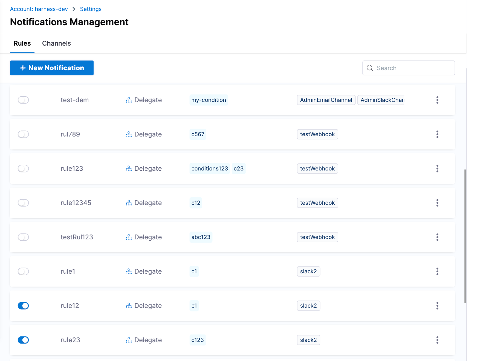

<!-- ---
title: Manage delegate notifications
description: This topic describes how to manage notifications for Harness Delegate.
keywords: [Notification Settings, Slack notifications, Microsoft Teams notifications, webhook notifications, PagerDuty notifications, Harness Delegate]
sidebar_position: 2
---

:::note
Currently, this feature is behind the feature flag `PL_CENTRAL_NOTIFICATIONS`. Contact [Harness Support](mailto:support@harness.io) to enable the feature.
:::

With notifications management, you can configure notifications for the delegate events below:

- Delegate Disconnected
- Delegate Expired
- Delegate Expires in 1, 2, 3, or 4 weeks

## Manage notification rules

You can use notifications management to configure and edit notifications for delegate events from the account, project, or org scope in Harness.

### Add a delegate event notification rule

You can add delegate event notification rules at the account, project, or org scope.

To add a delegate event notification rule, do the following:

1. In Harness, go to **Account Settings**, **Organization Settings**, or **Project Settings**, depending on the [scope](https://developer.harness.io/docs/platform/role-based-access-control/rbac-in-harness/#permissions-hierarchy-scopes) at which you want to add a delegate event notification rule.
2. Under **General**, select **Notifications Management**. The Notification Management page opens to the **Rules** tab by default.

    

3. Select **New Notification**. The **New Notification Setup** wizard opens.

   

   1. On the **Overview** screen, enter a **Notification Name**, then select **Continue**. The **Resources** screen opens.
   2. Under **Select Resource Type**, **Delegate** is selected for you by default. Harness plans to add additional resource types in future releases.
   3. Under **Select Delegates**, select the delegate for which you want to set up notifications, then select **Continue**. The **Set Conditions** screen opens. Here, you define the events for which you want to be notified.
   4. Select **Add Condition**. The **Create Condition** dialog opens.
   5. In **Condition Name**, enter a name for your notification condition, for example, `Delegate expires soon`.
   6. Select **Add Events**, and then select the events you want to be notified about, such as **About to expire in 2 weeks**. You can select multiple events.
   7. Select **Apply**, then select **Continue**. The **Set Channels** screen opens.
   8. Select your **Notification Channels**.
   9. To enable the rule now, toggle the **Enable on Save** option. If you don't want to enable the rule now, you can [enable the delegate event notification rule](#enable-a-delegate-event-notification-rule) later on the **Notifications Management** page

   10. Select **Submit**.

   Your notification is added to the Notifications Management page.

### Enable a delegate event notification rule

After you create a delegate event notification rule, if you didn't enable the rule when you first created it, you must enable the rule to receive notifications.

You can enable notification rules at the account, project, or org scope.

To enable a delegate event notification rule, do the following.

1. In Harness, go to **Account Settings**, **Organization Settings**, or **Project Settings**, depending on the [scope](https://developer.harness.io/docs/platform/role-based-access-control/rbac-in-harness/#permissions-hierarchy-scopes) at which you want to enable notification rules.
2. Under **General**, select **Notifications Management**. The Notification Management page opens to the **Rules** tab by default.
3. Locate the rule you want to enable and enable the **Status** toggle. Harness confirms that you enabled the rule.

### Disable a delegate event notification rule

You might need to temporarily disable notification rules you've set.

You can disable notification rules at the account, project, or org scope.

To disable a delegate event notification rule, do the following.

1. In Harness, go to **Account Settings**, **Organization Settings**, or **Project Settings**, depending on the [scope](https://developer.harness.io/docs/platform/role-based-access-control/rbac-in-harness/#permissions-hierarchy-scopes) at which you want to disable a delegate event notification rule.
2. Under **General**, select **Notifications Management**. The Notification Management page opens to the **Rules** tab by default.
3. Locate the rule you want to disable and disable the **Status** toggle. Harness confirms that you disabled the rule.

### Edit a delegate event notification

You can use notifications management to edit notifications for delegate events from the account, project, or org scope.

To edit delegate event notifications, do the following:

1. In Harness, go to **Account Settings**, **Organization Settings**, or **Project Settings**, depending on the [scope](https://developer.harness.io/docs/platform/role-based-access-control/rbac-in-harness/#permissions-hierarchy-scopes) at which you want to edit notifications.
2. Under **General**, select **Notifications Management**. The Notification Management page opens to the **Rules** tab by default.
3. Select **More Options** (&vellip;) for the notification you want to update, and then select **Edit**. The **Edit Notification Setup** wizard opens.
4. Edit your notification information on the necessary screen, selecting **Continue** to step through the wizard until you reach the **Set Channels** screen, then select **Submit** to save your changes.

### Delete a delegate event notification

You delete notifications for delegate events from the account, project, or org scope.

To delete a delegate event notification, do the following:

1. In Harness, go to **Account Settings**, **Organization Settings**, or **Project Settings**, depending on the [scope](https://developer.harness.io/docs/platform/role-based-access-control/rbac-in-harness/#permissions-hierarchy-scopes) at which you want to delete an event notification.
2. Under **General**, select **Notifications Management**. The Notification Management page opens to the **Rules** tab by default.
3. Select **More Options** (&vellip;) corresponding to the notification you want to delete, and then select **Delete**. A confirmation dialog opens.
4. Select **Delete**.

## Manage event notification channels

With notifications management, you can enable or disable notification channels at the account, project, and org scopes. For more information on notification channels, go to [Get started with notifications](/docs/platform/notifications/notification-settings#get-started-with-notifications).

### Add a new channel

You can add a new notification channel from the account, project, or org scope.

To add a new channel, do the following:

1. In Harness, go to **Account Settings**, **Organization Settings**, or **Project Settings**, depending on the [scope](https://developer.harness.io/docs/platform/role-based-access-control/rbac-in-harness/#permissions-hierarchy-scopes) at which you want to add a channel.
2. Under **General**, select **Notifications Management**. The Notification Management page opens to the **Rules** tab by default.
3. Select **Channels**, then select **New Channel**. The **Create Channel** dialog opens.
4. Enter your **Channel Name**.
5. Select the **Channel Type**. You can enable or disable the following notification channels:

   - Slack
   - Email
   - Microsoft Teams
   - PagerDuty
   - Webhooks

6. (Optional) Select **Add** to add additional channels.
7. Select **Apply** to save your changes.

### Edit a channel

You can edit a notification channel from the account, project, or org scope.

To edit a channel, do the following:

1. In Harness, go to **Account Settings**, **Organization Settings**, or **Project Settings**, depending on the [scope](https://developer.harness.io/docs/platform/role-based-access-control/rbac-in-harness/#permissions-hierarchy-scopes) at which you want to edit a notification channel.
2. Under **General**, select **Notifications Management**. The Notification Management page opens to the **Rules** tab by default.
3. Select **Channels**.
4. Select **More Options** (&vellip;) corresponding to the channel you want to update, and then select **Edit**. The **Edit Channel** dialog opens.
5. Update your channel settings, then select **Apply** to save your changes.
 -->
