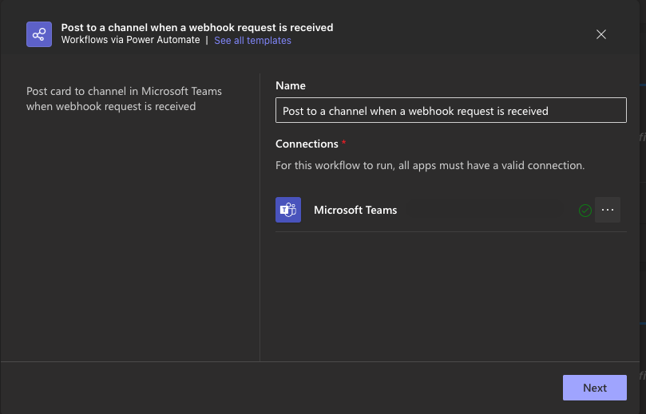
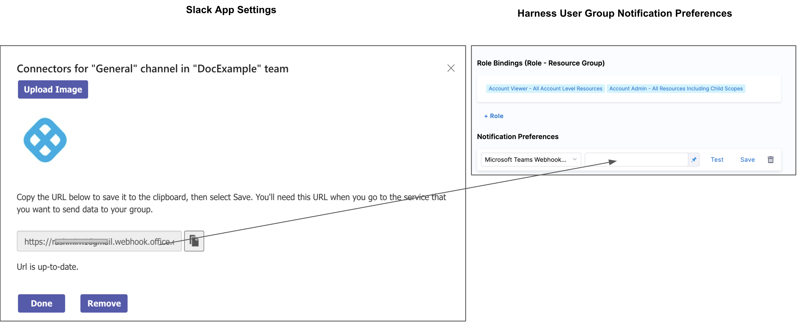

Harness notifies your User Groups of events in Pipelines, and general alerts.

You can integrate your Harness User Group with Microsoft Teams and receive notifications in Teams channels.

Setup is a simple process of generating a Webhook in Microsoft Teams and adding it to a Harness User Group's Notification Preferences. Let's get started.

### Before you begin

* See [User Group Notification Preferences](/docs/platform/role-based-access-control/add-user-groups#edit-notification-preferences)

### Review: Requirements

We assume you have a Microsoft Teams administrator account.

### Step 1: Create a Webhook in Microsoft Teams

1. In Microsoft Teams, right-click the team name where you want to send notifications, and select **Workflows** from the menu.

  

2. In the **Workflows** section, select **Post to a channel when webhook request is received**.

  

3. Provide a name for the webhook, then click **Next**.

  

4. Select the **Team** and **Channel** where you’d like to receive notifications, then click **Add Workflow**.

  

5. A webhook URL will be generated. Copy this URL for use in Harness.

  

### Step 2: Add Webhook to Harness User Group Notification Preferences

In your **Account**/**Organization**/**Project** click Access Control.

Click **User Groups**.

Select the User Group to which you want to add notification preferences.

In **Notification Preferences**, select **Microsoft Teams Webhook URL**.

Paste the Webhook into **Microsoft Teams Webhook URL** or add it as an [Encrypted Text](/docs/platform/secrets/add-use-text-secrets) in Harness and reference it here.

For example, if you have a text secret with the identifier `teamswebhookURL`, you can reference it like this: ​


```
<+secrets.getValue("teamswebhookURL")>​​
```
You can reference a secret within the Org scope using an expression with `org`:​


```
<+secrets.getvalue("org.your-secret-Id")>​
```
You can reference a secret within the Account scope using an expression with `account`:​


```
<+secrets.getvalue("account.your-secret-Id")>​
```
Click **Save**.


Now your Microsoft Teams channel will be used to notify this User Group of alerts.

