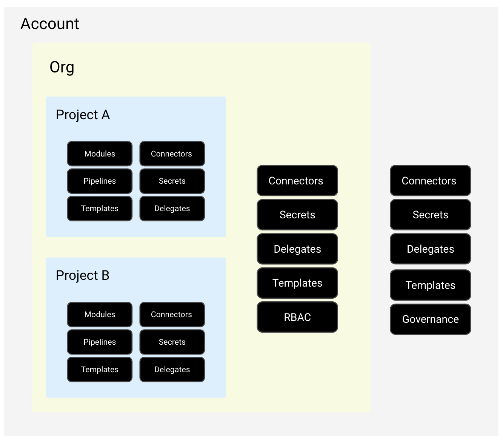
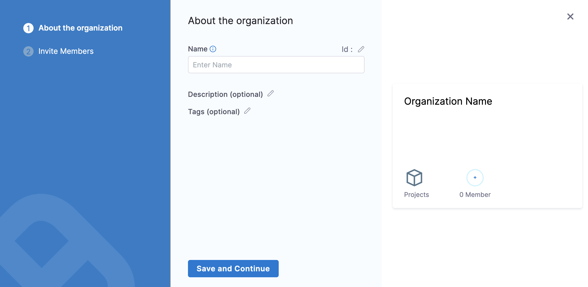
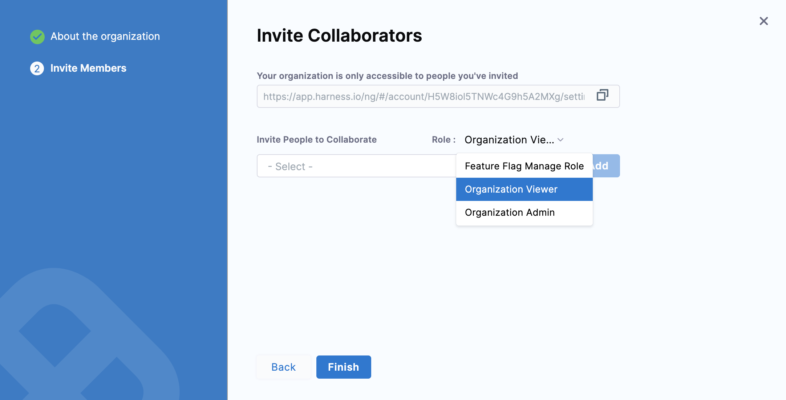
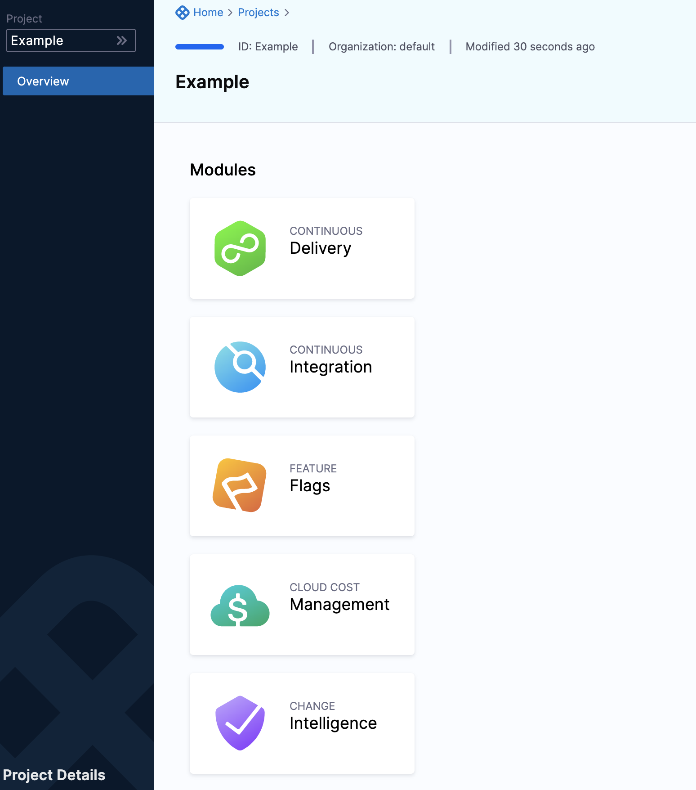

Harness Organizations (Orgs) allow you to group projects that share the same goal. For example, all projects for a business unit or division.

A Harness project is a group of Harness modules and their pipelines. For example, a project might have a Harness CI pipeline to build code and push an image to a repo and a Harness CD pipeline to pull and deploy that image to a cloud platform.

You can add an unlimited number of Harness projects to an org. All projects in the org can use the org's resources.

This topic describes how to create an org, invite Harness users to it as members, and create a project within the org.

### Before you begin

* [Learn Harness' Key Concepts](../../getting-started/learn-harness-key-concepts.md)

### Prerequisites

* Make sure you have the **Create** permissions for Organizations to create an Org.
* Make sure you have the **Create** permissions for Project to create a Project.

### Visual summary

Within a Harness account, you have organizations, and within organizations you have projects.

The resources in the org are available to all of its projects.

### Create a Harness org

1. In Harness, in **Account Settings** click **Organizations**.
2. Click **+New Organization**. The new organization settings appear.
   
   

3. In **Name**, enter a name for your organization.
4. Enter **Description**, and [Tags](../20_References/tags-reference.md) for your new org.
5. Click **Save and Continue**.

### Invite collaborators

The org and any projects added to it are used by their members only.

You don't have to add the same members to an org and its projects. You can add org-level members, and then add project-level members later when you set up or edit a project.

1. In **Invite People to Collaborate**, type a member's name and select it.
2. In **Role**, select the role the member will have in this org, such as Organization Admin or Organization Member.

   

3. Click **Add**.
   
   Members receive invites via their email addresses.

   You can always invite more members from within the Org later.

4. Click **Finish**. The Org is added to the list in Account Settings Organizations.

### Create a project

You can create Projects in the Org from the projects section of Harness, or from within the org. In this example, we'll create projects in **Projects**.

1. In Harness, go to **Home** and click **Projects**.
2. Click **+Project**.
3. Name the project, and select a color. The Id of the project is generated automatically. See [Harness Entity Reference](../20_References/harness-entity-reference.md).
4. In **Organization**, select the org you created.
5. Add a description and tags, and then click **Save and Continue**.
6. In **Invite Collaborators**, type a member's name and select it.
7. Select a role for the member, and click **Add**.
8. Click **Save and Continue** to create the project.

### Add modules

Next, the Harness modules appear.

1. Select the modules you want to use in your project. You can select more at any time.
2. Close the modules and open your Project in projects or in its organization.
3. When you open the project, all the modules are displayed.
4. Pick a module and click **Create New Pipeline** to get started!

### Project FAQs

#### Can I move resources between projects?

Harness does not support moving resources between projects or organizations at the moment.

#### What is the best way to decommission a project while retaining its history?

Harness recommends removing RBAC access to the project and only allowing users to view it or hiding it from most users. Admins are the only ones who can view configurations and deployment history in a project. Deleting a project will also delete its deployment history. In order to keep your history, it is better to leave the project available but block access and usage.

### See also

* [Learn Harness' Key Concepts](../../getting-started/learn-harness-key-concepts.md)
* [RBAC in Harness](/docs/platform/role-based-access-control/rbac-in-harness)

