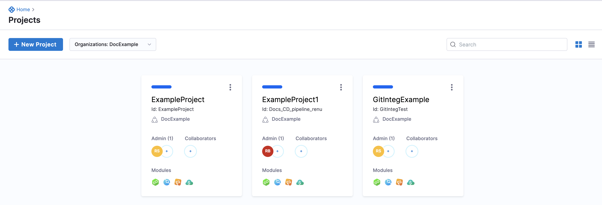

This topic explains Organizations and Projects in Harness.

### Before you begin

* [RBAC in Harness](/docs/platform/role-based-access-control/rbac-in-harness)

### Visual Summary

Harness enables you to manage access control at the following [scopes](/docs/platform/role-based-access-control/rbac-in-harness#permissions-hierarchy-scopes):

* Account
* Organization
* Project

### What is an organization?

Harness organizations (orgs) allow you to group projects that are related and share the same goals. For example, all projects for a business unit or division.

You can create multiple organizations within an account. Any resource that you create within the organization's scope is available for use in all the projects created within this organization.

Within each org you can add several Harness projects.

To create a new organization, make sure you have the **Create** permissions for organizations. For more information, see [Create a Harness Org](create-an-organization.md#create-a-harness-org).

### What is a project?

A Harness project is a group of Harness modules, their pipelines and resources. For example, a project might have a Harness CI Pipeline to build code and push an image and a Harness CD Pipeline to deploy that image to a cloud platform

Think of projects as a common space for managing teams working on similar technologies. A space where the team can work independently and not need to bother account admins or even org admins when new entities like connectors, delegates, or secrets are needed.

You can create multiple projects within an organization.

To create a new project, make sure you have the **Create** permissions for projects. For more information, go to [Create a Project](create-an-organization.md#create-a-project).

Much like account-level roles, project members can be assigned Project Admin, Member, and Viewer roles.

### What is a product module?

Your project can add Harness products as modules, such as Continuous Integration or Continuous Delivery.

### Resources across scopes

The following table lists the resources that are available at various scopes in Harness:

| **Resources** | **Account** | **Org** | **Project** |
| --- | --- | --- | --- |
| **Pipeline** | No | No | Yes |
| **Services** | Yes | Yes | Yes |
| **Environments** | Yes | Yes | Yes |
| **Git Management** | No | No | Yes |
| **Connectors** | Yes | Yes | Yes |
| **Secrets** | Yes | Yes | Yes |
| **SMTP Configuration** | Yes | No | No |
| **Templates** | Yes | Yes | Yes |
| **Audit Trail** | Yes | Yes | Yes |
| **Delegates** | Yes | Yes | Yes |
| **Governance** | Yes | Yes | Yes |

